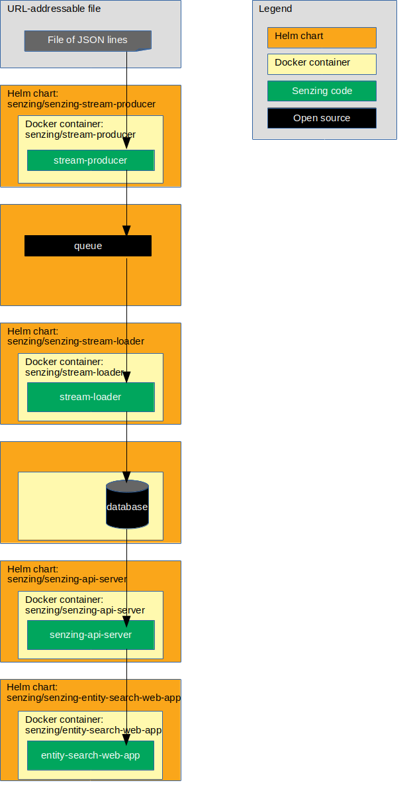

# kubernetes-demo

## Overview

The following diagram shows the relationship of the Helm charts, docker containers, and code in this Kubernetes demonstration.

The unlabeled boxes represent variations in the following implementations:

1. [Using DB2 database](docs/helm-db2-demo/README.md)
