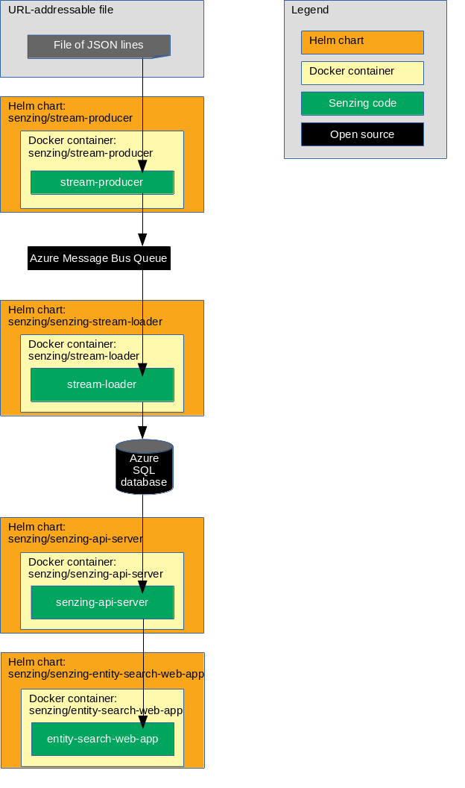

# kubernetes-demo-azure-helm-rabbitmq-mssql

## Synopsis

Using Microsoft Azure Kubernetes Service, bring up a Senzing stack on Kubernetes using Helm, Message Bus queue, and a MS SQL database.

## Overview

This repository illustrates a reference implementation of Senzing using Microft SQL Database as the underlying database.

The instructions show how to set up a system that:

1. Reads JSON lines from a file on the internet and sends each JSON line to a message queue via the Senzing
   [stream-producer](https://github.com/Senzing/stream-producer).
    1. In this implementation, the queue is an
       [Azure Message Bus](https://azure.microsoft.com/en-us/services/service-bus/) queue.
1. Reads messages from the queue and inserts into Senzing via the Senzing
   [stream-loader](https://github.com/Senzing/stream-loader).
    1. In this implementation, Senzing keeps its data in an
       [Azure SQL Database](https://azure.microsoft.com/en-us/products/azure-sql/database/#overview) database.
1. Reads information from Senzing via [Senzing API Server](https://github.com/Senzing/senzing-api-server) server.
1. Views resolved entities in a [web app](https://github.com/Senzing/entity-search-web-app).

The following diagram shows the relationship of the Helm charts, docker containers, and code in this Kubernetes demonstration.



### Contents

1. [Preamble](#preamble)
1. [Related artifacts](#related-artifacts)
1. [Expectations](#expectations)
1. [Prerequisites](#prerequisites)
    1. [Prerequisite software](#prerequisite-software)
    1. [Clone repository](#clone-repository)
1. [Demonstrate](#demonstrate)
    1. [Create demo directory](#create-demo-directory)
    1. [Azure login](#azure-login)
    1. [EULA](#eula)
    1. [Set environment variables](#set-environment-variables)
    1. [Identify Docker registry](#identify-docker-registry)
    1. [Create an Azure Resource Group](#create-an-azure-resource-group)
    1. [Create an Azure Service Bus Queue](#create-an-azure-service-bus-queue)
    1. [Create an Azure SQL Database](#create-an-azure-sql-database)
    1. [Create an Azure Kubernetes Service Cluster](#create-an-azure-kubernetes-service-cluster)
    1. [Connect to your AKS Cluster](#connect-to-your-aks-cluster)
    1. [Create custom helm values files](#create-custom-helm-values-files)
    1. [Create custom kubernetes configuration files](#create-custom-kubernetes-configuration-files)
    1. [Save environment variables](#save-environment-variables)
    1. [Create namespace](#create-namespace)
    1. [Create persistent volume](#create-persistent-volume)
    1. [Add helm repositories](#add-helm-repositories)
    1. [Deploy Senzing RPM](#deploy-senzing-rpm)
    1. [Install senzing-console Helm chart](#install-senzing-console-helm-chart)
    1. [Initialize database](#initialize-database)
    1. [Install stream-producer Helm chart](#install-stream-producer-helm-chart)
    1. [Install init-container Helm chart](#install-init-container-helm-chart)
    1. [Install stream-loader Helm chart](#install-stream-loader-helm-chart)
    1. [Install senzing-api-server Helm chart](#install-senzing-api-server-helm-chart)
    1. [Install senzing-entity-search-web-app Helm chart](#install-senzing-entity-search-web-app-helm-chart)
    1. [Optional charts](#optional-charts)
        1. [Install senzing-redoer Helm chart](#install-senzing-redoer-helm-chart)
        1. [Install configurator Helm chart](#install-configurator-helm-chart)
    1. [View data](#view-data)
        1. [View Azure Resource Group](#view-azure-resource-group)
        1. [View Azure Service Bus Queue](#view-azure-service-bus-queue)
        1. [View Azure SQL Database](#view-azure-sql-database)
        1. [View Azure Kubernetes Cluster](#view-azure-kubernetes-cluster)
        1. [View Senzing Console pod](#view-senzing-console-pod)
        1. [View Senzing API Server](#view-senzing-api-server)
        1. [View Senzing Entity Search WebApp](#view-senzing-entity-search-webapp)
        1. [View Senzing Configurator](#view-senzing-configurator)
1. [Cleanup](#cleanup)
    1. [Delete everything in Kubernetes](#delete-everything-in-kubernetes)
    1. [Delete Azure Kubernetes Service Cluster](#delete-azure-kubernetes-service-cluster)
    1. [Delete Azure SQL Database](#delete-azure-sql-database)
    1. [Delete Azure Service Bus Queue](#delete-azure-service-bus-queue)
    1. [Delete Azure Resource Group](#delete-azure-resource-group)
1. [Errors](#errors)
1. [References](#references)

## Preamble

At [Senzing](http://senzing.com),
we strive to create GitHub documentation in a
"[don't make me think](https://github.com/Senzing/knowledge-base/blob/master/WHATIS/dont-make-me-think.md)" style.
For the most part, instructions are copy and paste.
Whenever thinking is needed, it's marked with a "thinking" icon :thinking:.
Whenever customization is needed, it's marked with a "pencil" icon :pencil2:.
If the instructions are not clear, please let us know by opening a new
[Documentation issue](https://github.com/Senzing/kubernetes-demo/issues/new?assignees=&labels=&template=documentation_request.md)
describing where we can improve.   Now on with the show...

### Legend

1. :thinking: - A "thinker" icon means that a little extra thinking may be required.
   Perhaps you'll need to make some choices.
   Perhaps it's an optional step.
1. :pencil2: - A "pencil" icon means that the instructions may need modification before performing.
1. :warning: - A "warning" icon means that something tricky is happening, so pay attention.

## Related artifacts

1. [DockerHub](https://hub.docker.com/r/senzing)
1. [Helm Charts](https://github.com/Senzing/charts)

## Expectations

- **Space:** This repository and demonstration require 20 GB free disk space.
- **Time:** Budget 4 hours to get the demonstration up-and-running, depending on CPU and network speeds.
- **Background knowledge:** This repository assumes a working knowledge of:
  - [Docker](https://github.com/Senzing/knowledge-base/blob/master/WHATIS/docker.md)
  - [Kubernetes](https://github.com/Senzing/knowledge-base/blob/master/WHATIS/kubernetes.md)
  - [Helm](https://github.com/Senzing/knowledge-base/blob/master/WHATIS/helm.md)

## Prerequisites

### Prerequisite software

1. [Azure subscription](https://github.com/Senzing/knowledge-base/blob/master/WHATIS/azure-subscription.md)
1. [Azure Command Line Interface (CLI)](https://github.com/Senzing/knowledge-base/blob/master/WHATIS/azure-cli.md)
1. [kubectl](https://github.com/Senzing/knowledge-base/blob/master/HOWTO/install-kubectl.md)
1. [Helm 3](https://github.com/Senzing/knowledge-base/blob/master/HOWTO/install-helm.md)

### Clone repository

The Git repository has files that will be used in the `helm install --values` parameter.

1. Using these environment variable values:

    ```console
    export GIT_ACCOUNT=senzing
    export GIT_REPOSITORY=kubernetes-demo
    export GIT_ACCOUNT_DIR=~/${GIT_ACCOUNT}.git
    export GIT_REPOSITORY_DIR="${GIT_ACCOUNT_DIR}/${GIT_REPOSITORY}"
    ```

1. Follow steps in [clone-repository](https://github.com/Senzing/knowledge-base/blob/master/HOWTO/clone-repository.md) to install the Git repository.

## Demonstrate

### Create demo directory

1. :pencil2: Create unique prefix.
   This will be used to create unique names in Azure
   and will be used in a local directory name.

   :warning:  Must be all lowercase.
   Example:

    ```console
    export DEMO_PREFIX=xyzzy
    ```

1. Make a directory for the demo.
   Example:

    ```console
    export SENZING_DEMO_DIR=~/senzing-azure-demo-${DEMO_PREFIX}
    mkdir -p ${SENZING_DEMO_DIR}
    ```

### Azure login

1. Login to Azure.
   Example:

    ```console
    az login \
        > ${SENZING_DEMO_DIR}/az-login.json
    ```

### EULA

To use the Senzing code, you must agree to the End User License Agreement (EULA).

1. :warning: This step is intentionally tricky and not simply copy/paste.
   This ensures that you make a conscious effort to accept the EULA.
   Example:

    <pre>export SENZING_ACCEPT_EULA="&lt;the value from <a href="https://github.com/Senzing/knowledge-base/blob/master/lists/environment-variables.md#senzing_accept_eula">this link</a>&gt;"</pre>

To use the "MICROSOFT ODBC DRIVER 17 FOR SQL SERVER", you must agree to the End User License Agreement (EULA).

1. :warning: This step is intentionally tricky and not simply copy/paste.
   This ensures that you make a conscious effort to accept the EULA.
   Example:

    <pre>export MSSQL_ACCEPT_EULA="&lt;the value from <a href="https://github.com/Senzing/knowledge-base/blob/master/lists/environment-variables.md#mssql_accept_eula">this link</a>&gt;"</pre>

### Set environment variables

1. Set environment variables listed in "[Clone repository](#clone-repository)".

1. :pencil2: Identify Azure location.
   See [az-group-create > Required Parameters > --location](https://docs.microsoft.com/en-us/cli/azure/group?view=azure-cli-latest#az_group_create-required-parameters).
   Example:

    ```console
    export SENZING_AZURE_LOCATION=eastus
    ```

1. :pencil2: Specify Azure SQL Database credentials.
   Example:

    ```console
    export DATABASE_USERNAME=senzing
    export DATABASE_PASSWORD=$(< /dev/urandom tr -dc [:alnum:] | head -c${1:-20};echo;)
    echo "DATABASE_PASSWORD: ${DATABASE_PASSWORD}"
    ```

1. :pencil2: Specify Azure SQL Database firewall parameters.
   See [az sql server firewall-rule > Optional Parameters.](https://docs.microsoft.com/en-us/cli/azure/sql/server/firewall-rule?view=azure-cli-latest#az_sql_server_firewall_rule_create-optional-parameters)
   Example:

    ```console
    export SENZING_AZURE_DATABASE_BEGIN_IP=0.0.0.0
    export SENZING_AZURE_DATABASE_END_IP=0.0.0.0
    ```

1. Synthesize environment variables.
   Example:

    ```console
    export DATABASE_DATABASE=G2
    export DEMO_NAMESPACE=${DEMO_PREFIX}-namespace
    export SENZING_AZURE_ACR_NAME="${DEMO_PREFIX}Acr"
    export SENZING_AZURE_AKS_NAME="${DEMO_PREFIX}Aks"
    export SENZING_AZURE_QUEUE_NAME="${DEMO_PREFIX}Queue"
    export SENZING_AZURE_RESOURCE_GROUP_NAME="${DEMO_PREFIX}ResourceGroup"
    export SENZING_AZURE_SERVICE_BUS_NAMESPACE_NAME="${DEMO_PREFIX}ServiceBus"
    export SENZING_AZURE_SQL_FIREWALL="${DEMO_PREFIX}SqlFirewall"
    export SENZING_AZURE_SQL_SERVER=${DEMO_PREFIX}SqlServer
    ```

1. Retrieve latest docker image version numbers and set their environment variables.
   Example:

    ```console
    curl -X GET \
      --output ${SENZING_DEMO_DIR}/docker-versions-latest.sh \
      https://raw.githubusercontent.com/Senzing/knowledge-base/master/lists/docker-versions-latest.sh

    source ${SENZING_DEMO_DIR}/docker-versions-latest.sh
    ```

1. Retrieve latest Senzing version numbers and set their environment variables.
   Example:

    ```console
    curl -X GET \
      --output ${SENZING_DEMO_DIR}/senzing-versions-latest.sh \
      https://raw.githubusercontent.com/Senzing/knowledge-base/master/lists/senzing-versions-latest.sh

    source ${SENZING_DEMO_DIR}/senzing-versions-latest.sh
    ```

### Identify Docker registry

1. Use the default public `docker.io` registry which pulls images from
   [hub.docker.com](https://hub.docker.com/).
   Example:

    ```console
    export DOCKER_REGISTRY_URL=docker.io
    export DOCKER_REGISTRY_SECRET=${DOCKER_REGISTRY_URL}-secret
    ```

### Create an Azure Resource Group

1. Create Resource group
   using
   [az group create](https://docs.microsoft.com/en-us/cli/azure/group?view=azure-cli-latest#az_group_create).
   Example:

    ```console
    az group create \
        --name ${SENZING_AZURE_RESOURCE_GROUP_NAME} \
        --location ${SENZING_AZURE_LOCATION} \
        > ${SENZING_DEMO_DIR}/az-group-create.json
    ```

   View in [Azure portal](https://portal.azure.com/#blade/HubsExtension/BrowseResourceGroups).

### Create an Azure Service Bus Queue

1. Create Azure Service Bus Namespace
   using
   [az servicebus namespace create](https://docs.microsoft.com/en-us/cli/azure/servicebus/namespace?view=azure-cli-latest#az_servicebus_namespace_create).
   Example:

    ```console
    az servicebus namespace create \
        --location ${SENZING_AZURE_LOCATION} \
        --name ${SENZING_AZURE_SERVICE_BUS_NAMESPACE_NAME} \
        --resource-group ${SENZING_AZURE_RESOURCE_GROUP_NAME} \
        > ${SENZING_DEMO_DIR}/az-servicebus-namespace-create.json
    ```

   View in [Azure portal](https://portal.azure.com/#blade/HubsExtension/BrowseResource/resourceType/Microsoft.ServiceBus%2Fnamespaces).

1. Create Azure Queue in the Service Bus
   using
   [az servicebus queue create](https://docs.microsoft.com/en-us/cli/azure/servicebus/queue?view=azure-cli-latest#az_servicebus_queue_create).
   Example:

    ```console
    az servicebus queue create \
        --name ${SENZING_AZURE_QUEUE_NAME} \
        --namespace-name ${SENZING_AZURE_SERVICE_BUS_NAMESPACE_NAME} \
        --resource-group ${SENZING_AZURE_RESOURCE_GROUP_NAME} \
        > ${SENZING_DEMO_DIR}/az-servicebus-queue-create.json
    ```

   View in [Azure portal](https://portal.azure.com/#blade/HubsExtension/BrowseResource/resourceType/Microsoft.ServiceBus%2Fnamespaces).
   Select service bus.
   Near bottom, select "Queues" tab.

1. Create Authorization keys
   using
   [az servicebus namespace authorization-rule keys list](https://docs.microsoft.com/en-us/cli/azure/servicebus/namespace/authorization-rule/keys?view=azure-cli-latest#az_servicebus_namespace_authorization_rule_keys_list).
   Example:

    ```console
    az servicebus namespace authorization-rule keys list \
        --name RootManageSharedAccessKey \
        --namespace-name ${SENZING_AZURE_SERVICE_BUS_NAMESPACE_NAME} \
        --resource-group ${SENZING_AZURE_RESOURCE_GROUP_NAME} \
        > ${SENZING_DEMO_DIR}/az-servicebus-namespace-authorization-rule-keys-list.json
    ```

   FIXME: View in [Azure portal](https://portal.azure.com).
1. Capture values in environment variables.
   Example:

    ```console
    export SENZING_AZURE_CONNECTION_STRING=$(jq --raw-output ".primaryConnectionString" ${SENZING_DEMO_DIR}/az-servicebus-namespace-authorization-rule-keys-list.json)
    export SENZING_AZURE_QUEUE_NAME=$(jq --raw-output ".name" ${SENZING_DEMO_DIR}/az-servicebus-queue-create.json)
    ```

1. References:
    1. [Use the Azure CLI to create a Service Bus namespace and a queue](https://docs.microsoft.com/en-us/azure/service-bus-messaging/service-bus-quickstart-cli)

### Create an Azure SQL Database

1. Create Azure SQL server
   using
   [az sql server create](https://docs.microsoft.com/en-us/cli/azure/sql/server?view=azure-cli-latest#az_sql_server_create).
   Example:

    ```console
    az sql server create \
        --admin-password ${DATABASE_PASSWORD} \
        --admin-user ${DATABASE_USERNAME} \
        --location ${SENZING_AZURE_LOCATION}  \
        --name ${SENZING_AZURE_SQL_SERVER} \
        --resource-group ${SENZING_AZURE_RESOURCE_GROUP_NAME} \
        > ${SENZING_DEMO_DIR}/az-sql-server-create.json
    ```

   View in [Azure portal](https://portal.azure.com/#blade/HubsExtension/BrowseResource/resourceType/Microsoft.Sql%2Fazuresql).

1. Configure a firewall rule for the server
   using
   [az sql server firewall-rule create](https://docs.microsoft.com/en-us/cli/azure/sql/server/firewall-rule?view=azure-cli-latest#az_sql_server_firewall_rule_create).
   Example:

    ```console
    az sql server firewall-rule create \
        --end-ip-address ${SENZING_AZURE_DATABASE_END_IP} \
        --name ${SENZING_AZURE_SQL_FIREWALL} \
        --resource-group ${SENZING_AZURE_RESOURCE_GROUP_NAME} \
        --server ${SENZING_AZURE_SQL_SERVER} \
        --start-ip-address ${SENZING_AZURE_DATABASE_BEGIN_IP} \
        > ${SENZING_DEMO_DIR}/az-sql-server-firewall-rule-create.json
    ```

   FIXME: View in [Azure portal](https://portal.azure.com).

1. Create a single database
   using
   [az sql db create](https://docs.microsoft.com/en-us/cli/azure/sql/db?view=azure-cli-latest#az_sql_db_create).
   Example:

    ```console
    az sql db create \
        --capacity 2 \
        --compute-model Serverless \
        --edition GeneralPurpose \
        --family Gen5 \
        --name ${DATABASE_DATABASE} \
        --resource-group ${SENZING_AZURE_RESOURCE_GROUP_NAME} \
        --server ${SENZING_AZURE_SQL_SERVER} \
        > ${SENZING_DEMO_DIR}/az-sql-db-create.json
    ```

   View in [Azure portal](https://portal.azure.com/#blade/HubsExtension/BrowseResource/resourceType/Microsoft.Sql%2Fservers%2Fdatabases).

1. Capture values in environment variables.
   Example:

    ```console
    export DATABASE_HOST=$(tail +2 ${SENZING_DEMO_DIR}/az-sql-server-create.json | jq --raw-output ".fullyQualifiedDomainName")
    ```

1. References:
    1. [Create an Azure SQL Database single database](https://docs.microsoft.com/en-us/azure/azure-sql/database/single-database-create-quickstart?tabs=azure-cli)

### Create an Azure Kubernetes Service cluster

1. [Create Azure Kubernetes Service (AKS)](https://docs.microsoft.com/en-us/azure/aks/quickstart-helm#create-an-aks-cluster)
   using
   [az aks create](https://docs.microsoft.com/en-us/cli/azure/aks?view=azure-cli-latest#az_aks_create)
   Example:

    ```console
    az aks create \
        --resource-group ${SENZING_AZURE_RESOURCE_GROUP_NAME} \
        --name ${SENZING_AZURE_AKS_NAME} \
        --location ${SENZING_AZURE_LOCATION} \
        --generate-ssh-keys \
        > ${SENZING_DEMO_DIR}/az-aks-create.json
    ```

   View in [Azure portal](https://portal.azure.com/#blade/HubsExtension/BrowseResource/resourceType/Microsoft.ContainerService%2FmanagedClusters).

### Connect to your AKS cluster

1. [Connect to your AKS cluster](https://docs.microsoft.com/en-us/azure/aks/quickstart-helm#connect-to-your-aks-cluster).
   Get credentials for `kubectl` using
   [az aks get-credential](https://docs.microsoft.com/en-us/cli/azure/aks?view=azure-cli-latest#az_aks_get_credentials)
   Example:

    ```console
    az aks get-credentials \
        --resource-group ${SENZING_AZURE_RESOURCE_GROUP_NAME} \
        --name ${SENZING_AZURE_AKS_NAME} \
        > ${SENZING_DEMO_DIR}/az-aks-get-creadentials.json
    ```

### Create custom helm values files

:thinking: In this step, Helm template files are populated with actual values.
There are two methods of accomplishing this.
Only one method needs to be performed.

1. **Method #1:** Quick method using `envsubst`.
   Example:

    ```console
    export HELM_VALUES_DIR=${SENZING_DEMO_DIR}/helm-values
    mkdir -p ${HELM_VALUES_DIR}

    for file in ${GIT_REPOSITORY_DIR}/helm-values-templates/*.yaml; \
    do \
      envsubst < "${file}" > "${HELM_VALUES_DIR}/$(basename ${file})";
    done
    ```

1. **Method #2:** Copy and manually modify files method.
   Example:

    ```console
    export HELM_VALUES_DIR=${SENZING_DEMO_DIR}/helm-values
    mkdir -p ${HELM_VALUES_DIR}

    cp ${GIT_REPOSITORY_DIR}/helm-values-templates/* ${HELM_VALUES_DIR}
    ```

    :pencil2: Edit files in ${HELM_VALUES_DIR} replacing the following variables with actual values.

    1. `${DEMO_PREFIX}`
    1. `${DOCKER_REGISTRY_SECRET}`
    1. `${DOCKER_REGISTRY_URL}`
    1. `${SENZING_ACCEPT_EULA}`

### Create custom kubernetes configuration files

:thinking: In this step, Kubernetes template files are populated with actual values.
There are two methods of accomplishing this.
Only one method needs to be performed.

1. **Method #1:** Quick method using `envsubst`.
   Example:

    ```console
    export KUBERNETES_DIR=${SENZING_DEMO_DIR}/kubernetes
    mkdir -p ${KUBERNETES_DIR}

    for file in ${GIT_REPOSITORY_DIR}/kubernetes-templates/*; \
    do \
      envsubst < "${file}" > "${KUBERNETES_DIR}/$(basename ${file})";
    done
    ```

1. **Method #2:** Copy and manually modify files method.
   Example:

    ```console
    export KUBERNETES_DIR=${SENZING_DEMO_DIR}/kubernetes
    mkdir -p ${KUBERNETES_DIR}

    cp ${GIT_REPOSITORY_DIR}/kubernetes-templates/* ${KUBERNETES_DIR}
    ```

    :pencil2: Edit files in ${KUBERNETES_DIR} replacing the following variables with actual values.

    1. `${DEMO_NAMESPACE}`

### Save environment variables

1. Save environment variables into a file that can be sourced.
   Example:

    ```console
    cat <<EOT > ${SENZING_DEMO_DIR}/environment.sh
    #!/usr/bin/env bash

    EOT

    env \
    | grep \
        --regexp="^DEMO_" \
        --regexp="^DATABASE_" \
        --regexp="^DOCKER_" \
        --regexp="^GIT_" \
        --regexp="^HELM_" \
        --regexp="^KUBERNETES_" \
        --regexp="^MSSQL_" \
        --regexp="^SENZING_" \
    | sort \
    | awk -F= '{ print "export", $0 }' \
    >> ${SENZING_DEMO_DIR}/environment.sh

    chmod +x ${SENZING_DEMO_DIR}/environment.sh
    ```

### Create namespace

1. Create namespace using
   [helm create](https://helm.sh/docs/helm/helm_create/)
   Example:

    ```console
    kubectl apply -f ${KUBERNETES_DIR}/namespace.yaml
    ```

1. :thinking: **Optional:**
   Review namespaces.

    ```console
    kubectl get namespaces
    ```

### Create persistent volume

"Azure Files" have been selected over "Azure Disks" because:
> Since Azure Disks are mounted as ReadWriteOnce, they're only available to a single pod.
on <https://docs.microsoft.com/en-us/azure/aks/concepts-storage#volumes>

1. Create Storage Class.
   Example:

    ```console
    kubectl apply -f ${KUBERNETES_DIR}/storage-class-azure.yaml
    ```

   Reference: [Dynamically create and use a persistent volume with Azure Files in Azure Kubernetes Service (AKS)](https://docs.microsoft.com/en-us/azure/aks/azure-files-dynamic-pv)

1. Create persistent volume claims.
   Example:

    ```console
    kubectl apply -f ${KUBERNETES_DIR}/persistent-volume-claim-senzing-azure.yaml
    ```

1. :thinking: **Optional:**
   Review persistent volumes and claims.

    ```console
    kubectl get persistentvolumeClaims \
      --namespace ${DEMO_NAMESPACE}
    ```

#### View persistent volume

To view persistent volume:

1. Visit [Azure portal](https://portal.azure.com/#blade/HubsExtension/BrowseResource/resourceType/Microsoft.ClassicStorage%2FStorageAccounts).
1. Select storage account having resource group containing value of `DEMO_PREFIX`.
1. In "Data Storage" section, select "File shares"
1. Select "kubernetes-dynamic-pvc-...`

### Add helm repositories

1. Add Bitnami repository using
   [helm repo add](https://helm.sh/docs/helm/helm_repo_add/).
   Example:

    ```console
    helm repo add bitnami https://charts.bitnami.com/bitnami
    ```

1. Add Senzing repository using
   [helm repo add](https://helm.sh/docs/helm/helm_repo_add/).
   Example:

    ```console
    helm repo add senzing https://hub.senzing.com/charts/
    ```

1. Update repositories using
   [helm repo update](https://helm.sh/docs/helm/helm_repo_update/).
   Example:

    ```console
    helm repo update
    ```

1. :thinking: **Optional:**
   Review repositories using
   [helm repo list](https://helm.sh/docs/helm/helm_repo_list/).
   Example:

    ```console
    helm repo list
    ```

1. Reference: [helm repo](https://helm.sh/docs/helm/#helm-repo)

### Deploy Senzing RPM

:thinking: This deployment initializes the Persistent Volume with Senzing code and data.

There are 2 options when it comes to initializing the Persistent Volume with Senzing code and data.
Choose one:

1. [Root container method](#root-container-method) - requires a root container
1. [Non-root container method](#non-root-container-method) - can be done on kubernetes with a non-root container

#### Root container method

_Method #1:_ This method is simpler, but requires a root container.
This method uses a dockerized [apt](https://github.com/Senzing/docker-apt) command.

1. Install chart.
   Example:

    ```console
    helm install \
      ${DEMO_PREFIX}-senzing-apt \
      senzing/senzing-apt \
      --namespace ${DEMO_NAMESPACE} \
      --values ${HELM_VALUES_DIR}/senzing-apt-mssql.yaml
    ```

1. Wait until Job has completed.
   Example:

    ```console
    kubectl get pods \
      --namespace ${DEMO_NAMESPACE} \
      --watch
    ```

1. Example of completion:

    ```console
    NAME                          READY   STATUS      RESTARTS   AGE
    xyzzy-senzing-apt-8n2ql       0/1     Completed   0          2m44s
    ```

1. :thinking: **Optional:**
   To see results of installation, [view persistent volume](#view-persistent-volume).

#### Non-root container method

**FIXME:**  non-root container method not verified.

_Method #2:_ This method can be done on kubernetes with a non-root container.

1. Install chart with non-root container.
   This pod will be the recipient of a `docker cp` command.
   Example:

    ```console
    helm install \
      name ${DEMO_PREFIX}-senzing-base \
      senzing/senzing-base \
      --namespace ${DEMO_NAMESPACE} \
      --values ${HELM_VALUES_DIR}/senzing-base.yaml
    ```

1. The following instructions are done on a non-kubernetes machine which allows root docker containers.
   Example:  a personal laptop.

1. :pencil2: Set environment variables.
   **Note:** See [SENZING_ACCEPT_EULA](https://github.com/Senzing/knowledge-base/blob/master/lists/environment-variables.md#senzing_accept_eula) for correct value.
   Example:

    ```console
    export DEMO_PREFIX=my
    export DEMO_NAMESPACE=${DEMO_PREFIX}-namespace

    export SENZING_ACCEPT_EULA=put-in-correct-value
    export SENZING_VOLUME=/opt/my-senzing

    export SENZING_DATA_DIR=${SENZING_VOLUME}/data
    export SENZING_G2_DIR=${SENZING_VOLUME}/g2
    export SENZING_ETC_DIR=${SENZING_VOLUME}/etc
    export SENZING_VAR_DIR=${SENZING_VOLUME}/var
    ```

1. Run docker image.
   Example:

    ```console
    sudo docker run \
      --env SENZING_ACCEPT_EULA=${SENZING_ACCEPT_EULA} \
      --rm \
      --volume ${SENZING_DATA_DIR}:/opt/senzing/data \
      --volume ${SENZING_G2_DIR}:/opt/senzing/g2 \
      --volume ${SENZING_ETC_DIR}:/etc/opt/senzing \
      --volume ${SENZING_VAR_DIR}:/var/opt/senzing \
      senzing/apt
    ```

1. Copy files from local machine to `senzing-base` pod.
   Example:

    ```console
    export SENZING_BASE_POD_NAME=$(kubectl get pods \
      --namespace ${DEMO_NAMESPACE} \
      --output jsonpath="{.items[0].metadata.name}" \
      --selector "app.kubernetes.io/name=senzing-base, \
                  app.kubernetes.io/instance=${DEMO_PREFIX}-senzing-base" \
      )

    kubectl cp ${SENZING_DATA_DIR} ${DEMO_NAMESPACE}/${SENZING_BASE_POD_NAME}:/opt/senzing/senzing-data
    kubectl cp ${SENZING_G2_DIR}   ${DEMO_NAMESPACE}/${SENZING_BASE_POD_NAME}:/opt/senzing/senzing-g2
    kubectl cp ${SENZING_ETC_DIR}  ${DEMO_NAMESPACE}/${SENZING_BASE_POD_NAME}:/opt/senzing/senzing-etc
    kubectl cp ${SENZING_VAR_DIR}  ${DEMO_NAMESPACE}/${SENZING_BASE_POD_NAME}:/opt/senzing/senzing-var
    ```

1. :thinking: **Optional:**
   To see results of installation, [view persistent volume](#view-persistent-volume).

### Install senzing-console Helm chart

The [senzing-console](https://github.com/Senzing/docker-senzing-console)
will be used later to:

- Inspect mounted volumes
- Debug issues
- Run command-line tools

1. Install chart.
   Example:

    ```console
    helm install \
      ${DEMO_PREFIX}-senzing-console \
      senzing/senzing-console \
      --namespace ${DEMO_NAMESPACE} \
      --values ${HELM_VALUES_DIR}/senzing-console-mssql.yaml
    ```

1. To use senzing-console pod, see [View Senzing Console pod](#view-senzing-console-pod).

### Initialize database

1. Create tables in the database (i.e. the schema) used by Senzing.
   Example:

    ```console
    helm install \
      ${DEMO_PREFIX}-mssql-tools \
      senzing/mssql-tools \
      --namespace ${DEMO_NAMESPACE} \
      --values ${HELM_VALUES_DIR}/mssql-tools.yaml
    ```

1. View in [Azure portal](https://portal.azure.com/#blade/HubsExtension/BrowseResource/resourceType/Microsoft.Sql%2Fservers%2Fdatabases).
    1. Choose database. (Usually `G2`)
    1. Choose "Query editor" using `DATABASE_USERNAME` and `DATABASE_PASSWORD` values to log in.

### Install stream-producer Helm chart

The [stream producer](https://github.com/Senzing/stream-producer)
pulls JSON lines from a file and pushes them to message queue.

1. Install chart.
   Example:

    ```console
    helm install \
      ${DEMO_PREFIX}-senzing-stream-producer \
      senzing/senzing-stream-producer \
      --namespace ${DEMO_NAMESPACE} \
      --values ${HELM_VALUES_DIR}/stream-producer-azure-queue.yaml
    ```

1. View in [Azure portal](https://portal.azure.com/#blade/HubsExtension/BrowseResource/resourceType/Microsoft.ServiceBus%2Fnamespaces).
   Select service bus.
   Near bottom, select "Queues" tab.

### Install init-container Helm chart

The [init-container](https://github.com/Senzing/docker-init-container)
creates files from templates and initializes the G2 database.

1. Install chart.
   Example:

    ```console
    helm install \
      ${DEMO_PREFIX}-senzing-init-container \
      senzing/senzing-init-container \
      --namespace ${DEMO_NAMESPACE} \
      --values ${HELM_VALUES_DIR}/init-container-mssql.yaml
    ```

1. Wait for pods to run.
   Example:

    ```console
    kubectl get pods \
      --namespace ${DEMO_NAMESPACE} \
      --watch
    ```

### Install stream-loader Helm chart

The [stream loader](https://github.com/Senzing/stream-loader)
pulls messages from message queue and sends them to Senzing.

1. Install chart.
   Example:

    ```console
    helm install \
      ${DEMO_PREFIX}-senzing-stream-loader \
      senzing/senzing-stream-loader \
      --namespace ${DEMO_NAMESPACE} \
      --values ${HELM_VALUES_DIR}/stream-loader-azure-queue-mssql.yaml
    ```

### Install senzing-api-server Helm chart

The [Senzing API server](https://github.com/Senzing/senzing-api-server)
receives HTTP requests to read and modify Senzing data.

1. Install chart.
   Example:

    ```console
    helm install \
      ${DEMO_PREFIX}-senzing-api-server \
      senzing/senzing-api-server \
      --namespace ${DEMO_NAMESPACE} \
      --values ${HELM_VALUES_DIR}/senzing-api-server-mssql.yaml
    ```

1. Wait for pods to run.
   Example:

    ```console
    kubectl get pods \
      --namespace ${DEMO_NAMESPACE} \
      --watch
    ```

1. To view Senzing API server, see [View Senzing API Server](#view-senzing-api-server).

### Install senzing-entity-search-web-app Helm chart

The [Senzing Entity Search WebApp](https://github.com/Senzing/entity-search-web-app)
is a light-weight WebApp demonstrating Senzing search capabilities.

1. Install chart.
   Example:

    ```console
    helm install \
      ${DEMO_PREFIX}-senzing-entity-search-web-app \
      senzing/senzing-entity-search-web-app \
      --namespace ${DEMO_NAMESPACE} \
      --values ${HELM_VALUES_DIR}/entity-search-web-app.yaml
    ```

1. Wait until Deployment has completed.
   Example:

    ```console
    kubectl get pods \
      --namespace ${DEMO_NAMESPACE} \
      --watch
    ```

1. To view Senzing Entity Search WebApp, see [View Senzing Entity Search WebApp](#view-senzing-entity-search-webapp).

### Optional charts

These charts are not necessary for the demonstration,
but may be valuable in a production environment.

#### Install senzing-redoer Helm chart

The [redoer](https://github.com/Senzing/redoer) pulls Senzing redo records from the Senzing database and re-processes.

1. Install chart.
   Example:

    ```console
    helm install \
      ${DEMO_PREFIX}-senzing-redoer \
      senzing/senzing-redoer \
      --namespace ${DEMO_NAMESPACE} \
      --values ${HELM_VALUES_DIR}/redoer-mssql.yaml
    ```

#### Install configurator Helm chart

The [Senzing Configurator](https://github.com/Senzing/configurator) is a micro-service for changing Senzing configuration.

1. Install chart.
   Example:

    ```console
    helm install \
      ${DEMO_PREFIX}-senzing-configurator \
      senzing/senzing-configurator \
      --namespace ${DEMO_NAMESPACE} \
      --values ${HELM_VALUES_DIR}/configurator-mssql.yaml
    ```

1. To view Senzing Configurator, see [View Senzing Configurator](#view-senzing-configurator).

### View data

1. Username and password for the following sites are the values seen in the corresponding "values" YAML file located in
   [helm-values-templates](../helm-values-templates).
1. :pencil2: When using a separate terminal window in each of the examples below, set environment variables.
   Example:

    ```console
    export DEMO_PREFIX=my
    export DEMO_NAMESPACE=${DEMO_PREFIX}-namespace
    ```

#### View Azure Resource Group

1. View [Resource Group](https://portal.azure.com/#blade/HubsExtension/BrowseResourceGroups).

#### View Azure Service Bus Queue

1. View [Service Bus](https://portal.azure.com/#blade/HubsExtension/BrowseResource/resourceType/Microsoft.ServiceBus%2Fnamespaces)
   .
    1. Select service bus.
    1. Near bottom, select "Queues" tab.

#### View Azure SQL Database

1. View [MS SQL Server](https://portal.azure.com/#blade/HubsExtension/BrowseResource/resourceType/Microsoft.Sql%2Fazuresql)
   in Azure Portal.
1. View [Database](https://portal.azure.com/#blade/HubsExtension/BrowseResource/resourceType/Microsoft.Sql%2Fservers%2Fdatabases)
   in Azure Portal.

#### View Azure Kubernetes Cluster

1. View [Kubernetes cluster](https://portal.azure.com/#blade/HubsExtension/BrowseResource/resourceType/Microsoft.ContainerService%2FmanagedClusters)
   in Azure Portal.

#### View Senzing Console pod

1. In a separate terminal window, log into Senzing Console pod.
   Example:

    ```console
    export CONSOLE_POD_NAME=$(kubectl get pods \
      --namespace ${DEMO_NAMESPACE} \
      --output jsonpath="{.items[0].metadata.name}" \
      --selector "app.kubernetes.io/name=senzing-console, \
                  app.kubernetes.io/instance=${DEMO_PREFIX}-senzing-console" \
      )

    kubectl exec -it --namespace ${DEMO_NAMESPACE} ${CONSOLE_POD_NAME} -- /bin/bash
    ```

#### View Senzing API Server

1. In a separate terminal window, port forward to local machine.
   Example:

    ```console
    kubectl port-forward \
      --address 0.0.0.0 \
      --namespace ${DEMO_NAMESPACE} \
      svc/${DEMO_PREFIX}-senzing-api-server 8250:8080
    ```

1. Make HTTP calls via `curl`.
   Example:

    ```console
    export SENZING_API_SERVICE=http://localhost:8250

    curl -X GET ${SENZING_API_SERVICE}/heartbeat
    curl -X GET ${SENZING_API_SERVICE}/license
    curl -X GET ${SENZING_API_SERVICE}/entities/1
    ```

1. Using [SwaggerUI](https://swagger.io/tools/swagger-ui/).
   Example:

    ```console
    docker run \
      --env URL=https://raw.githubusercontent.com/Senzing/senzing-rest-api-specification/master/senzing-rest-api.yaml \
      --name senzing-swagger-ui \
      --publish 9180:8080 \
      --rm \
      swaggerapi/swagger-ui:v3.23.10
    ```

   Then visit [http://localhost:9180](http://localhost:9180).

#### View Senzing Entity Search WebApp

1. In a separate terminal window, port forward to local machine.
   Example:

    ```console
    kubectl port-forward \
      --address 0.0.0.0 \
      --namespace ${DEMO_NAMESPACE} \
      svc/${DEMO_PREFIX}-senzing-entity-search-web-app 8251:80
    ```

1. Senzing Entity Search WebApp will be viewable at [localhost:8251](http://localhost:8251).
   The [demonstration](https://github.com/Senzing/knowledge-base/blob/master/demonstrations/docker-compose-web-app.md)
   instructions will give a tour of the Senzing web app.

#### View Senzing Configurator

1. If the Senzing configurator was deployed,
   in a separate terminal window port forward to local machine.
   Example:

    ```console
    kubectl port-forward \
      --address 0.0.0.0 \
      --namespace ${DEMO_NAMESPACE} \
      svc/${DEMO_PREFIX}-senzing-configurator 8253:8253
    ```

1. Make HTTP calls via `curl`.
   Example:

    ```console
    export SENZING_API_SERVICE=http://localhost:8253

    curl -X GET ${SENZING_API_SERVICE}/datasources
    ```

## Cleanup

### Delete everything in Kubernetes

1. Example:

    ```console
    helm delete --namespace ${DEMO_NAMESPACE} ${DEMO_PREFIX}-senzing-configurator
    helm delete --namespace ${DEMO_NAMESPACE} ${DEMO_PREFIX}-senzing-redoer
    helm delete --namespace ${DEMO_NAMESPACE} ${DEMO_PREFIX}-senzing-entity-search-web-app
    helm delete --namespace ${DEMO_NAMESPACE} ${DEMO_PREFIX}-senzing-api-server
    helm delete --namespace ${DEMO_NAMESPACE} ${DEMO_PREFIX}-senzing-stream-loader
    helm delete --namespace ${DEMO_NAMESPACE} ${DEMO_PREFIX}-senzing-init-container
    helm delete --namespace ${DEMO_NAMESPACE} ${DEMO_PREFIX}-senzing-stream-producer
    helm delete --namespace ${DEMO_NAMESPACE} ${DEMO_PREFIX}-mssql-tools
    helm delete --namespace ${DEMO_NAMESPACE} ${DEMO_PREFIX}-senzing-console
    helm delete --namespace ${DEMO_NAMESPACE} ${DEMO_PREFIX}-senzing-apt
    helm repo remove senzing
    helm repo remove bitnami
    kubectl delete -f ${KUBERNETES_DIR}/persistent-volume-claim-senzing.yaml
    kubectl delete -f ${KUBERNETES_DIR}/persistent-volume-senzing.yaml
    kubectl delete -f ${KUBERNETES_DIR}/namespace.yaml
    ```

### Delete Azure Kubernetes Service Cluster

1. Delete the Azure Kubernetes Service cluster using
   [az aks delete](https://docs.microsoft.com/en-us/cli/azure/aks?view=azure-cli-latest#az_aks_delete).

    ```console
    az aks delete \
        --name ${SENZING_AZURE_AKS_NAME} \
        --no-wait \
        --resource-group ${SENZING_AZURE_RESOURCE_GROUP_NAME} \
        --yes
    ```

### Delete Azure SQL Database

1. Delete the Azure SQL database using
   [az sql db delete](https://docs.microsoft.com/en-us/cli/azure/sql/db?view=azure-cli-latest#az_sql_db_delete).

    ```console
    az sql db delete \
        --name ${DATABASE_DATABASE} \
        --no-wait \
        --resource-group ${SENZING_AZURE_RESOURCE_GROUP_NAME} \
        --server ${SENZING_AZURE_SQL_SERVER} \
        --yes
    ```

1. Delete the Azure SQL server using
   [az sql server delete](https://docs.microsoft.com/en-us/cli/azure/sql/server?view=azure-cli-latest#az_sql_server_delete).

    ```console
    az sql server delete \
        --name ${SENZING_AZURE_SQL_SERVER} \
        --resource-group ${SENZING_AZURE_RESOURCE_GROUP_NAME} \
        --yes
    ```

### Delete Azure Service Bus Queue

1. Delete the Azure Queue using
   [az servicebus queue delete](https://docs.microsoft.com/en-us/cli/azure/servicebus/queue?view=azure-cli-latest#az_servicebus_queue_delete).

    ```console
    az servicebus queue delete \
        --name ${SENZING_AZURE_QUEUE_NAME} \
        --namespace-name ${SENZING_AZURE_SERVICE_BUS_NAMESPACE_NAME} \
        --resource-group ${SENZING_AZURE_RESOURCE_GROUP_NAME}
    ```

1. Delete the Azure Message Bus Namespace using
   [az servicebus Namespace delete](https://docs.microsoft.com/en-us/cli/azure/servicebus/namespace?view=azure-cli-latest#az_servicebus_namespace_delete).

    ```console
    az servicebus namespace delete \
        --name ${SENZING_AZURE_SERVICE_BUS_NAMESPACE_NAME} \
        --resource-group ${SENZING_AZURE_RESOURCE_GROUP_NAME}
    ```

### Delete Azure Resource Group

1. Delete the Azure Resource Group using
   [az group delete](https://docs.microsoft.com/en-us/cli/azure/group?view=azure-cli-latest#az_group_delete).

    ```console
    az group delete \
        --name ${SENZING_AZURE_RESOURCE_GROUP_NAME} \
        --yes \
        --no-wait
    ```

## Errors

1. See [docs/errors.md](docs/errors.md).

## References
