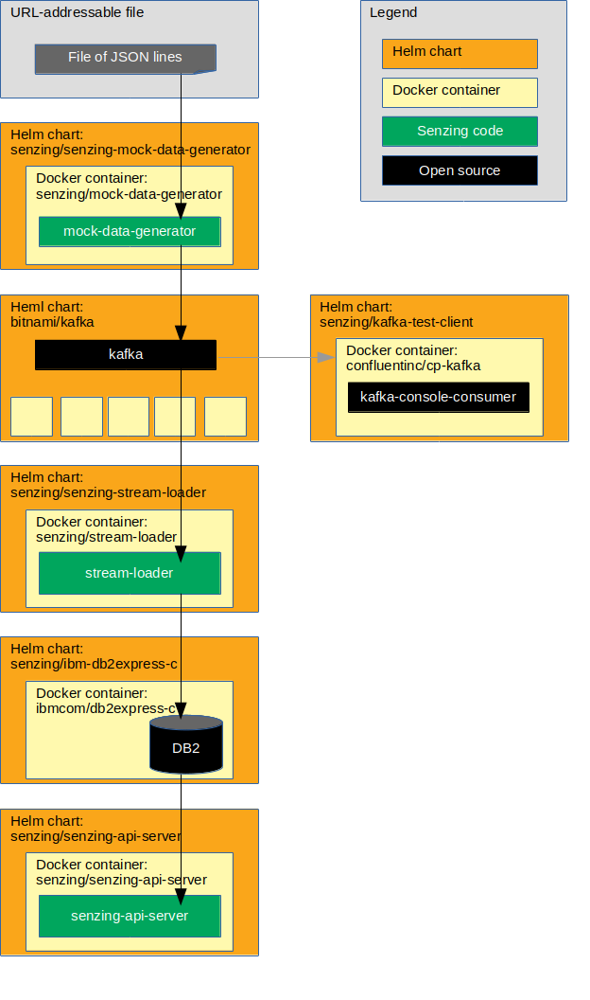

# kubernetes-helm-db2-demo

## Overview

This repository illustrates a reference implementation of Senzing using IBM DB2 as the underlying database.

The instructions show how to set up a system that:

1. Reads JSON lines from a file on the internet.
1. Sends each JSON line as a message to a Kafka topic.
1. Reads messages from the Kafka topic and inserts into Senzing.
    1. In this implementation, Senzing keeps its data in an IBM Db2 database.
1. Reads information from Senzing via [Senzing REST API](https://github.com/Senzing/senzing-rest-api) server.

The following diagram shows the relationship of the Helm charts, docker containers, and code in this Kubernetes demonstration.



### Contents

1. [Expectations](#expectations)
    1. [Space](#space)
    1. [Time](#time)
    1. [Background knowledge](#background-knowledge)
1. [Prerequisites](#prerequisites)
    1. [Prerequisite software](#prerequisite-software)
    1. [Clone repository](#clone-repository)
    1. [Docker images](#docker-images)
1. [Demonstrate](#demonstrate)
    1. [Set environment variables](#set-environment-variables)
    1. [Create custom helm values files](#create-custom-helm-values-files)
    1. [Create custom kubernetes configuration files](#create-custom-kubernetes-configuration-files)
    1. [Create namespace](#create-namespace)
    1. [Create persistent volume](#create-persistent-volume)
    1. [Add helm repositories](#add-helm-repositories)
    1. [Deploy Senzing_API.tgz package](#deploy-senzing_apitgz-package)
    1. [Install senzing-debug Helm chart](#install-senzing-debug-helm-chart)
    1. [Install DB2 Helm chart](#install-db2-helm-chart)
    1. [Initialize database](#initialize-database)
    1. [Install Kafka Helm chart](#install-kafka-helm-chart)
    1. [Install Kafka test client](#install-kafka-test-client)
    1. [Install mock-data-generator Helm chart](#install-mock-data-generator-helm-chart)
    1. [Install stream-loader Helm chart](#install-stream-loader-helm-chart)
    1. [Install senzing-api-server Helm chart](#install-senzing-api-server-helm-chart)
    1. [Test Senzing REST API server](#test-senzing-rest-api-server)
1. [Cleanup](#cleanup)
    1. [Delete everything in project](#delete-everything-in-project)
    1. [Delete minikube cluster](#delete-minikube-cluster)

## Expectations

### Space

This repository and demonstration require 20 GB free disk space.

### Time

Budget 4 hours to get the demonstration up-and-running, depending on CPU and network speeds.

### Background knowledge

This repository assumes a working knowledge of:

1. [Docker](https://github.com/Senzing/knowledge-base/blob/master/WHATIS/docker.md)
1. [Kubernetes](https://github.com/Senzing/knowledge-base/blob/master/WHATIS/kubernetes.md)
1. [Helm](https://github.com/Senzing/knowledge-base/blob/master/WHATIS/helm.md)

## Prerequisites

### Prerequisite software

#### kubectl

1. [Install kubectl](https://github.com/Senzing/knowledge-base/blob/master/HOWTO/install-kubectl.md).

#### minikube cluster

1. [Install minikube](https://github.com/Senzing/knowledge-base/blob/master/HOWTO/install-minikube.md).
1. [Start cluster](https://docs.bitnami.com/kubernetes/get-started-kubernetes/#overview)

    ```console
    minikube start --cpus 4 --memory 8192
    ```

    Alternative:

    ```console
    minikube start --cpus 4 --memory 8192 --vm-driver kvm2
    ```

#### Helm/Tiller

1. [Install Helm](https://github.com/Senzing/knowledge-base/blob/master/HOWTO/install-helm.md) on your local workstation.
1. [Install Tiller](https://github.com/Senzing/knowledge-base/blob/master/HOWTO/install-tiller.md) in the minikube cluster.

### Clone repository

The Git repository has files that will be used in the `helm install --values` parameter.

1. Using these environment variable values:

    ```console
    export GIT_ACCOUNT=senzing
    export GIT_REPOSITORY=kubernetes-demo
    ```

1. Follow steps in [clone-repository](https://github.com/Senzing/knowledge-base/blob/master/HOWTO/clone-repository.md) to install the Git repository.

1. After the Git repository has been cloned, be sure the following environment variables are set:

    ```console
    export GIT_ACCOUNT_DIR=~/${GIT_ACCOUNT}.git
    export GIT_REPOSITORY_DIR="${GIT_ACCOUNT_DIR}/${GIT_REPOSITORY}"
    ```

### Docker images

1. **FIXME:**  Describe how to accept terms and conditions for the senzing/senzing-package docker image.

#### Senzing docker images

1. In a new terminal window, build [senzing/senzing-package](https://github.com/Senzing/senzing-package) docker image.

#### Docker registry

1. If you need to create a private docker registry, see
       [HOWTO - Install docker registry server](https://github.com/Senzing/knowledge-base/blob/master/HOWTO/install-docker-registry-server.md).

1. Set environment variable. Example:

    ```console
    export DOCKER_REGISTRY_URL=my.docker-registry.com:5000
    ```

1. Add Senzing docker images to private docker registry.

    ```console
    export DOCKER_IMAGES=( \
      "senzing/senzing-package" \
    )

    for DOCKER_IMAGE in ${DOCKER_IMAGES[@]};\
    do \
      sudo docker tag  ${DOCKER_IMAGE} ${DOCKER_REGISTRY_URL}/${DOCKER_IMAGE}; \
      sudo docker push ${DOCKER_REGISTRY_URL}/${DOCKER_IMAGE}; \
      sudo docker rmi  ${DOCKER_REGISTRY_URL}/${DOCKER_IMAGE}; \
    done
    ```

## Demonstrate

### Set environment variables

1. Environment variables that need customization.  Example:

    ```console
    export DEMO_PREFIX=my
    export DEMO_NAMESPACE=${DEMO_PREFIX}-namespace

    export DOCKER_REGISTRY_URL=my.docker-registry.com:5000
    ```

1. Set environment variables listed in "[Clone repository](#clone-repository)".

### Create custom helm values files

1. Variation #1. Quick method using `envsubst`.

    ```console
    export HELM_VALUES_DIR=${GIT_REPOSITORY_DIR}/helm-values
    mkdir -p ${HELM_VALUES_DIR}

    for file in ${GIT_REPOSITORY_DIR}/helm-values-templates/*.yaml; \
    do \
      envsubst < "${file}" > "${HELM_VALUES_DIR}/$(basename ${file})";
    done
    ```

1. Variation #2. Copy and modify.

    ```console
    export HELM_VALUES_DIR=${GIT_REPOSITORY_DIR}/helm-values
    mkdir -p ${HELM_VALUES_DIR}

    cp ${GIT_REPOSITORY_DIR}/helm-values-templates/* ${HELM_VALUES_DIR}
    ```

    Edit files in ${HELM_VALUES_DIR} replacing the following variables with actual values.

    1. `${DEMO_PREFIX}`
    1. `${DEMO_NAMESPACE}`

### Create custom kubernetes configuration files

1. Variation #1. Quick method using `envsubst`.

    ```console
    export KUBERNETES_DIR=${GIT_REPOSITORY_DIR}/kubernetes
    mkdir -p ${KUBERNETES_DIR}

    for file in ${GIT_REPOSITORY_DIR}/kubernetes-templates/*; \
    do \
      envsubst < "${file}" > "${KUBERNETES_DIR}/$(basename ${file})";
    done
    ```

1. Variation #2. Copy and modify.

    ```console
    export KUBERNETES_DIR=${GIT_REPOSITORY_DIR}/kubernetes
    mkdir -p ${KUBERNETES_DIR}

    cp ${GIT_REPOSITORY_DIR}/kubernetes-templates/* ${KUBERNETES_DIR}
    ```

    Edit files in ${KUBERNETES_DIR} replacing the following variables with actual values.

    1. `${DEMO_PREFIX}`
    1. `${DEMO_NAMESPACE}`

### Create namespace

1. Create namespace.

    ```console
    kubectl create -f ${KUBERNETES_DIR}/namespace.yaml
    ```

1. Review namespaces.

    ```console
    kubectl get namespaces
    ```

### Create persistent volume

1. Create persistent volumes.  Example:

    ```console
    kubectl create -f ${KUBERNETES_DIR}/persistent-volume-opt-senzing.yaml
    ```

1. Create persistent volume claims. Example:

    ```console
    kubectl create -f ${KUBERNETES_DIR}/persistent-volume-claim-opt-senzing.yaml
    ```

1. Review persistent volumes and claims.

    ```console
    kubectl get persistentvolumes \
      --namespace ${DEMO_NAMESPACE}

    kubectl get persistentvolumeClaims \
      --namespace ${DEMO_NAMESPACE}
    ```

### Add helm repositories

1. Add Bitnami repository. Example:

    ```console
    helm repo add bitnami https://charts.bitnami.com
    ```

1. Add Senzing repository.  Example:

    ```console
    helm repo add senzing https://senzing.github.io/charts/
    ```

1. Update repositories.

    ```console
    helm repo update
    ```

1. Review repositories

    ```console
    helm repo list
    ```

1. Reference: [helm repo](https://helm.sh/docs/helm/#helm-repo)

### Deploy Senzing_API.tgz package

1. Example:

    ```console
    helm install \
      --name ${DEMO_PREFIX}-senzing-package \
      --namespace ${DEMO_NAMESPACE} \
      --values ${HELM_VALUES_DIR}/senzing-package.yaml \
      senzing/senzing-package
    ```

1. Wait until Job has completed.  Example:

    ```console
    kubectl get pods \
      --namespace ${DEMO_NAMESPACE} \
      --watch
    ```

1. Example of completion:

    ```console
    NAME                       READY   STATUS      RESTARTS   AGE
    my-senzing-package-8n2ql   0/1     Completed   0          2m44s
    ```

### Install senzing-debug Helm chart

This deployment will be used later to:
    * Inspect the `/opt/senzing` volume
    * Copy files onto the Persistent Volume
    * Debug issues

1. Install chart.  Example:

    ```console
    helm install \
      --name ${DEMO_PREFIX}-senzing-debug \
      --namespace ${DEMO_NAMESPACE} \
      --values ${GIT_REPOSITORY_DIR}/helm-values/senzing-debug-db2.yaml \
       senzing/senzing-debug
    ```

1. Log into debug pod. Run in a separate terminal window. Example:

    ```console
    export DEMO_PREFIX=my
    export DEMO_NAMESPACE=${DEMO_PREFIX}-namespace

    export DEBUG_POD_NAME=$(kubectl get pods \
      --namespace ${DEMO_NAMESPACE} \
      --output jsonpath="{.items[0].metadata.name}" \
      --selector "app.kubernetes.io/name=senzing-debug, \
                  app.kubernetes.io/instance=${DEMO_PREFIX}-senzing-debug" \
      )

    kubectl exec -it --namespace ${DEMO_NAMESPACE} ${DEBUG_POD_NAME} -- /bin/bash
    ```

### Install DB2 Helm chart

1. Install IBM DB2 Express-C.  Example:

    ```console
    helm install \
      --name ${DEMO_PREFIX}-ibm-db2express-c \
      --namespace ${DEMO_NAMESPACE} \
      --values ${HELM_VALUES_DIR}/ibm-db2express-c.yaml \
      senzing/ibm-db2express-c
    ```

1. Wait for pod to run. Example:

    ```console
    kubectl get pods \
      --namespace ${DEMO_NAMESPACE} \
      --watch
    ```

1. Example of pod running:

    ```console
    NAME                                   READY   STATUS      RESTARTS   AGE
    my-ibm-db2express-c-6bf64cbbdf-25gtb   1/1     Running     0          10m
    ```

### Initialize database

1. Log into the IBM DB2 Express-C container.  Example:

    ```console
    export DEMO_PREFIX=my
    export DEMO_NAMESPACE=${DEMO_PREFIX}-namespace

    export DATABASE_POD_NAME=$(kubectl get pods \
      --namespace ${DEMO_NAMESPACE} \
      --output jsonpath="{.items[0].metadata.name}" \
      --selector "app.kubernetes.io/name=ibm-db2express-c, \
                  app.kubernetes.io/instance=${DEMO_PREFIX}-ibm-db2express-c" \
      )

    kubectl exec -it --namespace ${DEMO_NAMESPACE} ${DATABASE_POD_NAME} -- /bin/bash
    ```

1. In the IBM DB2 Express-C container, run the following:

    ```console
    su - db2inst1
    db2 create database g2 using codeset utf-8 territory us
    db2 connect to g2
    db2 -tf /opt/senzing/g2/data/g2core-schema-db2-create.sql
    db2 connect reset
    exit
    exit
    ```

### Install Kafka Helm chart

1. Example:

    ```console
    helm install \
      --name ${DEMO_PREFIX}-kafka \
      --namespace ${DEMO_NAMESPACE} \
      --values ${HELM_VALUES_DIR}/kafka.yaml \
      bitnami/kafka
    ```

### Install Kafka test client

1. Install Kafka test client app. Example:

    ```console
    helm install \
      --name ${DEMO_PREFIX}-kafka-test-client \
      --namespace ${DEMO_NAMESPACE} \
      --values ${HELM_VALUES_DIR}/kafka-test-client.yaml \
      senzing/kafka-test-client
    ```

1. Wait for pods to run. Example:

    ```console
    kubectl get pods \
      --namespace ${DEMO_NAMESPACE} \
      --watch
    ```

1. Example of pods running:

    ```console
    NAME                                    READY   STATUS      RESTARTS   AGE
    my-kafka-0                              1/1     Running     0          9m13s
    my-kafka-test-client-854ff84955-dnjb6   1/1     Running     0          8m59s
    my-kafka-zookeeper-0                    1/1     Running     0          9m13s
    ```

1. Run the test client. Run in a separate terminal window. Example:

    ```console
    export DEMO_PREFIX=my
    export DEMO_NAMESPACE=${DEMO_PREFIX}-namespace

    export KAFKA_TEST_POD_NAME=$(kubectl get pods \
      --namespace ${DEMO_NAMESPACE} \
      --output jsonpath="{.items[0].metadata.name}" \
      --selector "app.kubernetes.io/name=kafka-test-client, \
                  app.kubernetes.io/instance=${DEMO_PREFIX}-kafka-test-client" \
      )

    kubectl exec \
      -it \
      --namespace ${DEMO_NAMESPACE} \
      ${KAFKA_TEST_POD_NAME} -- /usr/bin/kafka-console-consumer \
        --bootstrap-server ${DEMO_PREFIX}-kafka:9092 \
        --topic senzing-kafka-topic \
        --from-beginning
    ```  

### Install mock-data-generator Helm chart

1. Example:

    ```console
    helm install \
      --name ${DEMO_PREFIX}-senzing-mock-data-generator \
      --namespace ${DEMO_NAMESPACE} \
      --values ${HELM_VALUES_DIR}/mock-data-generator.yaml \
      senzing/senzing-mock-data-generator
    ```

### Install stream-loader Helm chart

1. Example:

    ```console
    helm install \
      --name ${DEMO_PREFIX}-senzing-stream-loader \
      --namespace ${DEMO_NAMESPACE} \
      --values ${HELM_VALUES_DIR}/stream-loader-db2.yaml \
      senzing/senzing-stream-loader
    ```

### Install senzing-api-server Helm chart

1. Example:

    ```console
    helm install \
      --name ${DEMO_PREFIX}-senzing-api-server \
      --namespace ${DEMO_NAMESPACE} \
      --values ${HELM_VALUES_DIR}/senzing-api-server-db2.yaml \
      senzing/senzing-api-server
    ```

1. Wait for pods to run. Example:

    ```console
    kubectl get pods \
      --namespace ${DEMO_NAMESPACE} \
      --watch
    ```

1. Port forward to local machine.  Run in a separate terminal window. Example:

    ```console
    export DEMO_PREFIX=my
    export DEMO_NAMESPACE=${DEMO_PREFIX}-namespace

    kubectl port-forward \
      --address 0.0.0.0 \
      --namespace ${DEMO_NAMESPACE} \
      svc/${DEMO_PREFIX}-senzing-api-server 8889:80
    ```

### Test Senzing REST API server

*Note:* port 8889 on the localhost has been mapped to port 80 in the docker container.
See `kubectl port-forward ...` above.

1. Example:

    ```console
    export SENZING_API_SERVICE=http://localhost:8889

    curl -X GET ${SENZING_API_SERVICE}/heartbeat
    curl -X GET ${SENZING_API_SERVICE}/license
    curl -X GET ${SENZING_API_SERVICE}/entities/1
    ```

## Cleanup

### Delete everything in project

1. Example:

    ```console
    helm delete --purge ${DEMO_PREFIX}-senzing-api-server
    helm delete --purge ${DEMO_PREFIX}-senzing-stream-loader
    helm delete --purge ${DEMO_PREFIX}-senzing-mock-data-generator
    helm delete --purge ${DEMO_PREFIX}-kafka-test-client
    helm delete --purge ${DEMO_PREFIX}-kafka
    helm delete --purge ${DEMO_PREFIX}-ibm-db2express-c
    helm delete --purge ${DEMO_PREFIX}-senzing-debug
    helm delete --purge ${DEMO_PREFIX}-senzing-package
    helm repo remove senzing
    helm repo remove bitnami
    kubectl delete -f ${KUBERNETES_DIR}/persistent-volume-claim-opt-senzing.yaml
    kubectl delete -f ${KUBERNETES_DIR}/persistent-volume-opt-senzing.yaml
    kubectl delete -f ${KUBERNETES_DIR}/namespace.yaml
    ```

### Delete minikube cluster

1. Example:

    ```console
    minikube stop
    minikube delete
    ```
