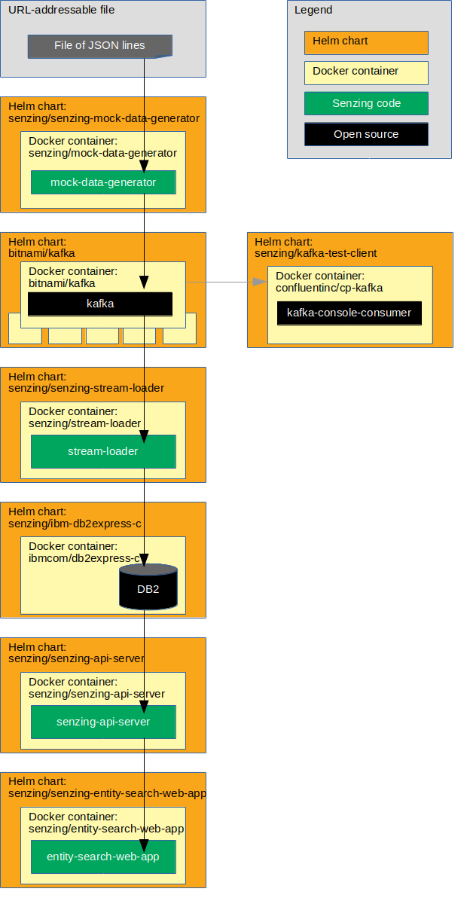

# kubernetes-demo-helm-kafka-db2

## Synopsis

Using `minikube`, bring up a Senzing stack on Kubernetes
using Helm, Kafka, and a Db2 database.

## Overview

This repository illustrates a reference implementation of Senzing using
IBM's Db2 as the underlying database.

The instructions show how to set up a system that:

1. Reads JSON lines from a file on the internet.
1. Sends each JSON line to a message queue.
    1. In this implementation, the queue is Kafka.
1. Reads messages from the queue and inserts into Senzing.
    1. In this implementation, Senzing keeps its data in an IBM Db2 database.
1. Reads information from Senzing via [Senzing API Server](https://github.com/Senzing/senzing-api-server) server.
1. Views resolved entities in a [web app](https://github.com/Senzing/entity-search-web-app).

The following diagram shows the relationship of the Helm charts, docker containers, and code in this Kubernetes demonstration.



### Contents

1. [Expectations](#expectations)
1. [Prerequisites](#prerequisites)
    1. [Prerequisite software](#prerequisite-software)
    1. [Clone repository](#clone-repository)
1. [Demonstrate](#demonstrate)
    1. [EULA](#eula)
    1. [Set environment variables](#set-environment-variables)
    1. [Create custom helm values files](#create-custom-helm-values-files)
    1. [Create custom kubernetes configuration files](#create-custom-kubernetes-configuration-files)
    1. [Create namespace](#create-namespace)
    1. [Create persistent volume](#create-persistent-volume)
    1. [Add helm repositories](#add-helm-repositories)
    1. [Deploy Senzing RPM](#deploy-senzing-rpm)
    1. [Install senzing-console Helm chart](#install-senzing-console-helm-chart)
    1. [Install IBM Db2 Driver](#install-ibm-db2-driver)
    1. [Install DB2 Helm chart](#install-db2-helm-chart)
    1. [Install Kafka Helm chart](#install-kafka-helm-chart)
    1. [Install Kafka test client](#install-kafka-test-client)
    1. [Install stream-producer Helm chart](#install-stream-producer-helm-chart)
    1. [Install init-container Helm chart](#install-init-container-helm-chart)
    1. [Install stream-loader Helm chart](#install-stream-loader-helm-chart)
    1. [Install senzing-api-server Helm chart](#install-senzing-api-server-helm-chart)
    1. [Install senzing-entity-search-web-app Helm chart](#install-senzing-entity-search-web-app-helm-chart)
    1. [Optional charts](#optional-charts)
        1. [Install senzing-redoer Helm chart](#install-senzing-redoer-helm-chart)
        1. [Install configurator Helm chart](#install-configurator-helm-chart)
    1. [View data](#view-data)
        1. [View Senzing Console pod](#view-senzing-console-pod)
        1. [View Kafka](#view-kafka)
        1. [View Senzing API Server](#view-senzing-api-server)
        1. [View Senzing Entity Search WebApp](#view-senzing-entity-search-webapp)
        1. [View Senzing Configurator](#view-senzing-configurator)
1. [Cleanup](#cleanup)
    1. [Delete everything in project](#delete-everything-in-project)
    1. [Delete minikube cluster](#delete-minikube-cluster)

## Preamble

At [Senzing](http://senzing.com),
we strive to create GitHub documentation in a
"[don't make me think](https://github.com/Senzing/knowledge-base/blob/master/WHATIS/dont-make-me-think.md)" style.
For the most part, instructions are copy and paste.
Whenever thinking is needed, it's marked with a "thinking" icon :thinking:.
Whenever customization is needed, it's marked with a "pencil" icon :pencil2:.
If the instructions are not clear, please let us know by opening a new
[Documentation issue](https://github.com/Senzing/template-python/issues/new?template=documentation_request.md)
describing where we can improve.   Now on with the show...

### Legend

1. :thinking: - A "thinker" icon means that a little extra thinking may be required.
   Perhaps you'll need to make some choices.
   Perhaps it's an optional step.
1. :pencil2: - A "pencil" icon means that the instructions may need modification before performing.
1. :warning: - A "warning" icon means that something tricky is happening, so pay attention.

## Related artifacts

1. [DockerHub](https://hub.docker.com/r/senzing)
1. [Helm Charts](https://github.com/Senzing/charts)

## Expectations

- **Space:** This repository and demonstration require 20 GB free disk space.
- **Time:** Budget 4 hours to get the demonstration up-and-running, depending on CPU and network speeds.
- **Background knowledge:** This repository assumes a working knowledge of:
  - [Docker](https://github.com/Senzing/knowledge-base/blob/master/WHATIS/docker.md)
  - [Kubernetes](https://github.com/Senzing/knowledge-base/blob/master/WHATIS/kubernetes.md)
  - [Helm](https://github.com/Senzing/knowledge-base/blob/master/WHATIS/helm.md)

## Prerequisites

### Prerequisite software

1. [minikube](https://github.com/Senzing/knowledge-base/blob/master/HOWTO/install-minikube.md)
1. [kubectl](https://github.com/Senzing/knowledge-base/blob/master/HOWTO/install-kubectl.md)
1. [Helm 3](https://github.com/Senzing/knowledge-base/blob/master/HOWTO/install-helm.md)

### Clone repository

The Git repository has files that will be used in the `helm install --values` parameter.

1. Using these environment variable values:

    ```console
    export GIT_ACCOUNT=senzing
    export GIT_REPOSITORY=kubernetes-demo
    export GIT_ACCOUNT_DIR=~/${GIT_ACCOUNT}.git
    export GIT_REPOSITORY_DIR="${GIT_ACCOUNT_DIR}/${GIT_REPOSITORY}"
    ```

1. Follow steps in [clone-repository](https://github.com/Senzing/knowledge-base/blob/master/HOWTO/clone-repository.md) to install the Git repository.

## Demonstrate

### Start minikube cluster

1. [Start cluster](https://docs.bitnami.com/kubernetes/get-started-kubernetes/#overview).
   Example:

    ```console
    minikube start --cpus 4 --memory 8192 --disk-size=50g
    ```

### EULA

To use the Senzing code, you must agree to the End User License Agreement (EULA).

1. :warning: This step is intentionally tricky and not simply copy/paste.
   This ensures that you make a conscious effort to accept the EULA.
   Example:

    <pre>export SENZING_ACCEPT_EULA="&lt;the value from <a href="https://github.com/Senzing/knowledge-base/blob/master/lists/environment-variables.md#senzing_accept_eula">this link</a>&gt;"</pre>

### Set environment variables

1. Set environment variables listed in "[Clone repository](#clone-repository)".

1. :pencil2: Environment variables that can be customized.
   Example:

    ```console
    export DEMO_PREFIX=my
    export DEMO_NAMESPACE=${DEMO_PREFIX}-namespace
    ```

1. Retrieve latest docker image version numbers and set their environment variables.
   Example:

    ```console
    curl -X GET \
      --output ${GIT_REPOSITORY_DIR}/bin/docker-versions-latest.sh \
      https://raw.githubusercontent.com/Senzing/knowledge-base/master/lists/docker-versions-latest.sh

    source ${GIT_REPOSITORY_DIR}/bin/docker-versions-latest.sh
    ```

1. Retrieve latest Senzing version numbers and set their environment variables.
   Example:

    ```console
    curl -X GET \
      --output ${GIT_REPOSITORY_DIR}/bin/senzing-versions-latest.sh \
      https://raw.githubusercontent.com/Senzing/knowledge-base/master/lists/senzing-versions-latest.sh

    source ${GIT_REPOSITORY_DIR}/bin/senzing-versions-latest.sh
    ```

### Identify Docker registry

:thinking: There are 3 options when it comes to using a docker registry.  Choose one:

1. [Use public registry](#use-public-registry)
1. [Use private registry](#use-private-registry)
1. [Use minikube registry](#use-minikube-registry)

#### Use public registry

_Method #1:_ Pulls docker images from public internet registry.

1. Use the default public `docker.io` registry which pulls images from
   [hub.docker.com](https://hub.docker.com/).
   Example:

    ```console
    export DOCKER_REGISTRY_URL=docker.io
    export DOCKER_REGISTRY_SECRET=${DOCKER_REGISTRY_URL}-secret
    ```

#### Use private registry

_Method #2:_ Pulls docker images from private registry.

1. :pencil2: Specify a private registry.
   Example:

    ```console
    export DOCKER_REGISTRY_URL=my.example.com:5000
    export DOCKER_REGISTRY_SECRET=${DOCKER_REGISTRY_URL}-secret
    export SENZING_SUDO=sudo
    ${GIT_REPOSITORY_DIR}/bin/populate-private-registry.sh
    ```

#### Use minikube registry

_Method #3:_ Pulls docker images from minikube's registry.

1. Use minikube's docker registry.
   Example:

    ```console
    minikube addons enable registry
    export DOCKER_REGISTRY_URL=docker.io
    export DOCKER_REGISTRY_SECRET=${DOCKER_REGISTRY_URL}-secret
    ${GIT_REPOSITORY_DIR}/bin/populate-minikube-registry.sh
    ```

### Create custom helm values files

:thinking: In this step, Helm template files are populated with actual values.
There are two methods of accomplishing this.
Only one method needs to be performed.

1. **Method #1:** Quick method using `envsubst`.
   Example:

    ```console
    export HELM_VALUES_DIR=${GIT_REPOSITORY_DIR}/helm-values
    mkdir -p ${HELM_VALUES_DIR}

    for file in ${GIT_REPOSITORY_DIR}/helm-values-templates/*.yaml; \
    do \
      envsubst < "${file}" > "${HELM_VALUES_DIR}/$(basename ${file})";
    done
    ```

1. **Method #2:** Copy and manually modify files method.
   Example:

    ```console
    export HELM_VALUES_DIR=${GIT_REPOSITORY_DIR}/helm-values
    mkdir -p ${HELM_VALUES_DIR}

    cp ${GIT_REPOSITORY_DIR}/helm-values-templates/* ${HELM_VALUES_DIR}
    ```

    :pencil2: Edit files in ${HELM_VALUES_DIR} replacing the following variables with actual values.

    1. `${DEMO_PREFIX}`
    1. `${DOCKER_REGISTRY_SECRET}`
    1. `${DOCKER_REGISTRY_URL}`
    1. `${SENZING_ACCEPT_EULA}`

### Create custom kubernetes configuration files

:thinking: In this step, Kubernetes template files are populated with actual values.
There are two methods of accomplishing this.
Only one method needs to be performed.

1. **Method #1:** Quick method using `envsubst`.
   Example:

    ```console
    export KUBERNETES_DIR=${GIT_REPOSITORY_DIR}/kubernetes
    mkdir -p ${KUBERNETES_DIR}

    for file in ${GIT_REPOSITORY_DIR}/kubernetes-templates/*; \
    do \
      envsubst < "${file}" > "${KUBERNETES_DIR}/$(basename ${file})";
    done
    ```

1. **Method #2:** Copy and manually modify files method.
   Example:

    ```console
    export KUBERNETES_DIR=${GIT_REPOSITORY_DIR}/kubernetes
    mkdir -p ${KUBERNETES_DIR}

    cp ${GIT_REPOSITORY_DIR}/kubernetes-templates/* ${KUBERNETES_DIR}
    ```

    :pencil2: Edit files in ${KUBERNETES_DIR} replacing the following variables with actual values.

    1. `${DEMO_NAMESPACE}`

### Create namespace

1. Create namespace.
   Example:

    ```console
    kubectl create -f ${KUBERNETES_DIR}/namespace.yaml
    ```

1. :thinking: **Optional:**
   Review namespaces.

    ```console
    kubectl get namespaces
    ```

### Create persistent volume

1. Create persistent volumes.
   Example:

    ```console
    kubectl create -f ${KUBERNETES_DIR}/persistent-volume-db2.yaml
    kubectl create -f ${KUBERNETES_DIR}/persistent-volume-senzing.yaml
    ```

1. Create persistent volume claims.
   Example:

    ```console
    kubectl create -f ${KUBERNETES_DIR}/persistent-volume-claim-db2.yaml
    kubectl create -f ${KUBERNETES_DIR}/persistent-volume-claim-senzing.yaml
    ```

1. :thinking: **Optional:**
   Review persistent volumes and claims.

    ```console
    kubectl get persistentvolumes \
      --namespace ${DEMO_NAMESPACE}

    kubectl get persistentvolumeClaims \
      --namespace ${DEMO_NAMESPACE}
    ```

### Add helm repositories

1. Add Bitnami repository.
   Example:

    ```console
    helm repo add bitnami https://charts.bitnami.com/bitnami
    ```

1. Add Senzing repository.
   Example:

    ```console
    helm repo add senzing https://hub.senzing.com/charts/
    ```

1. Update repositories.
   Example:

    ```console
    helm repo update
    ```

1. :thinking: **Optional:**
   Review repositories.
   Example:

    ```console
    helm repo list
    ```

1. Reference: [helm repo](https://helm.sh/docs/helm/#helm-repo)

### Deploy Senzing RPM

:thinking: This deployment initializes the Persistent Volume with Senzing code and data.

There are 3 options when it comes to initializing the Persistent Volume with Senzing code and data.
Choose one:

1. [Root container method](#root-container-method) - but requires a root container
1. [Non-root container method](#non-root-container-method) - can be done on kubernetes with a non-root container
1. [yum localinstall method](#yum-localinstall-method) - Uses existing Senzing RPMs, so no downloading during installation.

#### Root container method

_Method #1:_ This method is simpler, but requires a root container.

1. Install chart.
   Example:

    ```console
    helm install \
      ${DEMO_PREFIX}-senzing-yum \
      senzing/senzing-yum \
      --namespace ${DEMO_NAMESPACE} \
      --values ${HELM_VALUES_DIR}/senzing-yum.yaml
    ```

1. Wait until Job has completed.
   Example:

    ```console
    kubectl get pods \
      --namespace ${DEMO_NAMESPACE} \
      --watch
    ```

1. Example of completion:

    ```console
    NAME                       READY   STATUS      RESTARTS   AGE
    my-senzing-yum-8n2ql       0/1     Completed   0          2m44s
    ```

#### Non-root container method

_Method #2:_ This method can be done on kubernetes with a non-root container.

1. Install chart with non-root container.
   This pod will be the recipient of a `docker cp` command.
   Example:

    ```console
    helm install \
      name ${DEMO_PREFIX}-senzing-base \
      senzing/senzing-base \
      --namespace ${DEMO_NAMESPACE} \
      --values ${GIT_REPOSITORY_DIR}/helm-values/senzing-base.yaml
    ```

1. The following instructions are done on a non-kubernetes machine which allows root docker containers.
   Example:  a personal laptop.

1. :pencil2: Set environment variables.
   **Note:** See [SENZING_ACCEPT_EULA](https://github.com/Senzing/knowledge-base/blob/master/lists/environment-variables.md#senzing_accept_eula) for correct value.
   Example:

    ```console
    export DEMO_PREFIX=my
    export DEMO_NAMESPACE=${DEMO_PREFIX}-namespace

    export SENZING_ACCEPT_EULA=put-in-correct-value
    export SENZING_VOLUME=/opt/my-senzing

    export SENZING_DATA_DIR=${SENZING_VOLUME}/data
    export SENZING_G2_DIR=${SENZING_VOLUME}/g2
    export SENZING_ETC_DIR=${SENZING_VOLUME}/etc
    export SENZING_VAR_DIR=${SENZING_VOLUME}/var
    ```

1. Run docker image.
   Example:

    ```console
    sudo docker run \
      --env SENZING_ACCEPT_EULA=${SENZING_ACCEPT_EULA} \
      --rm \
      --volume ${SENZING_DATA_DIR}:/opt/senzing/data \
      --volume ${SENZING_G2_DIR}:/opt/senzing/g2 \
      --volume ${SENZING_ETC_DIR}:/etc/opt/senzing \
      --volume ${SENZING_VAR_DIR}:/var/opt/senzing \
      senzing/yum
    ```

1. Copy files from local machine to `senzing-base` pod.
   Example:

    ```console
    export SENZING_BASE_POD_NAME=$(kubectl get pods \
      --namespace ${DEMO_NAMESPACE} \
      --output jsonpath="{.items[0].metadata.name}" \
      --selector "app.kubernetes.io/name=senzing-base, \
                  app.kubernetes.io/instance=${DEMO_PREFIX}-senzing-base" \
      )

    kubectl cp ${SENZING_DATA_DIR} ${DEMO_NAMESPACE}/${SENZING_BASE_POD_NAME}:/opt/senzing/senzing-data
    kubectl cp ${SENZING_G2_DIR}   ${DEMO_NAMESPACE}/${SENZING_BASE_POD_NAME}:/opt/senzing/senzing-g2
    kubectl cp ${SENZING_ETC_DIR}  ${DEMO_NAMESPACE}/${SENZING_BASE_POD_NAME}:/opt/senzing/senzing-etc
    kubectl cp ${SENZING_VAR_DIR}  ${DEMO_NAMESPACE}/${SENZING_BASE_POD_NAME}:/opt/senzing/senzing-var
    ```

#### yum localinstall method

_Method #3:_ This method inserts the Senzing RPMs into the minikube environment for a `yum localinstall`.
The advantage of this method is that the Senzing RPMs are not downloaded from the internet during installation.

1. :pencil2: Identify a directory to store downloaded files.
   Example:

    ```console
    export DOWNLOAD_DIR=~/Downloads
    ```

1. Download Senzing RPMs.
   Example:

    ```console
    docker run \
      --rm \
      --volume ${DOWNLOAD_DIR}:/download \
      senzing/yumdownloader \
         senzingapi-${SENZING_VERSION_SENZINGAPI_BUILD} \
         senzingdata-v2-${SENZING_VERSION_SENZINGDATA_BUILD}
    ```

1. Copy files into minikube.
   Example:

    ```console
    scp -i $(minikube ssh-key) \
        ${DOWNLOAD_DIR}/${SENZING_VERSION_SENZINGAPI_RPM_FILENAME} \
        docker@$(minikube ip):/home/docker

    scp -i $(minikube ssh-key) \
        ${DOWNLOAD_DIR}/${SENZING_VERSION_SENZINGDATA_RPM_FILENAME} \
        docker@$(minikube ip):/home/docker
    ```

1. Log into `minikube` instance.
   Example:

    ```console
    minikube ssh
    ```

1. In the `minikube` instance, move files to `/mnt/vda1/senzing/senzing-rpms`.
   Example:

    ```console
    sudo mkdir -p /mnt/vda1/senzing/senzing-rpms
    sudo mv /home/docker/senzingdata* /mnt/vda1/senzing/senzing-rpms
    sudo mv /home/docker/senzingapi* /mnt/vda1/senzing/senzing-rpms
    exit
    ```

1. Install chart to perform `yum localinstall`.
   Example:

    ```console
    helm install \
      ${DEMO_PREFIX}-senzing-yum \
      senzing/senzing-yum \
      --namespace ${DEMO_NAMESPACE} \
      --values ${HELM_VALUES_DIR}/senzing-yum-localinstall.yaml
    ```

1. Wait until Job has completed.
   Example:

    ```console
    kubectl get pods \
      --namespace ${DEMO_NAMESPACE} \
      --watch
    ```

1. Example of completion:

    ```console
    NAME                       READY   STATUS      RESTARTS   AGE
    my-senzing-yum-8n2ql       0/1     Completed   0          2m44s
    ```

### Install senzing-console Helm chart

This deployment will be used later to:

- Inspect mounted volumes
- Debug issues

1. Install chart.
   Example:

    ```console
    helm install \
      ${DEMO_PREFIX}-senzing-console \
      senzing/senzing-console \
      --namespace ${DEMO_NAMESPACE} \
      --values ${GIT_REPOSITORY_DIR}/helm-values/senzing-console-db2.yaml
    ```

1. To use senzing-console pod, see [View Senzing Console pod](#view-senzing-console-pod).

### Install IBM Db2 Driver

This step adds the IBM Db2 Client driver code.

1. Install chart.
   Example:

    ```console
    helm install \
      ${DEMO_PREFIX}-ibm-db2-driver-installer \
      senzing/ibm-db2-driver-installer \
      --namespace ${DEMO_NAMESPACE} \
      --values ${HELM_VALUES_DIR}/ibm-db2-driver-installer.yaml
    ```

1. Wait until Jobs have completed.
   Example:

    ```console
    kubectl get pods \
      --namespace ${DEMO_NAMESPACE} \
      --watch
    ```

1. Example of completion:

    ```console
    NAME                               READY  STATUS     RESTARTS  AGE
    my-senzing-yum-8n2ql               0/1    Completed  0         2m44s
    my-ibm-db2-driver-installer-z8d45  0/1    Completed  0         1m35s
    ```

### Install Db2 Helm chart

This step starts IBM Db2 database and populates the database with the Senzing schema.

1. Install chart.
   Example:

    ```console
    helm install \
      ${DEMO_PREFIX}-senzing-ibm-db2 \
      senzing/senzing-ibm-db2 \
      --namespace ${DEMO_NAMESPACE} \
      --values ${HELM_VALUES_DIR}/senzing-ibm-db2.yaml
    ```

### Install Kafka Helm chart

1. Install chart.
   Example:

    ```console
    helm install \
      ${DEMO_PREFIX}-kafka \
      bitnami/kafka \
      --namespace ${DEMO_NAMESPACE} \
      --values ${HELM_VALUES_DIR}/kafka.yaml
    ```

### Install Kafka test client

1. Install Kafka test client app.  Example:

    ```console
    helm install \
      ${DEMO_PREFIX}-kafka-test-client \
      senzing/kafka-test-client \
      --namespace ${DEMO_NAMESPACE} \
      --values ${HELM_VALUES_DIR}/kafka-test-client.yaml
    ```

1. Wait for pods to run.
   *Note:* Kafka will crash and restart until Zookeeper is up an running.
   Example:

    ```console
    kubectl get pods \
      --namespace ${DEMO_NAMESPACE} \
      --watch
    ```

1. To view Kafka, see [View Kafka](#view-kafka).

### Install stream-producer Helm chart

The stream producer pulls JSON lines from a file and pushes them to Kafka.

1. Install chart.
   Example:

    ```console
    helm install \
      ${DEMO_PREFIX}-senzing-stream-producer \
      senzing/senzing-stream-producer \
      --namespace ${DEMO_NAMESPACE} \
      --values ${HELM_VALUES_DIR}/stream-producer-kafka.yaml
    ```

### Install init-container Helm chart

The init-container creates files from templates and initializes the G2 database.

1. Install chart.
   Example:

    ```console
    helm install \
      ${DEMO_PREFIX}-senzing-init-container \
      senzing/senzing-init-container \
      --namespace ${DEMO_NAMESPACE} \
      --values ${HELM_VALUES_DIR}/init-container-db2.yaml
    ```

1. Wait for pods to run.
   Example:

    ```console
    kubectl get pods \
      --namespace ${DEMO_NAMESPACE} \
      --watch
    ```

### Install stream-loader Helm chart

The stream loader pulls messages from Kafka and sends them to Senzing.

1. Install chart.
   Example:

    ```console
    helm install \
      ${DEMO_PREFIX}-senzing-stream-loader \
      senzing/senzing-stream-loader \
      --namespace ${DEMO_NAMESPACE} \
      --values ${HELM_VALUES_DIR}/stream-loader-kafka-db2.yaml
    ```

### Install senzing-api-server Helm chart

The Senzing API server receives HTTP requests to read and modify Senzing data.

1. Install chart.
   Example:

    ```console
    helm install \
      ${DEMO_PREFIX}-senzing-api-server \
      senzing/senzing-api-server \
      --namespace ${DEMO_NAMESPACE} \
      --values ${HELM_VALUES_DIR}/senzing-api-server-db2.yaml
    ```

1. Wait for pods to run.
   Example:

    ```console
    kubectl get pods \
      --namespace ${DEMO_NAMESPACE} \
      --watch
    ```

1. To view Senzing API server, see [View Senzing API Server](#view-senzing-api-server).

### Install senzing-entity-search-web-app Helm chart

The Senzing Entity Search WebApp is a light-weight WebApp demonstrating Senzing search capabilities.

1. Install chart.
   Example:

    ```console
    helm install \
      ${DEMO_PREFIX}-senzing-entity-search-web-app \
      senzing/senzing-entity-search-web-app \
      --namespace ${DEMO_NAMESPACE} \
      --values ${HELM_VALUES_DIR}/entity-search-web-app.yaml
    ```

1. Wait until Deployment has completed.
   Example:

    ```console
    kubectl get pods \
      --namespace ${DEMO_NAMESPACE} \
      --watch
    ```

1. To view Senzing Entity Search WebApp, see [View Senzing Entity Search WebApp](#view-senzing-entity-search-webapp).

### Optional charts

These charts are not necessary for the demonstration,
but may be valuable in a production environment.

#### Install senzing-redoer Helm chart

The "redo-er" pulls Senzing redo records from the Senzing database and re-processes.

1. Install chart.
   Example:

    ```console
    helm install \
      ${DEMO_PREFIX}-senzing-redoer \
      senzing/senzing-redoer \
      --namespace ${DEMO_NAMESPACE} \
      --values ${HELM_VALUES_DIR}/redoer-db2.yaml
    ```

#### Install configurator Helm chart

The Senzing Configurator is a micro-service for changing Senzing configuration.

1. Install chart.
   Example:

    ```console
    helm install \
      ${DEMO_PREFIX}-senzing-configurator \
      senzing/senzing-configurator \
      --namespace ${DEMO_NAMESPACE} \
      --values ${HELM_VALUES_DIR}/configurator-db2.yaml
    ```

1. To view Senzing Configurator, see [View Senzing Configurator](#view-senzing-configurator).

### View data

1. Username and password for the following sites are the values seen in the corresponding "values" YAML file located in
   [helm-values-templates](../helm-values-templates).
1. :pencil2: When using a separate terminal window in each of the examples below, set environment variables.
   Example:

    ```console
    export DEMO_PREFIX=my
    export DEMO_NAMESPACE=${DEMO_PREFIX}-namespace
    ```

#### View Senzing Console pod

1. In a separate terminal window, log into Senzing Console pod.
   Example:

    ```console
    export CONSOLE_POD_NAME=$(kubectl get pods \
      --namespace ${DEMO_NAMESPACE} \
      --output jsonpath="{.items[0].metadata.name}" \
      --selector "app.kubernetes.io/name=senzing-console, \
                  app.kubernetes.io/instance=${DEMO_PREFIX}-senzing-console" \
      )

    kubectl exec -it --namespace ${DEMO_NAMESPACE} ${CONSOLE_POD_NAME} -- /bin/bash
    ```

#### View Kafka

1. In a separate terminal window, run the test client.
   Example:

    ```console
    export KAFKA_TEST_POD_NAME=$(kubectl get pods \
      --namespace ${DEMO_NAMESPACE} \
      --output jsonpath="{.items[0].metadata.name}" \
      --selector "app.kubernetes.io/name=kafka-test-client, \
                  app.kubernetes.io/instance=${DEMO_PREFIX}-kafka-test-client" \
      )

    kubectl exec \
      -it \
      --namespace ${DEMO_NAMESPACE} \
      ${KAFKA_TEST_POD_NAME} -- /usr/bin/kafka-console-consumer \
        --bootstrap-server ${DEMO_PREFIX}-kafka:9092 \
        --topic senzing-kafka-topic \
        --from-beginning
    ```

#### View Senzing API Server

1. In a separate terminal window, port forward to local machine.
   Example:

    ```console
    kubectl port-forward \
      --address 0.0.0.0 \
      --namespace ${DEMO_NAMESPACE} \
      svc/${DEMO_PREFIX}-senzing-api-server 8250:8080
    ```

1. Make HTTP calls via `curl`.
   Example:

    ```console
    export SENZING_API_SERVICE=http://localhost:8250

    curl -X GET ${SENZING_API_SERVICE}/heartbeat
    curl -X GET ${SENZING_API_SERVICE}/license
    curl -X GET ${SENZING_API_SERVICE}/entities/1
    ```

#### View Senzing Entity Search WebApp

1. In a separate terminal window, port forward to local machine.
   Example:

    ```console
    kubectl port-forward \
      --address 0.0.0.0 \
      --namespace ${DEMO_NAMESPACE} \
      svc/${DEMO_PREFIX}-senzing-entity-search-web-app 8251:80
    ```

1. Senzing Entity Search WebApp will be viewable at [localhost:8251](http://localhost:8251).
   The [demonstration](https://github.com/Senzing/knowledge-base/blob/master/demonstrations/docker-compose-web-app.md)
   instructions will give a tour of the Senzing web app.

#### View Senzing Configurator

1. If the Senzing configurator was deployed,
   in a separate terminal window port forward to local machine.
   Example:

    ```console
    kubectl port-forward \
      --address 0.0.0.0 \
      --namespace ${DEMO_NAMESPACE} \
      svc/${DEMO_PREFIX}-senzing-configurator 8253:8253
    ```

1. Make HTTP calls via `curl`.
   Example:

    ```console
    export SENZING_API_SERVICE=http://localhost:8253

    curl -X GET ${SENZING_API_SERVICE}/datasources
    ```

## Cleanup

### Delete everything in project

1. Example:

    ```console
    helm delete --namespace ${DEMO_NAMESPACE} ${DEMO_PREFIX}-senzing-configurator
    helm delete --namespace ${DEMO_NAMESPACE} ${DEMO_PREFIX}-senzing-redoer
    helm delete --namespace ${DEMO_NAMESPACE} ${DEMO_PREFIX}-senzing-entity-search-web-app
    helm delete --namespace ${DEMO_NAMESPACE} ${DEMO_PREFIX}-senzing-api-server
    helm delete --namespace ${DEMO_NAMESPACE} ${DEMO_PREFIX}-senzing-stream-loader
    helm delete --namespace ${DEMO_NAMESPACE} ${DEMO_PREFIX}-senzing-init-container
    helm delete --namespace ${DEMO_NAMESPACE} ${DEMO_PREFIX}-senzing-stream-producer
    helm delete --namespace ${DEMO_NAMESPACE} ${DEMO_PREFIX}-kafka-test-client
    helm delete --namespace ${DEMO_NAMESPACE} ${DEMO_PREFIX}-kafka
    helm delete --namespace ${DEMO_NAMESPACE} ${DEMO_PREFIX}-senzing-ibm-db2
    helm delete --namespace ${DEMO_NAMESPACE} ${DEMO_PREFIX}-ibm-db2-driver-installer
    helm delete --namespace ${DEMO_NAMESPACE} ${DEMO_PREFIX}-senzing-console
    helm delete --namespace ${DEMO_NAMESPACE} ${DEMO_PREFIX}-senzing-yum
    helm repo remove senzing
    helm repo remove bitnami
    kubectl delete -f ${KUBERNETES_DIR}/persistent-volume-claim-senzing.yaml
    kubectl delete -f ${KUBERNETES_DIR}/persistent-volume-claim-db2.yaml
    kubectl delete -f ${KUBERNETES_DIR}/persistent-volume-senzing.yaml
    kubectl delete -f ${KUBERNETES_DIR}/persistent-volume-db2.yaml
    kubectl delete -f ${KUBERNETES_DIR}/namespace.yaml
    ```

### Delete minikube cluster

1. Example:

    ```console
    minikube stop
    minikube delete
    ```

## Errors

1. See [docs/errors.md](docs/errors.md).

## References
