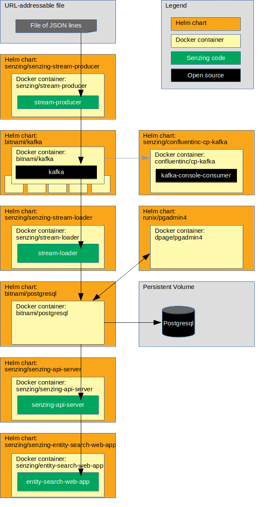

# kubernetes-demo-helm-kafka-postgresql

## Synopsis

Bring up a reference implementation Senzing stack on Kubernetes
using `minikube`, `kubectl`, and `helm`.
A containerized Kafka and a PostgreSQL database are deployed as
[backing services](https://12factor.net/backing-services)
for demonstration purposes.

## Overview

These instructions illustrate a reference implementation of Senzing using
PostgreSQL as the underlying database.

The instructions show how to set up a system that:

1. Reads JSON lines from a file on the internet and sends each JSON line to a message queue using the Senzing
   [stream-producer](https://github.com/Senzing/stream-producer).
    1. In this implementation, the queue is Kafka.
1. Reads messages from the queue and inserts into Senzing using the Senzing
   [stream-loader](https://github.com/Senzing/stream-loader).
    1. In this implementation, Senzing keeps its data in a PostgreSQL database.
1. Reads information from Senzing using the [Senzing API Server](https://github.com/Senzing/senzing-api-server) server.
1. Views resolved entities in a [web app](https://github.com/Senzing/entity-search-web-app).

The following diagram shows the relationship of the Helm charts, docker containers, and code in this Kubernetes demonstration.



### Contents

1. [Preamble](#preamble)
1. [Related artifacts](#related-artifacts)
1. [Expectations](#expectations)
1. [Prerequisites](#prerequisites)
    1. [Prerequisite software](#prerequisite-software)
    1. [Clone repository](#clone-repository)
    1. [Create demo directory](#create-demo-directory)
    1. [Start minikube cluster](#start-minikube-cluster)
    1. [View minikube cluster](#view-minikube-cluster)
    1. [Set environment variables](#set-environment-variables)
    1. [EULA](#eula)
    1. [Create senzing/installer docker image](#create-senzinginstaller-docker-image)
    1. [Identify Docker registry](#identify-docker-registry)
    1. [Create custom helm values files](#create-custom-helm-values-files)
    1. [Create custom Kubernetes configuration files](#create-custom-kubernetes-configuration-files)
    1. [Save environment variables](#save-environment-variables)
    1. [Create namespace](#create-namespace)
    1. [Create persistent volume](#create-persistent-volume)
    1. [Add helm repositories](#add-helm-repositories)
    1. [Install Postgresql Helm chart](#install-postgresql-helm-chart)
    1. [Install pgAdmin Helm chart](#install-pgadmin-helm-chart)
    1. [Install Kafka Helm chart](#install-kafka-helm-chart)
    1. [Install Kafka test client](#install-kafka-test-client)
1. [Demonstrate](#demonstrate)
    1. [Deploy Senzing](#deploy-senzing)
    1. [Install senzing-console Helm chart](#install-senzing-console-helm-chart)
    1. [Install Senzing license](#install-senzing-license)
    1. [Initialize database](#initialize-database)
    1. [Install init-container Helm chart](#install-init-container-helm-chart)
    1. [Install stream-producer Helm chart](#install-stream-producer-helm-chart)
    1. [Install stream-loader Helm chart](#install-stream-loader-helm-chart)
    1. [Install senzing-api-server Helm chart](#install-senzing-api-server-helm-chart)
    1. [Install senzing-entity-search-web-app Helm chart](#install-senzing-entity-search-web-app-helm-chart)
    1. [Optional charts](#optional-charts)
        1. [Install senzing-redoer Helm chart](#install-senzing-redoer-helm-chart)
        1. [Install SwaggerUI Helm chart](#install-swaggerui-helm-chart)
        1. [Install configurator Helm chart](#install-configurator-helm-chart)
    1. [View data](#view-data)
        1. [View Kafka](#view-kafka)
        1. [View PostgreSQL](#view-postgresql)
        1. [View Senzing Console pod](#view-senzing-console-pod)
        1. [View Senzing API Server](#view-senzing-api-server)
        1. [View Senzing Entity Search WebApp](#view-senzing-entity-search-webapp)
        1. [View SwaggerUI](#view-swaggerui)
        1. [View Senzing Configurator](#view-senzing-configurator)
1. [Cleanup](#cleanup)
    1. [Delete everything in Kubernetes](#delete-everything-in-kubernetes)
    1. [Delete minikube cluster](#delete-minikube-cluster)
1. [Errors](#errors)
1. [References](#references)

## Preamble

At [Senzing](http://senzing.com),
we strive to create GitHub documentation in a
"[don't make me think](https://github.com/Senzing/knowledge-base/blob/main/WHATIS/dont-make-me-think.md)" style.
For the most part, instructions are copy and paste.
Whenever thinking is needed, it's marked with a "thinking" icon :thinking:.
Whenever customization is needed, it's marked with a "pencil" icon :pencil2:.
If the instructions are not clear, please let us know by opening a new
[Documentation issue](https://github.com/Senzing/kubernetes-demo/issues/new?assignees=&labels=&template=documentation_request.md)
describing where we can improve.   Now on with the show...

### Legend

1. :thinking: - A "thinker" icon means that a little extra thinking may be required.
   Perhaps you'll need to make some choices.
   Perhaps it's an optional step.
1. :pencil2: - A "pencil" icon means that the instructions may need modification before performing.
1. :warning: - A "warning" icon means that something tricky is happening, so pay attention.

## Related artifacts

1. [DockerHub](https://hub.docker.com/r/senzing)
1. [Helm Charts](https://github.com/Senzing/charts)

## Expectations

- **Space:** This repository and demonstration require 20 GB free disk space.
- **Time:** Budget 4 hours to get the demonstration up-and-running, depending on CPU and network speeds.
- **Background knowledge:** This repository assumes a working knowledge of:
  - [Docker](https://github.com/Senzing/knowledge-base/blob/main/WHATIS/docker.md)
  - [Kubernetes](https://github.com/Senzing/knowledge-base/blob/main/WHATIS/kubernetes.md)
  - [Helm](https://github.com/Senzing/knowledge-base/blob/main/WHATIS/helm.md)

## Prerequisites

### Prerequisite software

1. [minikube](https://github.com/Senzing/knowledge-base/blob/main/HOWTO/install-minikube.md)
1. [kubectl](https://github.com/Senzing/knowledge-base/blob/main/HOWTO/install-kubectl.md)
1. [Helm 3](https://github.com/Senzing/knowledge-base/blob/main/HOWTO/install-helm.md)

### Clone repository

The Git repository has files that will be used in the `helm install --values` parameter.

1. Using these environment variable values:

    ```console
    export GIT_ACCOUNT=senzing
    export GIT_REPOSITORY=kubernetes-demo
    export GIT_ACCOUNT_DIR=~/${GIT_ACCOUNT}.git
    export GIT_REPOSITORY_DIR="${GIT_ACCOUNT_DIR}/${GIT_REPOSITORY}"
    ```

1. Follow steps in [clone-repository](https://github.com/Senzing/knowledge-base/blob/main/HOWTO/clone-repository.md) to install the Git repository.

### Create demo directory

1. :pencil2: Create a unique prefix.
   This will be used in a local directory name
   as well as a prefix to Kubernetes object.

   :warning:  Because it's used in Kubernetes resource names,
   it must be all lowercase.

   Example:

    ```console
    export DEMO_PREFIX=my
    ```

1. Make a directory for the demo.
   Example:

    ```console
    export SENZING_DEMO_DIR=~/senzing-kafka-postgresql-demo-${DEMO_PREFIX}
    mkdir -p ${SENZING_DEMO_DIR}
    ```

### Start minikube cluster

Using [Get Started with Bitnami Charts using Minikube](https://docs.bitnami.com/kubernetes/get-started-kubernetes/#overview)
as a guide, start a minikube cluster.

1. Start cluster using
   [minikube start](https://minikube.sigs.k8s.io/docs/commands/start/).
   Example:

    ```console
    minikube start --cpus 4 --memory 8192 --disk-size=50g
    ```

### View minikube cluster

:thinking: **Optional:** View the minikube cluster using the
[dashboard](https://minikube.sigs.k8s.io/docs/handbook/dashboard/).

1. Run command in a new terminal using
   [minikube dashboard](https://minikube.sigs.k8s.io/docs/commands/dashboard/).
   Example:

    ```console
    minikube dashboard
    ```

### Set environment variables

1. Set environment variables listed in "[Clone repository](#clone-repository)".

1. Synthesize environment variables.
   Example:

    ```console
    export DEMO_NAMESPACE=${DEMO_PREFIX}-namespace
    ```

1. Retrieve docker image version numbers and set their environment variables.
   Example:

    ```console
    source <(curl -X GET https://raw.githubusercontent.com/Senzing/knowledge-base/main/lists/docker-versions-stable.sh)
    ```

1. Retrieve Helm Chart version numbers and set their environment variables.
   Example:

    ```console
    source <(curl -X GET https://raw.githubusercontent.com/Senzing/knowledge-base/main/lists/helm-versions-stable.sh)
    ```

1. Retrieve Senzing version numbers and set their environment variables.
   Example:

    ```console
    source <(curl -X GET https://raw.githubusercontent.com/Senzing/knowledge-base/main/lists/senzing-versions-stable.sh)
    ```

### EULA

To use the Senzing code, you must agree to the End User License Agreement (EULA).

1. :warning:
   To use the Senzing code, you must agree to the End User License Agreement (EULA).
   This step is intentionally tricky and not simply copy/paste.
   This ensures that you make a conscious effort to accept the EULA.
   Example:

    <pre>export SENZING_ACCEPT_EULA="&lt;the value from <a href="https://github.com/Senzing/knowledge-base/blob/main/lists/environment-variables.md#senzing_accept_eula">this link</a>&gt;"</pre>

### Create senzing/installer docker image

:thinking: **Optional:**
One method of installing the Senzing binaries on the Kubernetes PV/PVC
is to make a Docker image that contains the contents of the Senzing `g2` and `data` folders.

1. Run the `docker build` command using
   [docker-build-senzing-installer.sh](../../bin/docker-build-senzing-installer.sh).
   **Note:**
   This will take a while as the Senzing binary packages will be downloaded.
   Example:

    ```console
    ${GIT_REPOSITORY_DIR}/bin/docker-build-senzing-installer.sh
    ```

### Identify Docker registry

:thinking: There are 3 options when it comes to using a docker registry.  Choose one:

1. [Use public registry](#use-public-registry)
1. [Use private registry](#use-private-registry)
1. [Use minikube registry](#use-minikube-registry)

#### Use public registry

**Method #1:** Pulls docker images from public internet registry.

1. Use the default public `docker.io` registry which pulls images from
   [hub.docker.com](https://hub.docker.com/).
   Example:

    ```console
    export DOCKER_REGISTRY_URL=docker.io
    export DOCKER_REGISTRY_SECRET=${DOCKER_REGISTRY_URL}-secret
    ```

#### Use private registry

**Method #2:** Pulls docker images from a private registry.

1. :pencil2: Specify a private registry.
   Example:

    ```console
    export DOCKER_REGISTRY_URL=my.example.com:5000
    export DOCKER_REGISTRY_SECRET=${DOCKER_REGISTRY_URL}-secret
    export SENZING_SUDO=sudo
    ${GIT_REPOSITORY_DIR}/bin/docker-pull-tag-and-push.sh docker-images-for-helm-kafka-postgresql
    ```

#### Use minikube registry

**Method #3:** Pulls docker images from minikube's registry.

1. Use minikube's docker registry using
   [minkube addons enable](https://minikube.sigs.k8s.io/docs/commands/addons/#minikube-addons-enable) and
   [minikube image load](https://minikube.sigs.k8s.io/docs/commands/image/#minikube-image-load).
   Example:

    ```console
    minikube addons enable registry
    export DOCKER_REGISTRY_URL=docker.io
    export DOCKER_REGISTRY_SECRET=${DOCKER_REGISTRY_URL}-secret
    ${GIT_REPOSITORY_DIR}/bin/populate-minikube-registry.sh docker-images-for-helm-kafka-postgresql
    ```

### Create custom helm values files

For final customization of the Helm Charts,
various files need to be created for use in the
`--values` parameter of `helm install`.

:thinking: In this step, Helm template files are populated with actual values.
There are two methods of accomplishing this.
Only one method needs to be performed.

1. **Method #1:** Helm template files are instantiated with actual values
   into `${HELM_VALUES_DIR}` directory by using
   [make-helm-values-files.sh](../../bin/make-helm-values-files.sh).

    ```console
    export HELM_VALUES_DIR=${SENZING_DEMO_DIR}/helm-values
    ${GIT_REPOSITORY_DIR}/bin/make-helm-values-files.sh
    ```

1. **Method #2:** Copy and manually modify files method.
   Example:

    ```console
    export HELM_VALUES_DIR=${SENZING_DEMO_DIR}/helm-values
    mkdir -p ${HELM_VALUES_DIR}

    cp ${GIT_REPOSITORY_DIR}/helm-values-templates/* ${HELM_VALUES_DIR}
    ```

    :pencil2: Edit files in ${HELM_VALUES_DIR} replacing the following variables with actual values.

    1. `${DEMO_PREFIX}`
    1. `${DOCKER_REGISTRY_SECRET}`
    1. `${DOCKER_REGISTRY_URL}`
    1. `${SENZING_ACCEPT_EULA}`

1. :thinking: **Optional:**
   List newly generated files.
   Example:

    ```console
    ls ${HELM_VALUES_DIR}
    ```

### Create custom kubernetes configuration files

Create Kubernetes manifest files for use with `kubectl create`.

:thinking: In this step, Kubernetes template files are populated with actual values.
There are two methods of accomplishing this.
Only one method needs to be performed.

1. **Method #1:** Kubernetes manifest files are instantiated with actual values
   into `{KUBERNETES_DIR}` directory by using
   [make-kubernetes-manifest-files.sh](../../bin/make-kubernetes-manifest-files.sh).
   Example:

    ```console
    export KUBERNETES_DIR=${SENZING_DEMO_DIR}/kubernetes
    ${GIT_REPOSITORY_DIR}/bin/make-kubernetes-manifest-files.sh
    ```

1. **Method #2:** Copy and manually modify files method.
   Example:

    ```console
    export KUBERNETES_DIR=${SENZING_DEMO_DIR}/kubernetes
    mkdir -p ${KUBERNETES_DIR}

    cp ${GIT_REPOSITORY_DIR}/kubernetes-templates/* ${KUBERNETES_DIR}
    ```

    :pencil2: Edit files in ${KUBERNETES_DIR} replacing the following variables with actual values.

    1. `${DEMO_NAMESPACE}`

### Save environment variables

Environment variables will be needed in new terminal windows using
[save-environment-variables.sh](../../bin/save-environment-variables.sh).

1. Save environment variables into a file that can be sourced.
   Example:

    ```console
    ${GIT_REPOSITORY_DIR}/bin/save-environment-variables.sh
    ```

### Create namespace

A new
[Kubernetes namespace](https://kubernetes.io/docs/concepts/overview/working-with-objects/namespaces/)
is created to isolate this demonstration from other applications running on Kubernetes.

1. Create Kubernetes namespace using
   [kubectl create](https://kubernetes.io/docs/reference/generated/kubectl/kubectl-commands#create).
   Example:

    ```console
    kubectl create -f ${KUBERNETES_DIR}/namespace.yaml
    ```

1. :thinking: **Optional:**
   Review namespaces using
   [kubectl get](https://kubernetes.io/docs/reference/generated/kubectl/kubectl-commands#get).
   Example:

    ```console
    kubectl get namespaces
    ```

### Create persistent volume

:thinking: **Optional:**
These steps for creating Persistent Volumes (PV) and Persistent Volume Claims (PVC)
are for a demonstration environment.
They are not sufficient for a production environment.
If PVs and PVCs already exist, this step may be skipped.

1. Create persistent volumes using
   [kubectl create](https://kubernetes.io/docs/reference/generated/kubectl/kubectl-commands#create).
   Example:

    ```console
    kubectl create -f ${KUBERNETES_DIR}/persistent-volume-postgresql.yaml
    kubectl create -f ${KUBERNETES_DIR}/persistent-volume-senzing.yaml
    ```

1. Create persistent volume claims using
   [kubectl create](https://kubernetes.io/docs/reference/generated/kubectl/kubectl-commands#create).
   Example:

    ```console
    kubectl create -f ${KUBERNETES_DIR}/persistent-volume-claim-postgresql.yaml
    kubectl create -f ${KUBERNETES_DIR}/persistent-volume-claim-senzing.yaml
    ```

1. :thinking: **Optional:**
   Review persistent volumes and claims using
   [kubectl get](https://kubernetes.io/docs/reference/generated/kubectl/kubectl-commands#get).
   Example:

    ```console
    kubectl get persistentvolumes \
      --namespace ${DEMO_NAMESPACE}

    kubectl get persistentvolumeClaims \
      --namespace ${DEMO_NAMESPACE}
    ```

### Add helm repositories

1. Add Bitnami repository using
   [helm repo add](https://helm.sh/docs/helm/helm_repo_add/).
   Example:

    ```console
    helm repo add bitnami https://charts.bitnami.com/bitnami
    ```

1. Add Helm repository for `pgAdmin` using
   [helm repo add](https://helm.sh/docs/helm/helm_repo_add/).
   Example:

    ```console
    helm repo add runix https://helm.runix.net
    ```

1. Add Senzing repository using
   [helm repo add](https://helm.sh/docs/helm/helm_repo_add/).
   Example:

    ```console
    helm repo add senzing https://hub.senzing.com/charts/
    ```

1. Update repositories using
   [helm repo update](https://helm.sh/docs/helm/helm_repo_update/).
   Example:

    ```console
    helm repo update
    ```

1. :thinking: **Optional:**
   Review repositories using
   [helm repo list](https://helm.sh/docs/helm/helm_repo_list/).
   Example:

    ```console
    helm repo list
    ```

### Install Postgresql Helm chart

:thinking: This step installs a PostgreSQL database container.
It is not a production-ready database and is only used for demonstration purposes.
The choice of databases is a **limiting factor** in the speed at which Senzing can operate.
This database choice is *at least* an order of magnitude slower than a
well-tuned production database.

In a production environment,
a separate PostgreSQL database would be provisioned and maintained.
The `${SENZING_DEMO_DIR}/helm-values/*.yaml` files would then be updated to have the
`SENZING_DATABASE_URL` point to the production database.

For this demonstration, the
[bitnami/postgresql Helm Chart](https://github.com/bitnami/charts/tree/master/bitnami/postgresql)
provisions an instance of the
[bitnami/postgresql Docker image](https://hub.docker.com/r/bitnami/postgresql).

1. Create Configmap for `pg_hba.conf` using
   [kubectl create](https://kubernetes.io/docs/reference/generated/kubectl/kubectl-commands#create).
   Example:

    ```console
    kubectl create configmap ${DEMO_PREFIX}-pg-hba \
      --namespace ${DEMO_NAMESPACE} \
      --from-file=${KUBERNETES_DIR}/pg_hba.conf
    ```

    Note: `pg_hba.conf` will be stored in the PersistentVolumeClaim.

1. Install
   [bitnami/postgresql](https://github.com/bitnami/charts/tree/master/bitnami/postgresql)
   chart using
   [helm install](https://helm.sh/docs/helm/helm_install/).
   Example:

    ```console
    helm install \
      ${DEMO_PREFIX}-bitnami-postgresql \
      bitnami/postgresql \
      --namespace ${DEMO_NAMESPACE} \
      --values ${HELM_VALUES_DIR}/bitnami-postgresql.yaml \
      --version ${SENZING_HELM_VERSION_BITNAMI_POSTGRESQL:-""}
    ```

1. Wait for pod to run using
   [kubectl get](https://kubernetes.io/docs/reference/generated/kubectl/kubectl-commands#get).
   Example:

    ```console
    kubectl get pods \
      --namespace ${DEMO_NAMESPACE} \
      --watch
    ```

1. Example of pod running:

    ```console
    NAME                                   READY   STATUS      RESTARTS   AGE
    my-bitnami-postgresql-6bf64cbbdf-25gtb  1/1     Running     0          10m
    ```

### Install pgAdmin Helm Chart

[pgAdmin](https://www.pgadmin.org/)
is a web-based user interface for viewing the PostgreSQL database.

1. Install
   [runix/pgadmin4](https://github.com/rowanruseler/helm-charts/tree/master/charts/pgadmin4)
   chart using
   [helm install](https://helm.sh/docs/helm/helm_install/).
   Example:

    ```console
    helm install \
      ${DEMO_PREFIX}-pgadmin \
      runix/pgadmin4 \
      --namespace ${DEMO_NAMESPACE} \
      --values ${HELM_VALUES_DIR}/pgadmin.yaml \
      --version ${SENZING_HELM_VERSION_RUNIX_PGADMIN4:-""}
    ```

1. To view PostgreSQL via pgAdmin, see [View PostgreSQL](#view-postgresql).

### Install Kafka Helm chart

The
[binami/kafka Helm Chart](https://github.com/bitnami/charts/tree/master/bitnami/kafka)
provisions an instance of the
[bitnami/kafka Docker image](https://hub.docker.com/r/bitnami/kafka).

1. Install
   [bitnami/kafka](https://github.com/bitnami/charts/tree/master/bitnami/kafka)
   chart using
   [helm install](https://helm.sh/docs/helm/helm_install/).
   Example:

    ```console
    helm install \
      ${DEMO_PREFIX}-bitnami-kafka \
      bitnami/kafka \
      --namespace ${DEMO_NAMESPACE} \
      --values ${HELM_VALUES_DIR}/bitnami-kafka.yaml \
      --version ${SENZING_HELM_VERSION_BITNAMI_KAFKA:-""}
    ```

### Install Kafka test client

1. Install Kafka test client app.  Example:

    ```console
    helm install \
      ${DEMO_PREFIX}-confluentinc-cp-kafka \
      senzing/confluentinc-cp-kafka \
      --namespace ${DEMO_NAMESPACE} \
      --values ${HELM_VALUES_DIR}/confluentinc-cp-kafka.yaml \
      --version ${SENZING_HELM_VERSION_SENZING_CONFLUENTINC_CP_KAFKA:-""}
    ```

1. Wait for pods to run using
   [kubectl get](https://kubernetes.io/docs/reference/generated/kubectl/kubectl-commands#get).
   *Note:* Kafka will crash and restart until Zookeeper is up an running.
   Example:

    ```console
    kubectl get pods \
      --namespace ${DEMO_NAMESPACE} \
      --watch
    ```

1. To view Kafka, see [View Kafka](#view-kafka).

## Demonstrate

### Deploy Senzing

:thinking: This deployment initializes the Persistent Volume with Senzing code and data
at `/opt/senzing/g2` and `/opt/senzing/data`.
These paths are relative to inside the containers via PVC mounts.
The actual location on the PVC may vary.

There are 4 options when it comes to initializing the Persistent Volume with Senzing code and data.
Choose one:

1. [Root container method](#root-container-method) - requires a root container
1. [senzing/installer container method](#senzinginstaller-container-method) - uses
   [senzing/installer](https://github.com/Senzing/docker-installer)
   container optionally built in
   [Create senzing/installer docker image](#create-senzinginstaller-docker-image)
   step.
1. [Non-root container method](#non-root-container-method) - can be done on kubernetes with a non-root container
1. [yum localinstall method](#yum-localinstall-method) - Uses existing Senzing RPMs, so no downloading during installation.

#### Root container method

**Method #1:** This method is simpler, but requires a root container.
This method uses a dockerized [apt](https://github.com/Senzing/docker-apt) command.

1. Install
   [senzing/senzing-apt](https://github.com/Senzing/charts/tree/main/charts/senzing-apt)
   chart using
   [helm install](https://helm.sh/docs/helm/helm_install/).
   Example:

    ```console
    helm install \
      ${DEMO_PREFIX}-senzing-apt \
      senzing/senzing-apt \
      --namespace ${DEMO_NAMESPACE} \
      --values ${HELM_VALUES_DIR}/senzing-apt.yaml \
      --version ${SENZING_HELM_VERSION_SENZING_APT:-""}
    ```

1. Wait until Job has completed using
   [kubectl get](https://kubernetes.io/docs/reference/generated/kubectl/kubectl-commands#get).
   Example:

    ```console
    kubectl get pods \
      --namespace ${DEMO_NAMESPACE} \
      --watch
    ```

1. Example of completion:

    ```console
    NAME                       READY   STATUS      RESTARTS   AGE
    my-senzing-apt-8n2ql       0/1     Completed   0          2m44s
    ```

#### senzing/installer container method

**Method #2:** This method uses a docker container to copy Senzing binaries that are "baked-in"
the container to mounted volumes.
This method requires:

1. The `senzing/installer` image built in the
   [Create senzing/installer docker image](#create-senzinginstaller-docker-image)
   step.
1. Registry choice of
   "[Use private registry](#use-private-registry)"
   or
   "[Use minikube registry](#use-minikube-registry)".
   That is, the image is not available on the public DockerHub registry.

Copy Senzing's `g2` and `data` directories onto the Persistent Volume Claim (PVC)
at `/opt/senzing/g2` and `/opt/senzing/data`.
These paths are relative to inside the containers via PVC mounts.
The actual location on the PVC may vary.

1. Log into `minikube` instance using
   [minikube ssh](https://minikube.sigs.k8s.io/docs/commands/ssh/).
   Example:

    ```console
    minikube ssh
    ```

1. In the `minikube` instance, create `/mnt/vda1/senzing`.
   Example:

    ```console
    sudo mkdir -p /mnt/vda1/senzing
    exit
    ```

1. Install
   [senzing/senzing-installer](https://github.com/Senzing/charts/tree/main/charts/senzing-installer)
   chart using
   [helm install](https://helm.sh/docs/helm/helm_install/).
   Example:

    ```console
    helm install \
      ${DEMO_PREFIX}-senzing-installer \
      senzing/senzing-installer \
      --namespace ${DEMO_NAMESPACE} \
      --values ${HELM_VALUES_DIR}/senzing-installer.yaml\
      --version ${SENZING_HELM_VERSION_SENZING_INSTALLER:-""}
    ```

1. Wait until Job has completed using
   [kubectl get](https://kubernetes.io/docs/reference/generated/kubectl/kubectl-commands#get).
   Example:

    ```console
    kubectl get pods \
      --namespace ${DEMO_NAMESPACE} \
      --watch
    ```

1. Example of completion:

    ```console
    NAME                         READY   STATUS      RESTARTS   AGE
    my-senzing-installer-8n2ql   0/1     Completed   0          2m44s
    ```

#### Non-root container method

**Method #3:** This method can be done on kubernetes with a non-root container.
The following instructions are done on a non-kubernetes machine which allows root docker containers.
Example: A personal laptop.

1. Set environment variables.
   Example:

    ```console
    export SENZING_DATA_DIR=${SENZING_DEMO_DIR}/data
    export SENZING_G2_DIR=${SENZING_DEMO_DIR}/g2
    ```

1. Run docker container to download and extract Senzing binaries to
   `SENZING_DATA_DIR` and `SENZING_G2_DIR`.
   Example:

    ```console
    sudo docker run \
      --env SENZING_ACCEPT_EULA=${SENZING_ACCEPT_EULA} \
      --interactive \
      --rm \
      --tty \
      --volume ${SENZING_DATA_DIR}:/opt/senzing/data \
      --volume ${SENZING_G2_DIR}:/opt/senzing/g2 \
      senzing/apt
    ```

1. Install
   [senzing/senzing-base](https://github.com/Senzing/charts/tree/main/charts/senzing-base)
   chart with non-root container using
   [helm install](https://helm.sh/docs/helm/helm_install/).
   This pod will be the recipient of `kubectl cp` commands.
   Example:

    ```console
    helm install \
      ${DEMO_PREFIX}-senzing-base \
      senzing/senzing-base \
      --namespace ${DEMO_NAMESPACE} \
      --values ${HELM_VALUES_DIR}/senzing-base.yaml \
      --version ${SENZING_HELM_VERSION_SENZING_BASE:-""}
    ```

1. Wait for pod to run using
   [kubectl get](https://kubernetes.io/docs/reference/generated/kubectl/kubectl-commands#get).
   Example:

    ```console
    kubectl get pods \
      --namespace ${DEMO_NAMESPACE} \
      --watch
    ```

1. Identify Senzing Base pod name.
   Example:

    ```console
    export SENZING_BASE_POD_NAME=$(kubectl get pods \
      --namespace ${DEMO_NAMESPACE} \
      --output jsonpath="{.items[0].metadata.name}" \
      --selector "app.kubernetes.io/name=senzing-base, \
                  app.kubernetes.io/instance=${DEMO_PREFIX}-senzing-base" \
      )
    ```

1. Copy files from local machine to Senzing Base pod using
   [kubectl cp](https://kubernetes.io/docs/reference/generated/kubectl/kubectl-commands#cp).
   Example:

    ```console
    kubectl cp ${SENZING_DATA_DIR} ${DEMO_NAMESPACE}/${SENZING_BASE_POD_NAME}:/opt/senzing/data
    kubectl cp ${SENZING_G2_DIR}   ${DEMO_NAMESPACE}/${SENZING_BASE_POD_NAME}:/opt/senzing/g2
    ```

#### yum localinstall method

**Method #4:** This method inserts the Senzing RPMs into the minikube environment for a `yum localinstall`.
The advantage of this method is that the Senzing RPMs are not downloaded from the internet during installation.
This produces the same result as the `apt` installs describe in prior methods.
**Note:**  The environment variables were "sourced" in
[Set environment variables](#set-environment-variables).

1. :pencil2: Identify a directory to store downloaded files.
   Example:

    ```console
    export DOWNLOAD_DIR=~/Downloads
    ```

1. Download Senzing RPMs.
   Example:

    ```console
    docker run \
      --rm \
      --volume ${DOWNLOAD_DIR}:/download \
      senzing/yumdownloader \
        senzingapi-${SENZING_VERSION_SENZINGAPI_BUILD} \
        senzingdata-v3-${SENZING_VERSION_SENZINGDATA_BUILD}
    ```

1. Copy files into minikube.
   Example:

    ```console
    scp -i $(minikube ssh-key) \
        ${DOWNLOAD_DIR}/${SENZING_VERSION_SENZINGAPI_RPM_FILENAME} \
        docker@$(minikube ip):/home/docker

    scp -i $(minikube ssh-key) \
        ${DOWNLOAD_DIR}/${SENZING_VERSION_SENZINGDATA_RPM_FILENAME} \
        docker@$(minikube ip):/home/docker
    ```

1. Log into `minikube` instance using
   [minikube ssh](https://minikube.sigs.k8s.io/docs/commands/ssh/).
   Example:

    ```console
    minikube ssh
    ```

1. In the `minikube` instance, move files to `/mnt/vda1/senzing/senzing-rpms`.
   Example:

    ```console
    sudo mkdir -p /mnt/vda1/senzing/senzing-rpms
    sudo mv /home/docker/senzingdata* /mnt/vda1/senzing/senzing-rpms
    sudo mv /home/docker/senzingapi* /mnt/vda1/senzing/senzing-rpms
    exit
    ```

1. Install
   [senzing/senzing-yum](https://github.com/Senzing/charts/tree/main/charts/senzing-yum)
   chart to perform `yum localinstall` using
   [helm install](https://helm.sh/docs/helm/helm_install/).
   Example:

    ```console
    helm install \
      ${DEMO_PREFIX}-senzing-yum \
      senzing/senzing-yum \
      --namespace ${DEMO_NAMESPACE} \
      --values ${HELM_VALUES_DIR}/senzing-yum-localinstall.yaml \
      --version ${SENZING_HELM_VERSION_SENZING_YUM:-""}
    ```

1. Wait until Job has completed using
   [kubectl get](https://kubernetes.io/docs/reference/generated/kubectl/kubectl-commands#get).
   Example:

    ```console
    kubectl get pods \
      --namespace ${DEMO_NAMESPACE} \
      --watch
    ```

1. Example of completion:

    ```console
    NAME                       READY   STATUS      RESTARTS   AGE
    my-senzing-yum-8n2ql       0/1     Completed   0          2m44s
    ```

### Install senzing-console Helm chart

The [senzing-console](https://github.com/Senzing/docker-senzing-console)
will be used later to
inspect mounted volumes,
debug issues, or
run command-line tools.

1. Install
   [senzing/senzing-console](https://github.com/Senzing/charts/tree/main/charts/senzing-console)
   chart using
   [helm install](https://helm.sh/docs/helm/helm_install/).
   Example:

    ```console
    helm install \
      ${DEMO_PREFIX}-senzing-console \
      senzing/senzing-console \
      --namespace ${DEMO_NAMESPACE} \
      --values ${HELM_VALUES_DIR}/senzing-console-postgresql.yaml \
      --version ${SENZING_HELM_VERSION_SENZING_CONSOLE:-""}
    ```

1. For the next steps, capture the pod name in `CONSOLE_POD_NAME` using
   [kubectl get](https://kubernetes.io/docs/reference/generated/kubectl/kubectl-commands#get).
   Example:

    ```console
    export CONSOLE_POD_NAME=$(kubectl get pods \
      --namespace ${DEMO_NAMESPACE} \
      --output jsonpath="{.items[0].metadata.name}" \
      --selector "app.kubernetes.io/name=senzing-console, \
                  app.kubernetes.io/instance=${DEMO_PREFIX}-senzing-console" \
      )
    ```

1. To use senzing-console pod, see [View Senzing Console pod](#view-senzing-console-pod).

### Install Senzing license

To ingest more than the default number of allowed records, a
[Senzing license](https://github.com/Senzing/knowledge-base/blob/main/HOWTO/obtain-senzing-license.md)
is needed in the `/etc/opt/senzing` directory.

1. :pencil2: Identify location of license on local system.
   Example:

    ```console
    export SENZING_G2_LICENSE_PATH=/path/to/local/g2.lic
    ```

1. Copy the Senzing license to `/etc/opt/senzing/g2.lic`
   on pod's mounted volumes.
   Example:

    ```console
    kubectl cp \
      ${SENZING_G2_LICENSE_PATH} \
      ${DEMO_NAMESPACE}/${CONSOLE_POD_NAME}:/etc/opt/senzing/g2.lic
    ```

### Initialize database

The [PostgreSQL Client](https://github.com/Senzing/postgresql-client)
is used to create tables in the database (i.e. the schema) used by Senzing.

1. Install
   [senzing/senzing-postgresql-client](https://github.com/Senzing/charts/tree/main/charts/senzing-postgresql-client)
   chart using
   [helm install](https://helm.sh/docs/helm/helm_install/).
   Example:

    ```console
    helm install \
      ${DEMO_PREFIX}-senzing-postgresql-client \
      senzing/senzing-postgresql-client \
      --namespace ${DEMO_NAMESPACE} \
      --values ${HELM_VALUES_DIR}/senzing-postgresql-client.yaml \
      --version ${SENZING_HELM_VERSION_SENZING_POSTGRESQL_CLIENT:-""}
    ```

1. Wait for pod to complete
   [kubectl get](https://kubernetes.io/docs/reference/generated/kubectl/kubectl-commands#get).
   Example:

    ```console
    kubectl get pods \
      --namespace ${DEMO_NAMESPACE} \
      --watch
    ```

### Install init-container Helm chart

The [init-container](https://github.com/Senzing/docker-init-container)
creates files from templates and initializes the G2 database.

1. Install
   [senzing/senzing-init-container](https://github.com/Senzing/charts/tree/main/charts/senzing-init-container)
   chart using
   [helm install](https://helm.sh/docs/helm/helm_install/).
   Example:

    ```console
    helm install \
      ${DEMO_PREFIX}-senzing-init-container \
      senzing/senzing-init-container \
      --namespace ${DEMO_NAMESPACE} \
      --values ${HELM_VALUES_DIR}/senzing-init-container-postgresql.yaml \
      --version ${SENZING_HELM_VERSION_SENZING_INIT_CONTAINER:-""}
    ```

1. Wait for pod to complete
   [kubectl get](https://kubernetes.io/docs/reference/generated/kubectl/kubectl-commands#get).
   Example:

    ```console
    kubectl get pods \
      --namespace ${DEMO_NAMESPACE} \
      --watch
    ```

### Install stream-producer Helm chart

The [stream producer](https://github.com/Senzing/stream-producer)
pulls JSON lines from a file and pushes them to a message queue.

1. Install
   [senzing/senzing-stream-producer](https://github.com/Senzing/charts/tree/main/charts/senzing-stream-producer)
   chart using
   [helm install](https://helm.sh/docs/helm/helm_install/).
   Example:

    ```console
    helm install \
      ${DEMO_PREFIX}-senzing-stream-producer \
      senzing/senzing-stream-producer \
      --namespace ${DEMO_NAMESPACE} \
      --values ${HELM_VALUES_DIR}/senzing-stream-producer-kafka.yaml \
      --version ${SENZING_HELM_VERSION_SENZING_STREAM_PRODUCER:-""}
    ```

### Install stream-loader Helm chart

The [stream loader](https://github.com/Senzing/stream-loader)
pulls messages from a message queue and sends them to Senzing.

1. Install
   [senzing/senzing-stream-loader](https://github.com/Senzing/charts/tree/main/charts/senzing-stream-loader)
   chart using
   [helm install](https://helm.sh/docs/helm/helm_install/).
   Example:

    ```console
    helm install \
      ${DEMO_PREFIX}-senzing-stream-loader \
      senzing/senzing-stream-loader \
      --namespace ${DEMO_NAMESPACE} \
      --values ${HELM_VALUES_DIR}/senzing-stream-loader-kafka-postgresql.yaml \
      --version ${SENZING_HELM_VERSION_SENZING_STREAM_LOADER:-""}
    ```

### Install senzing-api-server Helm chart

The [Senzing API server](https://github.com/Senzing/senzing-api-server)
receives HTTP requests to read and modify Senzing data.

1. Install
   [senzing/senzing-api-server](https://github.com/Senzing/charts/tree/main/charts/senzing-api-server)
   chart using
   [helm install](https://helm.sh/docs/helm/helm_install/).
   Example:

    ```console
    helm install \
      ${DEMO_PREFIX}-senzing-api-server \
      senzing/senzing-api-server \
      --namespace ${DEMO_NAMESPACE} \
      --values ${HELM_VALUES_DIR}/senzing-api-server-postgresql.yaml \
      --version ${SENZING_HELM_VERSION_SENZING_API_SERVER:-""}
    ```

1. Wait for pods to run using
   [kubectl get](https://kubernetes.io/docs/reference/generated/kubectl/kubectl-commands#get).
   Example:

    ```console
    kubectl get pods \
      --namespace ${DEMO_NAMESPACE} \
      --watch
    ```

1. To view Senzing API server, see [View Senzing API Server](#view-senzing-api-server).

### Install senzing-entity-search-web-app Helm chart

The [Senzing Entity Search WebApp](https://github.com/Senzing/entity-search-web-app)
is a light-weight WebApp demonstrating Senzing search capabilities.

1. Install
   [senzing/senzing-entity-search-web-app](https://github.com/Senzing/charts/tree/main/charts/senzing-entity-search-web-app)
   chart using
   [helm install](https://helm.sh/docs/helm/helm_install/).
   Example:

    ```console
    helm install \
      ${DEMO_PREFIX}-senzing-entity-search-web-app \
      senzing/senzing-entity-search-web-app \
      --namespace ${DEMO_NAMESPACE} \
      --values ${HELM_VALUES_DIR}/senzing-entity-search-web-app.yaml \
      --version ${SENZING_HELM_VERSION_SENZING_ENTITY_SEARCH_WEB_APP:-""}
    ```

1. Wait until Deployment has completed using
   [kubectl get](https://kubernetes.io/docs/reference/generated/kubectl/kubectl-commands#get).
   Example:

    ```console
    kubectl get pods \
      --namespace ${DEMO_NAMESPACE} \
      --watch
    ```

1. To view Senzing Entity Search WebApp, see [View Senzing Entity Search WebApp](#view-senzing-entity-search-webapp).

### Optional charts

These charts are not necessary for the demonstration,
but may be valuable in a production environment.

#### Install senzing-redoer Helm chart

The [redoer](https://github.com/Senzing/redoer) pulls Senzing redo records from the Senzing database and re-processes.

1. Install
   [senzing/senzing-redoer](https://github.com/Senzing/charts/tree/main/charts/senzing-redoer)
   chart using
   [helm install](https://helm.sh/docs/helm/helm_install/).
   Example:

    ```console
    helm install \
      ${DEMO_PREFIX}-senzing-redoer \
      senzing/senzing-redoer \
      --namespace ${DEMO_NAMESPACE} \
      --values ${HELM_VALUES_DIR}/senzing-redoer-postgresql.yaml \
      --version ${SENZING_HELM_VERSION_SENZING_REDOER:-""}
    ```

#### Install SwaggerUI Helm chart

The [SwaggerUI](https://swagger.io/tools/swagger-ui/) is a micro-service
for viewing the Senzing REST OpenAPI specification in a web browser.

1. Install
   [senzing/swaggerapi-swagger-ui](https://github.com/Senzing/charts/tree/main/charts/swaggerapi-swagger-ui)
   chart using
   [helm install](https://helm.sh/docs/helm/helm_install/).
   Example:

    ```console
    helm install \
      ${DEMO_PREFIX}-swaggerapi-swagger-ui \
      senzing/swaggerapi-swagger-ui \
      --namespace ${DEMO_NAMESPACE} \
      --values ${HELM_VALUES_DIR}/swaggerapi-swagger-ui.yaml \
      --version ${SENZING_HELM_VERSION_SENZING_SWAGGERAPI_SWAGGER_UI:-""}
    ```

1. To view SwaggerUI, see [View SwaggerUI](#view-swaggerui).

#### Install configurator Helm chart

The [Senzing Configurator](https://github.com/Senzing/configurator) is a micro-service for changing Senzing configuration.

1. Install
   [senzing/senzing-configurator](https://github.com/Senzing/charts/tree/main/charts/senzing-configurator)
   chart using
   [helm install](https://helm.sh/docs/helm/helm_install/).
   Example:

    ```console
    helm install \
      ${DEMO_PREFIX}-senzing-configurator \
      senzing/senzing-configurator \
      --namespace ${DEMO_NAMESPACE} \
      --values ${HELM_VALUES_DIR}/senzing-configurator-postgresql.yaml \
      --version ${SENZING_HELM_VERSION_SENZING_CONFIGURATOR:-""}
    ```

1. To view Senzing Configurator, see [View Senzing Configurator](#view-senzing-configurator).

### View data

1. Because some of the Kubernetes Services use LoadBalancer,
   a `minikube` tunnel is needed for
   [LoadBalancer access](https://minikube.sigs.k8s.io/docs/handbook/accessing/#loadbalancer-access).
   Example:

    ```console
    minikube tunnel
    ```

1. :pencil2: When using a separate terminal window in each of the examples below, set environment variables.
   **Note:** Replace `${DEMO_PREFIX}` with the actual DEMO_PREFIX value.
   Example:

    ```console
    source ~/senzing-kafka-postgresql-demo-${DEMO_PREFIX}/environment.sh
    ```

1. Username and password for the following sites are the values seen in
   the corresponding "values" YAML file located in the
   [helm-values-templates](../../helm-values-templates) directory.

#### View Kafka

1. In a separate terminal window, run the test client.
   Example:

    ```console
    export KAFKA_TEST_POD_NAME=$(kubectl get pods \
      --namespace ${DEMO_NAMESPACE} \
      --output jsonpath="{.items[0].metadata.name}" \
      --selector "app.kubernetes.io/name=confluentinc-cp-kafka, \
                  app.kubernetes.io/instance=${DEMO_PREFIX}-confluentinc-cp-kafka" \
      )

    kubectl exec \
      -it \
      --namespace ${DEMO_NAMESPACE} \
      ${KAFKA_TEST_POD_NAME} -- /usr/bin/kafka-console-consumer \
        --bootstrap-server ${DEMO_PREFIX}-bitnami-kafka:9092 \
        --topic senzing-kafka-topic \
        --from-beginning
    ```

#### View PostgreSQL

[pgAdmin](https://www.pgadmin.org/)
is a web-based user interface for viewing the PostgreSQL database.

1. In a separate terminal window, port forward to local machine using
   [kubectl port-forward](https://kubernetes.io/docs/reference/generated/kubectl/kubectl-commands#port-forward).
   Example:

    ```console
    kubectl port-forward \
      --address 0.0.0.0 \
      --namespace ${DEMO_NAMESPACE} \
      svc/${DEMO_PREFIX}-pgadmin-pgadmin4 9171:80
    ```

1. PostgreSQL will be viewable at [localhost:9171](http://localhost:9171).
    1. Login
       1. See `${SENZING_DEMO_DIR}/helm-values/pgpadmin.yaml` for **pgadmin** email and password
          (`env.email` and `env.password`)
       1. Default: username: `postgres`  password: `postgres`
    1. On left-hand navigation, select:
        1. Servers > senzing > databases > G2 > schemas > public > tables
    1. The records received from the queue can be viewed in the following Senzing tables:
        1. DSRC_RECORD
        1. OBS_ENT

#### View Senzing Console pod

The [senzing-console](https://github.com/Senzing/docker-senzing-console)
is used to inspect mounted volumes, debug issues, or run command-line tools.

1. In a separate terminal window, log into Senzing Console pod using
   [kubectl exec](https://kubernetes.io/docs/reference/generated/kubectl/kubectl-commands#exec).
   Example:

    ```console
    export CONSOLE_POD_NAME=$(kubectl get pods \
      --namespace ${DEMO_NAMESPACE} \
      --output jsonpath="{.items[0].metadata.name}" \
      --selector "app.kubernetes.io/name=senzing-console, \
                  app.kubernetes.io/instance=${DEMO_PREFIX}-senzing-console" \
      )

    kubectl exec -it --namespace ${DEMO_NAMESPACE} ${CONSOLE_POD_NAME} -- /bin/bash
    ```

#### View Senzing API Server

The [Senzing API server](https://github.com/Senzing/senzing-api-server)
receives HTTP requests to read and modify Senzing data.

1. In a separate terminal window, port forward to local machine using
   [kubectl port-forward](https://kubernetes.io/docs/reference/generated/kubectl/kubectl-commands#port-forward).
   Example:

    ```console
    kubectl port-forward \
      --address 0.0.0.0 \
      --namespace ${DEMO_NAMESPACE} \
      svc/${DEMO_PREFIX}-senzing-api-server 8250:80
    ```

1. Make HTTP calls using `curl`.
   Example:

    ```console
    export SENZING_API_SERVICE=http://localhost:8250

    curl -X GET ${SENZING_API_SERVICE}/heartbeat
    curl -X GET ${SENZING_API_SERVICE}/license
    curl -X GET ${SENZING_API_SERVICE}/entities/1
    ```

#### View Senzing Entity Search WebApp

The [Senzing Entity Search WebApp](https://github.com/Senzing/entity-search-web-app)
is a light-weight WebApp demonstrating Senzing search capabilities.

1. In a separate terminal window, port forward to local machine using
   [kubectl port-forward](https://kubernetes.io/docs/reference/generated/kubectl/kubectl-commands#port-forward).
   Example:

    ```console
    kubectl port-forward \
      --address 0.0.0.0 \
      --namespace ${DEMO_NAMESPACE} \
      svc/${DEMO_PREFIX}-senzing-entity-search-web-app 8251:80
    ```

1. Senzing Entity Search WebApp will be viewable at [localhost:8251](http://localhost:8251).
   The [demonstration](https://github.com/Senzing/knowledge-base/blob/main/demonstrations/docker-compose-web-app.md)
   instructions will give a tour of the Senzing web app.

#### View SwaggerUI

The [SwaggerUI](https://swagger.io/tools/swagger-ui/) is a micro-service
for viewing the Senzing REST OpenAPI specification in a web browser.

1. In a separate terminal window, port forward to local machine using
   [kubectl port-forward](https://kubernetes.io/docs/reference/generated/kubectl/kubectl-commands#port-forward).
   Example:

    ```console
    kubectl port-forward \
      --address 0.0.0.0 \
      --namespace ${DEMO_NAMESPACE} \
      svc/${DEMO_PREFIX}-swaggerapi-swagger-ui 9180:80
    ```

   Then visit [http://localhost:9180](http://localhost:9180).

#### View Senzing Configurator

The [Senzing Configurator](https://github.com/Senzing/configurator) is a micro-service for changing Senzing configuration.

1. If the Senzing configurator was deployed,
   in a separate terminal window port forward to local machine using
   [kubectl port-forward](https://kubernetes.io/docs/reference/generated/kubectl/kubectl-commands#port-forward).
   Example:

    ```console
    kubectl port-forward \
      --address 0.0.0.0 \
      --namespace ${DEMO_NAMESPACE} \
      svc/${DEMO_PREFIX}-senzing-configurator 8253:80
    ```

1. Make HTTP calls using `curl`.
   Example:

    ```console
    export SENZING_API_SERVICE=http://localhost:8253

    curl -X GET ${SENZING_API_SERVICE}/datasources
    ```

## Cleanup

The following commands remove the Senzing Demo application from Kubernetes.

### Delete everything in Kubernetes

Delete Kubernetes artifacts using
[helm uninstall](https://helm.sh/docs/helm/helm_uninstall/),
[helm repo remove](https://helm.sh/docs/helm/helm_repo_remove/), and
[kubectl delete](https://kubernetes.io/docs/reference/generated/kubectl/kubectl-commands#delete).

1. Example:

    ```console
    helm uninstall --namespace ${DEMO_NAMESPACE} ${DEMO_PREFIX}-senzing-configurator
    helm uninstall --namespace ${DEMO_NAMESPACE} ${DEMO_PREFIX}-swaggerapi-swagger-ui
    helm uninstall --namespace ${DEMO_NAMESPACE} ${DEMO_PREFIX}-senzing-redoer
    helm uninstall --namespace ${DEMO_NAMESPACE} ${DEMO_PREFIX}-senzing-entity-search-web-app
    helm uninstall --namespace ${DEMO_NAMESPACE} ${DEMO_PREFIX}-senzing-api-server
    helm uninstall --namespace ${DEMO_NAMESPACE} ${DEMO_PREFIX}-senzing-stream-loader
    helm uninstall --namespace ${DEMO_NAMESPACE} ${DEMO_PREFIX}-senzing-init-container
    helm uninstall --namespace ${DEMO_NAMESPACE} ${DEMO_PREFIX}-senzing-stream-producer
    helm uninstall --namespace ${DEMO_NAMESPACE} ${DEMO_PREFIX}-confluentinc-cp-kafka
    helm uninstall --namespace ${DEMO_NAMESPACE} ${DEMO_PREFIX}-bitnami-kafka
    helm uninstall --namespace ${DEMO_NAMESPACE} ${DEMO_PREFIX}-pgadmin
    helm uninstall --namespace ${DEMO_NAMESPACE} ${DEMO_PREFIX}-senzing-postgresql-client
    helm uninstall --namespace ${DEMO_NAMESPACE} ${DEMO_PREFIX}-bitnami-postgresql
    helm uninstall --namespace ${DEMO_NAMESPACE} ${DEMO_PREFIX}-senzing-console
    helm uninstall --namespace ${DEMO_NAMESPACE} ${DEMO_PREFIX}-senzing-installer
    helm uninstall --namespace ${DEMO_NAMESPACE} ${DEMO_PREFIX}-senzing-apt
    helm uninstall --namespace ${DEMO_NAMESPACE} ${DEMO_PREFIX}-senzing-yum
    helm repo remove senzing
    helm repo remove runix
    helm repo remove bitnami
    kubectl delete -f ${KUBERNETES_DIR}/persistent-volume-claim-senzing.yaml
    kubectl delete -f ${KUBERNETES_DIR}/persistent-volume-claim-postgresql.yaml
    kubectl delete -f ${KUBERNETES_DIR}/persistent-volume-senzing.yaml
    kubectl delete -f ${KUBERNETES_DIR}/persistent-volume-postgresql.yaml
    kubectl delete -f ${KUBERNETES_DIR}/namespace.yaml
    ```

### Delete minikube cluster

Delete minikube artifacts using
[minikube stop](https://minikube.sigs.k8s.io/docs/commands/stop/) and
[minikube delete](https://minikube.sigs.k8s.io/docs/commands/delete/)

1. Example:

    ```console
    minikube stop
    minikube delete
    ```

## Errors

1. See [docs/errors.md](docs/errors.md).

## References
