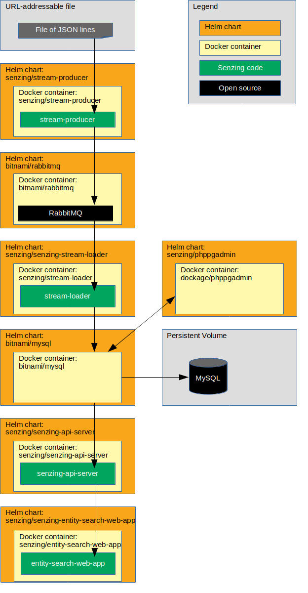

# kubernetes-demo-helm-rabbitmq-mysql

## Overview

This repository illustrates a reference implementation of Senzing using MySQL as the underlying database.

The instructions show how to set up a system that:

1. Reads JSON lines from a file on the internet.
1. Sends each JSON line to a message queue.
    1. In this implementation, the queue is RabbitMQ.
1. Reads messages from the queue and inserts into Senzing.
    1. In this implementation, Senzing keeps its data in a MySQL database.
1. Reads information from Senzing via [Senzing API Server](https://github.com/Senzing/senzing-api-server) server.
1. Views resolved entities in a [web app](https://github.com/Senzing/entity-search-web-app).

The following diagram shows the relationship of the Helm charts, docker containers, and code in this Kubernetes demonstration.



### Contents

1. [Expectations](#expectations)
    1. [Space](#space)
    1. [Time](#time)
    1. [Background knowledge](#background-knowledge)
1. [Prerequisites](#prerequisites)
    1. [Prerequisite software](#prerequisite-software)
    1. [Clone repository](#clone-repository)
1. [Demonstrate](#demonstrate)
    1. [EULA](#eula)
    1. [Set environment variables](#set-environment-variables)
    1. [Create custom helm values files](#create-custom-helm-values-files)
    1. [Create custom kubernetes configuration files](#create-custom-kubernetes-configuration-files)
    1. [Create namespace](#create-namespace)
    1. [Create persistent volume](#create-persistent-volume)
    1. [Add helm repositories](#add-helm-repositories)
    1. [Deploy Senzing RPM](#deploy-senzing-rpm)
    1. [Install senzing-debug Helm chart](#install-senzing-debug-helm-chart)
    1. [Install MySQL Helm chart](#install-mysql-helm-chart)
    1. [Initialize database](#initialize-database)
    1. [Install phpMyAdmin Helm chart](#install-phpmyadmin-helm-chart)
    1. [Install RabbitMQ Helm chart](#install-rabbitmq-helm-chart)
    1. [Install stream-producer Helm chart](#install-stream-producer-helm-chart)
    1. [Install init-container Helm chart](#install-init-container-helm-chart)
    1. [Install stream-loader Helm chart](#install-stream-loader-helm-chart)
    1. [Install senzing-api-server Helm chart](#install-senzing-api-server-helm-chart)
    1. [Install senzing-entity-search-web-app Helm chart](#install-senzing-entity-search-web-app-helm-chart)
    1. [Optional charts](#optional-charts)
        1. [Install senzing-redoer Helm chart](#install-senzing-redoer-helm-chart)
        1. [Install configurator Helm chart](#install-configurator-helm-chart)
    1. [View data](#view-data)
        1. [View Senzing Debug pod](#view-senzing-debug-pod)
        1. [View RabbitMQ](#view-rabbitmq)
        1. [View MySQL](#view-mysql)
        1. [View Senzing API Server](#view-senzing-api-server)
        1. [View Senzing Entity Search WebApp](#view-senzing-entity-search-webapp)
        1. [View Senzing Configurator](#view-senzing-configurator)
1. [Cleanup](#cleanup)
    1. [Delete everything in project](#delete-everything-in-project)
    1. [Delete minikube cluster](#delete-minikube-cluster)

## Expectations

### Space

This repository and demonstration require 20 GB free disk space.

### Time

Budget 4 hours to get the demonstration up-and-running, depending on CPU and network speeds.

### Background knowledge

This repository assumes a working knowledge of:

1. [Docker](https://github.com/Senzing/knowledge-base/blob/master/WHATIS/docker.md)
1. [Kubernetes](https://github.com/Senzing/knowledge-base/blob/master/WHATIS/kubernetes.md)
1. [Helm](https://github.com/Senzing/knowledge-base/blob/master/WHATIS/helm.md)

## Prerequisites

### Prerequisite software

#### kubectl

1. [Install kubectl](https://github.com/Senzing/knowledge-base/blob/master/HOWTO/install-kubectl.md).

#### minikube cluster

1. [Install minikube](https://github.com/Senzing/knowledge-base/blob/master/HOWTO/install-minikube.md).
1. [Start cluster](https://docs.bitnami.com/kubernetes/get-started-kubernetes/#overview)

    ```console
    minikube start --cpus 4 --memory 8192 --disk-size=50g
    ```

    Alternative:

    ```console
    minikube start --cpus 4 --memory 8192 --disk-size=50g --vm-driver kvm2
    ```

#### Helm/Tiller

1. [Install Helm](https://github.com/Senzing/knowledge-base/blob/master/HOWTO/install-helm.md) on your local workstation.
1. [Install Tiller](https://github.com/Senzing/knowledge-base/blob/master/HOWTO/install-tiller.md) in the minikube cluster.

### Clone repository

The Git repository has files that will be used in the `helm install --values` parameter.

1. Using these environment variable values:

    ```console
    export GIT_ACCOUNT=senzing
    export GIT_REPOSITORY=kubernetes-demo
    export GIT_ACCOUNT_DIR=~/${GIT_ACCOUNT}.git
    export GIT_REPOSITORY_DIR="${GIT_ACCOUNT_DIR}/${GIT_REPOSITORY}"
    ```

1. Follow steps in [clone-repository](https://github.com/Senzing/knowledge-base/blob/master/HOWTO/clone-repository.md) to install the Git repository.

## Demonstrate

### EULA

To use the Senzing code, you must agree to the End User License Agreement (EULA).

1. :warning: This step is intentionally tricky and not simply copy/paste.
   This ensures that you make a conscious effort to accept the EULA.
   See
   [SENZING_ACCEPT_EULA](https://github.com/Senzing/knowledge-base/blob/master/lists/environment-variables.md#senzing_accept_eula)
   for the correct value.
   Replace the double-quote character in the example with the correct value.
   The use of the double-quote character is intentional to prevent simple copy/paste.
   Example:

    ```console
    export SENZING_ACCEPT_EULA="
    ```

### Set environment variables

1. :pencil2: Environment variables that need customization.
   Example:

    ```console
    export DEMO_PREFIX=my
    export DEMO_NAMESPACE=${DEMO_PREFIX}-namespace

    export DOCKER_REGISTRY_URL=docker.io
    export DOCKER_REGISTRY_SECRET=${DOCKER_REGISTRY_URL}-secret
    ```

1. Set environment variables listed in "[Clone repository](#clone-repository)".

### Create custom helm values files

:thinking: In this step, Helm template files are populated with actual values.
There are two methods of accomplishing this.
Only one method needs to be performed.

1. **Method #1:** Quick method using `envsubst`.
   Example:

    ```console
    export HELM_VALUES_DIR=${GIT_REPOSITORY_DIR}/helm-values
    mkdir -p ${HELM_VALUES_DIR}

    for file in ${GIT_REPOSITORY_DIR}/helm-values-templates/*.yaml; \
    do \
      envsubst < "${file}" > "${HELM_VALUES_DIR}/$(basename ${file})";
    done
    ```

1. **Method #2:** Copy and manually modify files method.
   Example:

    ```console
    export HELM_VALUES_DIR=${GIT_REPOSITORY_DIR}/helm-values
    mkdir -p ${HELM_VALUES_DIR}

    cp ${GIT_REPOSITORY_DIR}/helm-values-templates/* ${HELM_VALUES_DIR}
    ```

    :pencil2: Edit files in ${HELM_VALUES_DIR} replacing the following variables with actual values.

    1. `${DEMO_PREFIX}`
    1. `${DOCKER_REGISTRY_SECRET}`
    1. `${DOCKER_REGISTRY_URL}`
    1. `${SENZING_ACCEPT_EULA}`

### Create custom kubernetes configuration files

:thinking: In this step, Kubernetes template files are populated with actual values.
There are two methods of accomplishing this.
Only one method needs to be performed.

1. **Method #1:** Quick method using `envsubst`.
   Example:

    ```console
    export KUBERNETES_DIR=${GIT_REPOSITORY_DIR}/kubernetes
    mkdir -p ${KUBERNETES_DIR}

    for file in ${GIT_REPOSITORY_DIR}/kubernetes-templates/*; \
    do \
      envsubst < "${file}" > "${KUBERNETES_DIR}/$(basename ${file})";
    done
    ```

1. **Method #2:** Copy and manually modify files method.
   Example:

    ```console
    export KUBERNETES_DIR=${GIT_REPOSITORY_DIR}/kubernetes
    mkdir -p ${KUBERNETES_DIR}

    cp ${GIT_REPOSITORY_DIR}/kubernetes-templates/* ${KUBERNETES_DIR}
    ```

    :pencil2: Edit files in ${KUBERNETES_DIR} replacing the following variables with actual values.

    1. `${DEMO_NAMESPACE}`

### Create namespace

1. Create namespace.
   Example:

    ```console
    kubectl create -f ${KUBERNETES_DIR}/namespace.yaml
    ```

1. :thinking: **Optional:**
   Review namespaces.

    ```console
    kubectl get namespaces
    ```

### Create persistent volume

1. Create persistent volumes.
   Example:

    ```console
    kubectl create -f ${KUBERNETES_DIR}/persistent-volume-mysql.yaml
    kubectl create -f ${KUBERNETES_DIR}/persistent-volume-rabbitmq.yaml
    kubectl create -f ${KUBERNETES_DIR}/persistent-volume-senzing.yaml
    ```

1. Create persistent volume claims.
   Example:

    ```console
    kubectl create -f ${KUBERNETES_DIR}/persistent-volume-claim-mysql.yaml
    kubectl create -f ${KUBERNETES_DIR}/persistent-volume-claim-rabbitmq.yaml
    kubectl create -f ${KUBERNETES_DIR}/persistent-volume-claim-senzing.yaml
    ```

1. :thinking: **Optional:**
   Review persistent volumes and claims.

    ```console
    kubectl get persistentvolumes \
      --namespace ${DEMO_NAMESPACE}

    kubectl get persistentvolumeClaims \
      --namespace ${DEMO_NAMESPACE}
    ```

### Add helm repositories

1. Add Senzing repository.
   Example:

    ```console
    helm repo add senzing https://senzing.github.io/charts/
    ```

1. Update repositories.
   Example:

    ```console
    helm repo update
    ```

1. :thinking: **Optional:**
   Review repositories.
   Example:

    ```console
    helm repo list
    ```

1. Reference: [helm repo](https://helm.sh/docs/helm/#helm-repo)

### Deploy Senzing RPM

:thinking: This deployment initializes the Persistent Volume with Senzing code and data.
There are two methods available.
The first method is simpler, but requires a root container.
The second method can be done on kubernetes with a non-root container.
Only one method needs to be performed.

#### root container method

**Method #1:** This method is simpler, but requires a root container.

1. Install chart.
   Example:

    ```console
    helm install \
      --name ${DEMO_PREFIX}-senzing-yum \
      --namespace ${DEMO_NAMESPACE} \
      --values ${HELM_VALUES_DIR}/senzing-yum.yaml \
      senzing/senzing-yum
    ```

1. Wait until Job has completed.
   Example:

    ```console
    kubectl get pods \
      --namespace ${DEMO_NAMESPACE} \
      --watch
    ```

1. Example of completion:

    ```console
    NAME                       READY   STATUS      RESTARTS   AGE
    my-senzing-yum-8n2ql       0/1     Completed   0          2m44s
    ```

#### Non-root container method

**Method #2:** This method can be done on kubernetes with a non-root container.

1. Install chart with non-root container.
   This pod will be the recipient of a `docker cp` command.
   Example:

    ```console
    helm install \
      --name ${DEMO_PREFIX}-senzing-base \
      --namespace ${DEMO_NAMESPACE} \
      --values ${GIT_REPOSITORY_DIR}/helm-values/senzing-base.yaml \
       senzing/senzing-base
    ```

1. The following instructions are done on a non-kubernetes machine which allows root docker containers.
   Example:  a personal laptop.

1. :pencil2: Set environment variables.
   **Note:** See [SENZING_ACCEPT_EULA](https://github.com/Senzing/knowledge-base/blob/master/lists/environment-variables.md#senzing_accept_eula) for correct value.
   Example:

    ```console
    export DEMO_PREFIX=my
    export DEMO_NAMESPACE=${DEMO_PREFIX}-namespace

    export SENZING_ACCEPT_EULA=put-in-correct-value
    export SENZING_VOLUME=/opt/my-senzing

    export SENZING_DATA_DIR=${SENZING_VOLUME}/data
    export SENZING_G2_DIR=${SENZING_VOLUME}/g2
    export SENZING_ETC_DIR=${SENZING_VOLUME}/etc
    export SENZING_VAR_DIR=${SENZING_VOLUME}/var
    ```

1. Run docker image.
   Example:

    ```console
    sudo docker run \
      --env SENZING_ACCEPT_EULA=${SENZING_ACCEPT_EULA} \
      --rm \
      --volume ${SENZING_DATA_DIR}:/opt/senzing/data \
      --volume ${SENZING_G2_DIR}:/opt/senzing/g2 \
      --volume ${SENZING_ETC_DIR}:/etc/opt/senzing \
      --volume ${SENZING_VAR_DIR}:/var/opt/senzing \
      senzing/yum
    ```

1. Copy files from local machine to `senzing-base` pod.
   Example:

    ```console
    export SENZING_BASE_POD_NAME=$(kubectl get pods \
      --namespace ${DEMO_NAMESPACE} \
      --output jsonpath="{.items[0].metadata.name}" \
      --selector "app.kubernetes.io/name=senzing-base, \
                  app.kubernetes.io/instance=${DEMO_PREFIX}-senzing-base" \
      )

    kubectl cp ${SENZING_DATA_DIR} ${DEMO_NAMESPACE}/${SENZING_BASE_POD_NAME}:/opt/senzing/senzing-data
    kubectl cp ${SENZING_G2_DIR}   ${DEMO_NAMESPACE}/${SENZING_BASE_POD_NAME}:/opt/senzing/senzing-g2
    kubectl cp ${SENZING_ETC_DIR}  ${DEMO_NAMESPACE}/${SENZING_BASE_POD_NAME}:/opt/senzing/senzing-etc
    kubectl cp ${SENZING_VAR_DIR}  ${DEMO_NAMESPACE}/${SENZING_BASE_POD_NAME}:/opt/senzing/senzing-var
    ```

### Install senzing-debug Helm chart

This deployment will be used later to:

- Inspect mounted volumes
- Debug issues

1. Install chart.
   Example:

    ```console
    helm install \
      --name ${DEMO_PREFIX}-senzing-debug \
      --namespace ${DEMO_NAMESPACE} \
      --values ${GIT_REPOSITORY_DIR}/helm-values/senzing-debug.yaml \
       senzing/senzing-debug
    ```

1. To use senzing-debug pod, see [View Senzing Debug pod](#view-senzing-debug-pod).

### Install MySQL Helm chart

1. Install chart.
   Example:

    ```console
    helm install \
      --name ${DEMO_PREFIX}-mysql \
      --namespace ${DEMO_NAMESPACE} \
      --values ${HELM_VALUES_DIR}/mysql.yaml \
      stable/mysql
    ```

1. Wait for pod to run.
   Example:

    ```console
    kubectl get pods \
      --namespace ${DEMO_NAMESPACE} \
      --watch
    ```

1. Example of pod running:

    ```console
    NAME                              READY   STATUS      RESTARTS   AGE
    my-mysql-6bf64cbbdf-25gtb         1/1     Running     0          10m
    ```

### Initialize database

1. Create tables in the database (i.e. the schema) used by Senzing.
   Example:

    ```console
    helm install \
      --name ${DEMO_PREFIX}-mysql-client \
      --namespace ${DEMO_NAMESPACE} \
      --values ${HELM_VALUES_DIR}/mysql-client.yaml \
      senzing/mysql-client
    ```

### Install phpMyAdmin Helm Chart

1. Install phpMyAdmin app.
   Example:

    ```console
    helm install \
      --name ${DEMO_PREFIX}-phpmyadmin \
      --namespace ${DEMO_NAMESPACE} \
      --values ${HELM_VALUES_DIR}/phpmyadmin.yaml \
      senzing/phpmyadmin
    ```

1. To view MySQL via phpMyAdmin, see [View MySQL](#view-mysql).

### Install RabbitMQ Helm chart

1. Install chart.
   Example:

    ```console
    helm install \
      --name ${DEMO_PREFIX}-rabbitmq \
      --namespace ${DEMO_NAMESPACE} \
      --values ${HELM_VALUES_DIR}/rabbitmq.yaml \
      stable/rabbitmq
    ```

1. Wait for pods to run.
   Example:

    ```console
    kubectl get pods \
      --namespace ${DEMO_NAMESPACE} \
      --watch
    ```

1. To view RabbitMQ, see [View RabbitMQ](#view-rabbitmq).

### Install stream-producer Helm chart

The mock data generator pulls JSON lines from a file and pushes them to RabbitMQ.

1. Install chart.
   Example:

    ```console
    helm install \
      --name ${DEMO_PREFIX}-senzing-stream-producer \
      --namespace ${DEMO_NAMESPACE} \
      --values ${HELM_VALUES_DIR}/stream-producer-rabbitmq.yaml \
      senzing/senzing-stream-producer
    ```

### Install init-container Helm chart

The init-container creates files from templates and initializes the G2 database.

1. Install chart.
   Example:

    ```console
    helm install \
      --name ${DEMO_PREFIX}-senzing-init-container \
      --namespace ${DEMO_NAMESPACE} \
      --values ${HELM_VALUES_DIR}/init-container-mysql.yaml \
      senzing/senzing-init-container
    ```

1. Wait for pods to run.
   Example:

    ```console
    kubectl get pods \
      --namespace ${DEMO_NAMESPACE} \
      --watch
    ```

### Install stream-loader Helm chart

The stream loader pulls messages from RabbitMQ and sends them to Senzing.

1. Install chart.
   Example:

    ```console
    helm install \
      --name ${DEMO_PREFIX}-senzing-stream-loader \
      --namespace ${DEMO_NAMESPACE} \
      --values ${HELM_VALUES_DIR}/stream-loader-rabbitmq-mysql.yaml \
      senzing/senzing-stream-loader
    ```

### Install senzing-api-server Helm chart

The Senzing API server receives HTTP requests to read and modify Senzing data.

1. Install chart.
   Example:

    ```console
    helm install \
      --name ${DEMO_PREFIX}-senzing-api-server \
      --namespace ${DEMO_NAMESPACE} \
      --values ${HELM_VALUES_DIR}/senzing-api-server.yaml \
      senzing/senzing-api-server
    ```

1. Wait for pods to run.
   Example:

    ```console
    kubectl get pods \
      --namespace ${DEMO_NAMESPACE} \
      --watch
    ```

1. To view Senzing API server, see [View Senzing API Server](#view-senzing-api-server).

### Install senzing-entity-search-web-app Helm chart

The Senzing Entity Search WebApp is a light-weight WebApp demonstrating Senzing search capabilities.

1. Install chart.
   Example:

    ```console
    helm install \
      --name ${DEMO_PREFIX}-senzing-entity-search-web-app \
      --namespace ${DEMO_NAMESPACE} \
      --values ${HELM_VALUES_DIR}/entity-search-web-app.yaml \
      senzing/senzing-entity-search-web-app
    ```

1. Wait until Deployment has completed.
   Example:

    ```console
    kubectl get pods \
      --namespace ${DEMO_NAMESPACE} \
      --watch
    ```

1. To view Senzing Entity Search WebApp, see [View Senzing Entity Search WebApp](#view-senzing-entity-search-webapp).

### Optional charts

These charts are not necessary for the demonstration,
but may be valuable in a production environment.

#### Install senzing-redoer Helm chart

The "redo-er" pulls Senzing redo records from the Senzing database and re-processes.

1. Install chart.
   Example:

    ```console
    helm install \
      --name ${DEMO_PREFIX}-senzing-redoer \
      --namespace ${DEMO_NAMESPACE} \
      --values ${HELM_VALUES_DIR}/redoer-mysql.yaml \
      senzing/senzing-redoer
    ```

#### Install configurator Helm chart

The Senzing Configurator is a micro-service for changing Senzing configuration.

1. Install chart.
   Example:

    ```console
    helm install \
      --name ${DEMO_PREFIX}-senzing-configurator \
      --namespace ${DEMO_NAMESPACE} \
      --values ${HELM_VALUES_DIR}/configurator-mysql.yaml \
      senzing/senzing-configurator
    ```

1. To view Senzing Configurator, see [View Senzing Configurator](#view-senzing-configurator).

### View data

1. Username and password for the following sites are the values seen in the corresponding "values" YAML file located in
   [helm-values-templates](../helm-values-templates).
1. :pencil2: When using a separate terminal window in each of the examples below, set environment variables.
   Example:

    ```console
    export DEMO_PREFIX=my
    export DEMO_NAMESPACE=${DEMO_PREFIX}-namespace
    ```

#### View Senzing Debug pod

1. In a separate terminal window, log into debug pod.
   Example:

    ```console
    export DEBUG_POD_NAME=$(kubectl get pods \
      --namespace ${DEMO_NAMESPACE} \
      --output jsonpath="{.items[0].metadata.name}" \
      --selector "app.kubernetes.io/name=senzing-debug, \
                  app.kubernetes.io/instance=${DEMO_PREFIX}-senzing-debug" \
      )

    kubectl exec -it --namespace ${DEMO_NAMESPACE} ${DEBUG_POD_NAME} -- /bin/bash
    ```

#### View RabbitMQ

1. In a separate terminal window, port forward to local machine.
   Example:

    ```console
    kubectl port-forward \
      --address 0.0.0.0 \
      --namespace ${DEMO_NAMESPACE} \
      svc/${DEMO_PREFIX}-rabbitmq 15672:15672
    ```

1. RabbitMQ will be viewable at [localhost:15672](http://localhost:15672).
    1. Login
        1. See `helm-values/rabbitmq.yaml` for Username and password.

#### View MySQL

1. In a separate terminal window, port forward to local machine.
   Example:

    ```console
    kubectl port-forward \
      --address 0.0.0.0 \
      --namespace ${DEMO_NAMESPACE} \
      svc/${DEMO_PREFIX}-phpmyadmin 9173:80
    ```

1. MySQL will be viewable at [localhost:9173](http://localhost:9173).
    1. Login
       1. See `helm-values/mysql.yaml` for `mysqlUser` and `mysqlPassword`.
       1. Default: username: `g2`  password: `g2`
    1. On left-hand navigation, select "G2" database to explore.
    1. The records received from the queue can be viewed in the following Senzing tables:
        1. G2 > DSRC_RECORD
        1. G2 > OBS_ENT

#### View Senzing API Server

1. In a separate terminal window, port forward to local machine.
   Example:

    ```console
    kubectl port-forward \
      --address 0.0.0.0 \
      --namespace ${DEMO_NAMESPACE} \
      svc/${DEMO_PREFIX}-senzing-api-server 8250:8080
    ```

1. Make HTTP calls via `curl`.
   Example:

    ```console
    export SENZING_API_SERVICE=http://localhost:8250

    curl -X GET ${SENZING_API_SERVICE}/heartbeat
    curl -X GET ${SENZING_API_SERVICE}/license
    curl -X GET ${SENZING_API_SERVICE}/entities/1
    ```

#### View Senzing Entity Search WebApp

1. In a separate terminal window, port forward to local machine.
   Example:

    ```console
    kubectl port-forward \
      --address 0.0.0.0 \
      --namespace ${DEMO_NAMESPACE} \
      svc/${DEMO_PREFIX}-senzing-entity-search-web-app 8251:80
    ```

1. Senzing Entity Search WebApp will be viewable at [localhost:8251](http://localhost:8251).
   The [demonstration](https://github.com/Senzing/knowledge-base/blob/master/demonstrations/docker-compose-web-app.md)
   instructions will give a tour of the Senzing web app.

#### View Senzing Configurator

1. If the Senzing configurator was deployed,
   in a separate terminal window port forward to local machine.
   Example:

    ```console
    kubectl port-forward \
      --address 0.0.0.0 \
      --namespace ${DEMO_NAMESPACE} \
      svc/${DEMO_PREFIX}-senzing-configurator 8253:8253
    ```

1. Make HTTP calls via `curl`.
   Example:

    ```console
    export SENZING_API_SERVICE=http://localhost:8253

    curl -X GET ${SENZING_API_SERVICE}/datasources
    ```

## Cleanup

### Delete everything in project

1. Example:

    ```console
    helm delete --purge ${DEMO_PREFIX}-senzing-configurator
    helm delete --purge ${DEMO_PREFIX}-senzing-redoer
    helm delete --purge ${DEMO_PREFIX}-senzing-entity-search-web-app
    helm delete --purge ${DEMO_PREFIX}-senzing-api-server
    helm delete --purge ${DEMO_PREFIX}-senzing-stream-loader
    helm delete --purge ${DEMO_PREFIX}-senzing-init-container
    helm delete --purge ${DEMO_PREFIX}-senzing-stream-producer
    helm delete --purge ${DEMO_PREFIX}-rabbitmq
    helm delete --purge ${DEMO_PREFIX}-phpmyadmin
    helm delete --purge ${DEMO_PREFIX}-mysql-client
    helm delete --purge ${DEMO_PREFIX}-mysql
    helm delete --purge ${DEMO_PREFIX}-senzing-debug
    helm delete --purge ${DEMO_PREFIX}-senzing-yum
    helm repo remove senzing
    kubectl delete -f ${KUBERNETES_DIR}/persistent-volume-claim-senzing.yaml
    kubectl delete -f ${KUBERNETES_DIR}/persistent-volume-claim-mysql.yaml
    kubectl delete -f ${KUBERNETES_DIR}/persistent-volume-claim-rabbitmq.yaml
    kubectl delete -f ${KUBERNETES_DIR}/persistent-volume-senzing.yaml
    kubectl delete -f ${KUBERNETES_DIR}/persistent-volume-mysql.yaml
    kubectl delete -f ${KUBERNETES_DIR}/persistent-volume-rabbitmq.yaml
    kubectl delete -f ${KUBERNETES_DIR}/namespace.yaml
    ```

### Delete minikube cluster

1. Example:

    ```console
    minikube stop
    minikube delete
    ```
