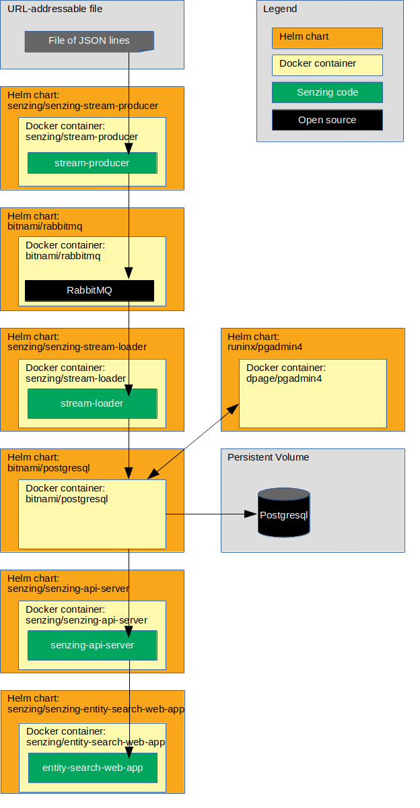

# kubernetes-demo-helm-rabbitmq-postgresql-airgapped

## Synopsis

Bring up a Senzing stack on Kubernetes in an air-gapped environment
using Helm, RabbitMQ, and a PostgreSQL database.

## Overview

This repository illustrates a reference implementation of Senzing using
PostgreSQL as the underlying database.

The instructions show how to set up a system that:

1. Reads JSON lines from a file and sends each JSON line to a message queue using the Senzing
   [stream-producer](https://github.com/Senzing/stream-producer).
    1. In this implementation, the queue is RabbitMQ.
1. Reads messages from the queue and inserts into Senzing using the Senzing
   [stream-loader](https://github.com/Senzing/stream-loader).
    1. In this implementation, Senzing keeps its data in a PostgreSQL database.
1. Reads information from Senzing using the [Senzing API Server](https://github.com/Senzing/senzing-api-server) server.
1. Views resolved entities in a [web app](https://github.com/Senzing/entity-search-web-app).

The following diagram shows the relationship of the Helm charts, docker containers, and code in this Kubernetes demonstration.



### Contents

1. [Preamble](#preamble)
1. [Related artifacts](#related-artifacts)
1. [Expectations](#expectations)
1. [Prerequisites](#prerequisites)
    1. [Prerequisite software on non-airgapped system](#prerequisite-software-on-non-airgapped-system)
    1. [Prerequisite software on air-apped system](#prerequisite-software-on-air-gapped-system)
    1. [Prerequisites on kubernetes](#prerequisites-on-kubernetes)
1. [On non-airgapped system](#on-non-airgapped-system)
    1. [Create artifact directory](#create-artifact-directory)
    1. [Download git repositories](#download-git-repositories)
    1. [Download version metadata](#download-version-metadata)
    1. [Download Governor](#download-governor)
    1. [Download sample data](#download-sample-data)
    1. [Add Senzing license](#add-senzing-license)
    1. [Create senzing/installer docker image](#create-senzinginstaller-docker-image)
    1. [Download Docker images](#download-docker-images)
    1. [Transfer Docker images](#transfer-docker-images)
    1. [Save environment variables for air-gapped environment](#save-environment-variables-for-air-gapped-environment)
    1. [Package artifacts](#package-artifacts)
1. [Transfer to air-gapped system](#transfer-to-air-gapped-system)
1. [On Air-gapped system](#on-air-gapped-system)
    1. [Decompress file](#decompress-file)
    1. [Create deployment directory](#create-deployment-directory)
    1. [Set environment variables](#set-environment-variables)
    1. [Load Docker images](#load-docker-images)
    1. [Save environment variables](#save-environment-variables)
    1. [Create custom helm values files](#create-custom-helm-values-files)
    1. [Create custom kubernetes configuration files](#create-custom-kubernetes-configuration-files)
    1. [Create namespace](#create-namespace)
    1. [Create persistent volume](#create-persistent-volume)
    1. [Deploy Senzing](#deploy-senzing)
    1. [Install senzing-console-privileged Helm chart](#install-senzing-console-privileged-helm-chart)
    1. [Install Senzing license](#install-senzing-license)
    1. [Install Senzing Governor](#install-senzing-governor)
    1. [Install sample data](#install-sample-data)
    1. [Install Postgresql Helm chart](#install-postgresql-helm-chart)
    1. [Initialize database](#initialize-database)
    1. [Install phpPgAdmin Helm chart](#install-phppgadmin-helm-chart)
    1. [Install RabbitMQ Helm chart](#install-rabbitmq-helm-chart)
    1. [Install stream-producer Helm chart](#install-stream-producer-helm-chart)
    1. [Install init-container Helm chart](#install-init-container-helm-chart)
    1. [Install stream-loader Helm chart](#install-stream-loader-helm-chart)
    1. [Install senzing-api-server Helm chart](#install-senzing-api-server-helm-chart)
    1. [Install senzing-entity-search-web-app Helm chart](#install-senzing-entity-search-web-app-helm-chart)
    1. [Optional charts](#optional-charts)
        1. [Install senzing-redoer Helm chart](#install-senzing-redoer-helm-chart)
        1. [Install SwaggerUI Helm chart](#install-swaggerui-helm-chart)
        1. [Install configurator Helm chart](#install-configurator-helm-chart)
    1. [View data](#view-data)
        1. [View RabbitMQ](#view-rabbitmq)
        1. [View PostgreSQL](#view-postgresql)
        1. [View Senzing Console pod](#view-senzing-console-pod)
        1. [View Senzing API Server](#view-senzing-api-server)
        1. [View Senzing Entity Search WebApp](#view-senzing-entity-search-webapp)
        1. [View SwaggerUI](#view-swaggerui)
        1. [View Senzing Configurator](#view-senzing-configurator)
1. [Cleanup](#cleanup)
    1. [Delete everything in Kubernetes](#delete-everything-in-kubernetes)
1. [Errors](#errors)
1. [References](#references)

## Preamble

At [Senzing](http://senzing.com),
we strive to create GitHub documentation in a
"[don't make me think](https://github.com/Senzing/knowledge-base/blob/master/WHATIS/dont-make-me-think.md)" style.
For the most part, instructions are copy and paste.
Whenever thinking is needed, it's marked with a "thinking" icon :thinking:.
Whenever customization is needed, it's marked with a "pencil" icon :pencil2:.
If the instructions are not clear, please let us know by opening a new
[Documentation issue](https://github.com/Senzing/kubernetes-demo/issues/new?assignees=&labels=&template=documentation_request.md)
describing where we can improve.   Now on with the show...

### Legend

1. :thinking: - A "thinker" icon means that a little extra thinking may be required.
   Perhaps you'll need to make some choices.
   Perhaps it's an optional step.
1. :pencil2: - A "pencil" icon means that the instructions may need modification before performing.
1. :warning: - A "warning" icon means that something tricky is happening, so pay attention.

## Related artifacts

1. [DockerHub](https://hub.docker.com/r/senzing)
1. [Helm Charts](https://github.com/Senzing/charts)

## Expectations

- **Space:** This repository and demonstration require 20 GB free disk space.
- **Time:** Budget 4 hours to get the demonstration up-and-running, depending on CPU and network speeds.
- **Background knowledge:** This repository assumes a working knowledge of:
  - [Docker](https://github.com/Senzing/knowledge-base/blob/master/WHATIS/docker.md)
  - [Kubernetes](https://github.com/Senzing/knowledge-base/blob/master/WHATIS/kubernetes.md)
  - [Helm](https://github.com/Senzing/knowledge-base/blob/master/WHATIS/helm.md)

## Prerequisites

### Prerequisite software on non-airgapped system

1. [Helm 3](https://github.com/Senzing/knowledge-base/blob/master/HOWTO/install-helm.md)

### Prerequisite software on air-gapped system

1. [kubectl](https://github.com/Senzing/knowledge-base/blob/master/HOWTO/install-kubectl.md)
1. [Helm 3](https://github.com/Senzing/knowledge-base/blob/master/HOWTO/install-helm.md)
1. Kubernetes

### Prerequisites on kubernetes

1. Persistent Volume Claims:
    1. PostgreSql - `postgresql-persistent-volume-claim`
    1. RabbitMQ = `rabbitmq-persistent-volume-claim`
    1. Senzing - `senzing-persistent-volume-claim`
        1. 50GB
        1. Read-Write-Many

## On non-airgapped system

On a non-airgapped system,
aggregate all of the files needed on an air-gapped system.

### Create artifact directory

A new directory is created to place all
artifacts that will be compressed into a single file.
On the non-airgapped system:

1. :pencil2: Choose a name that will be used for the new `.zip` file
   and for the working directory use to construct the `.zip` file.
   Example:

    ```console
    export SENZING_AIRGAPPED_FILENAME=my-senzing-airgapped
    ```

1. Make a directory on the non-airgapped system that will be used to
   aggregate artifacts to be transferred to air-gapped system.
   Example:

    ```console
    export SENZING_AIRGAPPED_WORK_DIR=~/${SENZING_AIRGAPPED_FILENAME}
    export SENZING_AIRGAPPED_DIR=${SENZING_AIRGAPPED_WORK_DIR}/${SENZING_AIRGAPPED_FILENAME}
    mkdir -p ${SENZING_AIRGAPPED_DIR}
    ```

### Download git repositories

[Helm Charts](https://helm.sh/)
and helper scripts need to be added to the
artifact directory.
On the non-airgapped system:

1. Download
   [Bitnami Helm charts](https://github.com/bitnami/charts/)
   git repository, dependencies, and eliminate unnecessary files.
   Example:

    ```console
    curl -X GET \
      --output ${SENZING_AIRGAPPED_DIR}/bitnami-charts.zip \
      https://codeload.github.com/bitnami/charts/zip/refs/heads/master

    unzip \
      -d ${SENZING_AIRGAPPED_DIR}/bitnami-charts-tmp \
      ${SENZING_AIRGAPPED_DIR}/bitnami-charts.zip

    mv ${SENZING_AIRGAPPED_DIR}/bitnami-charts-tmp/charts-master \
       ${SENZING_AIRGAPPED_DIR}/bitnami-charts

    rmdir ${SENZING_AIRGAPPED_DIR}/bitnami-charts-tmp
    rm    ${SENZING_AIRGAPPED_DIR}/bitnami-charts.zip

    pushd ${SENZING_AIRGAPPED_DIR}/bitnami-charts
    rm *
    rm .*
    rm -rf .*
    rm -rf !("bitnami")
    pushd ${SENZING_AIRGAPPED_DIR}/bitnami-charts/bitnami
    rm -rf !("postgresql"|"rabbitmq")
    popd
    popd

    for CHART_DIR in ${SENZING_AIRGAPPED_DIR}/bitnami-charts/bitnami/* ; do
        echo "Processing: ${CHART_DIR}"
        helm dependency update ${CHART_DIR}
    done
    ```

1. Download
   [Senzing Helm charts](https://github.com/Senzing/charts)
   git repository, dependencies, and eliminate unnecessary files.
   Example:

    ```console
    curl -X GET \
      --output ${SENZING_AIRGAPPED_DIR}/senzing-charts.zip \
      https://codeload.github.com/Senzing/charts/zip/refs/heads/master

    unzip \
      -d ${SENZING_AIRGAPPED_DIR}/senzing-charts-tmp \
      ${SENZING_AIRGAPPED_DIR}/senzing-charts.zip

    mv ${SENZING_AIRGAPPED_DIR}/senzing-charts-tmp/charts-master \
       ${SENZING_AIRGAPPED_DIR}/senzing-charts

    rmdir ${SENZING_AIRGAPPED_DIR}/senzing-charts-tmp
    rm    ${SENZING_AIRGAPPED_DIR}/senzing-charts.zip

    pushd ${SENZING_AIRGAPPED_DIR}/senzing-charts
    rm *
    rm .*
    rm -rf .*
    rm -rf !("charts")
    pushd ${SENZING_AIRGAPPED_DIR}/senzing-charts/charts
    rm -rf !("phppgadmin"|"senzing-api-server"|"senzing-configurator"|"senzing-console"|"senzing-entity-search-web-app"|"senzing-init-container"|"senzing-installer"|"senzing-postgresql-client"|"senzing-redoer"|"senzing-stream-loader"|"senzing-stream-producer"|"swaggerapi-swagger-ui"|)
    popd
    popd

    for CHART_DIR in ${SENZING_AIRGAPPED_DIR}/senzing-charts/charts/* ; do
        echo "Processing: ${CHART_DIR}"
        helm dependency update ${CHART_DIR}
    done
    ```

1. Download
   [Senzing's Kubernetes Demo](https://github.com/Senzing/kubernetes-demo)
   git repository.
   Example:

    ```console
    curl -X GET \
      --output ${SENZING_AIRGAPPED_DIR}/kubernetes-demo.zip \
      https://codeload.github.com/Senzing/kubernetes-demo/zip/refs/heads/master

    unzip \
      -d ${SENZING_AIRGAPPED_DIR}/kubernetes-demo-tmp \
      ${SENZING_AIRGAPPED_DIR}/kubernetes-demo.zip

    mv ${SENZING_AIRGAPPED_DIR}/kubernetes-demo-tmp/kubernetes-demo-master \
       ${SENZING_AIRGAPPED_DIR}/kubernetes-demo

    rmdir ${SENZING_AIRGAPPED_DIR}/kubernetes-demo-tmp
    rm    ${SENZING_AIRGAPPED_DIR}/kubernetes-demo.zip
    ```

### Download version metadata

Metadata identifying versions of
[Docker images](https://github.com/Senzing/knowledge-base/blob/master/lists/docker-versions-latest.sh)
and
[Senzing binaries](https://github.com/Senzing/knowledge-base/blob/master/lists/senzing-versions-latest.sh)
need to be added to the artifact directory.
On the non-airgapped system:

1. Create directory used to store executable scripts and binary files.
   Example:

    ```console
    mkdir ${SENZING_AIRGAPPED_DIR}/bin
    ```

1. Download current Senzing versions.
   This file will be used in future `source` commmands.
   Example:

    ```console
    curl -X GET \
      --output ${SENZING_AIRGAPPED_DIR}/bin/senzing-versions-latest.sh \
      https://raw.githubusercontent.com/Senzing/knowledge-base/master/lists/senzing-versions-latest.sh
    ```

1. Download current Senzing docker versions.
   This file will be used in future `source` commmands.
   Example:

    ```console
    curl -X GET \
      --output ${SENZING_AIRGAPPED_DIR}/bin/docker-versions-latest.sh \
      https://raw.githubusercontent.com/Senzing/knowledge-base/master/lists/docker-versions-latest.sh
    ```

### Download Governor

The Senzing PostgreSQL
[Governor](https://github.com/Senzing/governor-postgresql-transaction-id)
needs to be added to the artifact directory.
On the non-airgapped system:

1. Download Senzing Governor for PostgreSQL.
   Example:

    ```console
    mkdir -p ${SENZING_AIRGAPPED_DIR}/opt/senzing/g2/python

    curl -X GET \
      --output ${SENZING_AIRGAPPED_DIR}/opt/senzing/g2/python/senzing_governor.py \
      https://raw.githubusercontent.com/Senzing/governor-postgresql-transaction-id/master/senzing_governor.py
    ```

### Download sample data

To demonstrate populating Senzing,
sample data will be added to the artifact directory.
On the non-airgapped system:

1. Get sample data.

   **Note:**
   Only 10,000 records will be downloaded from file.
   The byte `--range`  will download slightly more than 10K lines.
   Example:

    ```console
    mkdir -p ${SENZING_AIRGAPPED_DIR}/var/opt/senzing/data

    curl -X GET \
      --output ${SENZING_AIRGAPPED_DIR}/var/opt/senzing/loadtest-dataset.json \
      --range 0-4300000 \
      https://s3.amazonaws.com/public-read-access/TestDataSets/loadtest-dataset-1M.json
    ```

### Add Senzing license

To ingest more than the default number of allowed records, a
[Senzing license](https://github.com/Senzing/knowledge-base/blob/master/HOWTO/obtain-senzing-license.md)
should be added to the artifact directory.
On the non-airgapped system:

1. :pencil2: Locate your Senzing license file (usually `g2.lic`).
   Example:

    ```console
    export SENZING_LICENSE_FILE=~/Downloads/g2.lic
    ```

1. Copy license into directory for air-gapped artifacts.
   Example:

    ```console
    mkdir -p ${SENZING_AIRGAPPED_DIR}/etc/opt/senzing
    cp ${SENZING_LICENSE_FILE} ${SENZING_AIRGAPPED_DIR}/etc/opt/senzing/g2.lic
    ```

### Create senzing/installer docker image

To install the Senzing binaries on the Kubernetes PV/PVC
on the air-gapped system, a Docker image needs to be created
locally which contains the contents of the Senzing `g2` and `data` folders.
On the non-airgapped system:

1. :warning:
   To use the Senzing code, you must agree to the End User License Agreement (EULA).
   This step is intentionally tricky and not simply copy/paste.
   This ensures that you make a conscious effort to accept the EULA.
   Example:

    <pre>export SENZING_ACCEPT_EULA="&lt;the value from <a href="https://github.com/Senzing/knowledge-base/blob/master/lists/environment-variables.md#senzing_accept_eula">this link</a>&gt;"</pre>

1. Run the `docker build` command.

   **Note:**
   This will take a while as the Senzing binary packages will be downloaded.
   Example:

    ```console
    source ${SENZING_AIRGAPPED_DIR}/bin/senzing-versions-latest.sh

    sudo docker build \
        --build-arg SENZING_ACCEPT_EULA=${SENZING_ACCEPT_EULA} \
        --build-arg SENZING_APT_INSTALL_PACKAGE="senzingapi=${SENZING_VERSION_SENZINGAPI_BUILD}" \
        --tag senzing/installer:${SENZING_VERSION_SENZINGAPI} \
        https://github.com/Senzing/docker-installer.git
    ```

### Download Docker images

These steps download the Docker images to the
local Docker registry on the non-airgapped machine.
On the non-airgapped system:

1. Identify versioned docker images
   using the `source` command.
   Example:

    ```console
    source ${SENZING_AIRGAPPED_DIR}/bin/docker-versions-latest.sh
    source ${SENZING_AIRGAPPED_DIR}/kubernetes-demo/bin/airgapped/docker-images.sh
    ```

1. Pull docker images.
   Example:

    ```console
    for DOCKER_IMAGE in ${DOCKER_IMAGES[@]};
    do
        echo ${DOCKER_IMAGE}
        sudo docker pull ${DOCKER_IMAGE}
    done
    ```

### Transfer Docker images

There are two method of transferring the docker images to the air-gapped system.
The first option being the ability to `docker push` to a private docker registry used by the air-gapped system.
The second option is to package the docker images in the final `.zip` file
and later load them on the air-gapped system.
Only one of the two options need be followed.

#### Use private Docker registry

1. :thinking: **Optional:**
   *Option 1* -
   If the "air-gapped" private Docker registry **can** be accessed from the non-airgapped system, use
   [docker push](https://docs.docker.com/engine/reference/commandline/push/)
   to transfer the docker images.

    1. :pencil2: Identify the private Docker registry
       Example:

        ```console
        export DOCKER_REGISTRY_URL=my.docker-registry.com:5000
        ```

    1. Tag and push docker images to private Docker registry
       Example:

        ```console
        ${SENZING_AIRGAPPED_DIR}/kubernetes-demo/bin/docker-tag-and-push.sh
        ```

#### Package saved Docker images

1. :thinking: **Optional:**
   *Option 2* -
   If the "air-gapped" private Docker registry **cannot** be accessed from the non-airgapped system, use
   [docker save](https://docs.docker.com/engine/reference/commandline/save/)
   to create files that can be transferred to the air-gapped system.
   Example:

    ```console
    mkdir ${SENZING_AIRGAPPED_DIR}/docker-images
    mkdir ${SENZING_AIRGAPPED_DIR}/docker-images/bitnami
    mkdir ${SENZING_AIRGAPPED_DIR}/docker-images/senzing
    mkdir ${SENZING_AIRGAPPED_DIR}/docker-images/swaggerapi

    for DOCKER_IMAGE in ${DOCKER_IMAGES[@]};
    do
        echo ${DOCKER_IMAGE}
        docker save ${DOCKER_IMAGE} \
         --output ${SENZING_AIRGAPPED_DIR}/docker-images/${DOCKER_IMAGE}.tar
    done
    ```

### Save environment variables for air-gapped environment

To "reuse" environment variables on the air-gapped system,
the environment variables set on the non-airgapped system
need to be captured in a file that can be used by the
`source` command on the air-gapped system.
On the non-airgapped system:

1. Create a `${SENZING_AIRGAPPED_DIR}/bin/environment.sh` file
   that can be used by the `source` command on the air-gapped machine.
   Example:

    ```console
    ${SENZING_AIRGAPPED_DIR}/kubernetes-demo/bin/airgapped/save-environment-variables.sh
    ```

### Package artifacts

Create a single file that can be transferred to the air-gapped machine.
On the non-airgapped system:

1. Compress directory into single `.zip` file.
   The file size will be between 4-5 GB.
   Example:

    ```console
    cd ${SENZING_AIRGAPPED_WORK_DIR}
    zip -r ~/${SENZING_AIRGAPPED_FILENAME}.zip *
    ```

## Transfer to air-gapped system

Transfer `senzing-airgap-artifacts.zip` to air-gapped system.

1. For the demonstration, it is assumed that it will be placed at
   `~/senzing-airgap-artifacts.zip` on the air-gapped system.

## On air-gapped system

The following steps are performed on the air-gapped system.

### Decompress file

The contents of the single file need to be extracted into a
new directory on the air-gapped machine.

1. Decompress `senzing-airgap-artifacts.zip` into "home" directory.
   Example:

    ```console
    unzip -d ~ ~/my-senzing-airgapped.zip
    ```

1. Identify the artifact directory.
   Example:

    ```console
    export SENZING_AIRGAPPED_DIR=~/my-senzing-airgapped
    ```

### Create deployment directory

An additional "deployment directory" needs to be created to store modified artifacts.
In this demonstration, the contents of `${SENZING_AIRGAPPED_DIR}`
will be considered **read-only** so that they can be reused.

1. :pencil2: Create a unique prefix.
   This will be used in a local directory name
   as well as a prefix to kubernetes object.

   :warning:  Because it's used in kubernetes resource names,
   it must be all lowercase.

   Example:

    ```console
    export DEMO_PREFIX=my
    ```

1. Make a directory for the demo.
   Oddly, the "prefix" will be used as a "suffix" for the new deployment directory.
   It will be used as a prefix in other contexts.
   Example:

    ```console
    export SENZING_DEMO_DIR=${SENZING_AIRGAPPED_DIR}-${DEMO_PREFIX}
    mkdir -p ${SENZING_DEMO_DIR}
    ```

### Set environment variables

1. Synthesize environment variables.
   Example:

    ```console
    export DEMO_NAMESPACE=${DEMO_PREFIX}-namespace
    ```

1. Set environment variables that identify Docker image versions
   using the `source` command.
   Example:

    ```console
    source ${SENZING_AIRGAPPED_DIR}/bin/docker-versions-latest.sh
    ```

1. Set environment variables that identify Senzing versions
   using the `source` command.
   Example:

    ```console
    source ${SENZING_AIRGAPPED_DIR}/bin/senzing-versions-latest.sh
    ```

1. Identify location of `kubernetes-demo` repository
   using the `source` command.
   Example:

    ```console
    source ${SENZING_AIRGAPPED_DIR}/bin/environment.sh
    ```

### Load Docker images

:thinking: **Optional:**
If the
[Package saved Docker images](#package-saved-docker-images)
option was chosen
(i.e. not the
[Use private Docker registry](#use-private-docker-registry)
option),
then the docker images need to be loaded into
an air-gapped private Docker registry.

1. Load Docker image files into local docker repository.
   Example:

    ```console
    ${SENZING_AIRGAPPED_DIR}/kubernetes-demo/bin/airgapped/docker-load.sh
    ```

1. :pencil2: Identify private Docker registry.
   Example:

    ```console
    export DOCKER_REGISTRY_URL=my.docker-registry.com:5000
    ```

1. :thinking: **Optional:**
 : Identify Docker registry secret.
   Example:

    ```console
    export DOCKER_REGISTRY_SECRET=${DEMO_PREFIX}-registry-secret
    ```

1. :thinking: **Optional:**
   If `sudo` is needed to run docker commands.
   Example:

    ```console
    export SENZING_SUDO=sudo
    ```

1. Push Docker images to private docker registry.
   Example:

    ```console
    source ${SENZING_AIRGAPPED_DIR}/kubernetes-demo/bin/airgapped/docker-images.sh
    ${SENZING_AIRGAPPED_DIR}/kubernetes-demo/bin/docker-tag-and-push.sh
    ```

### Save environment variables

1. Save environment variables into a file that can be sourced.
   Example:

    ```console
    ${SENZING_AIRGAPPED_DIR}/kubernetes-demo/bin/save-environment-variables.sh
    ```

### Create custom helm values files

1. Helm template files are instantiated with actual values
   into `${HELM_VALUES_DIR}` directory
   using `envsubst` on template files.
   Example:

    ```console
    export HELM_VALUES_DIR=${SENZING_DEMO_DIR}/helm-values
    ${SENZING_AIRGAPPED_DIR}/kubernetes-demo/bin/make-helm-values-files.sh
    ```

1. :thinking: **Optional:**
   List newly generated files.
   Example:

    ```console
    ls ${HELM_VALUES_DIR}
    ```

### Create custom kubernetes configuration files

1. Kubernetes manifest files are instantiated with actual values
   into `{KUBERNETES_DIR}` directory
   using `envsubst` on template files.
   Example:

    ```console
    export KUBERNETES_DIR=${SENZING_DEMO_DIR}/kubernetes
    ${SENZING_AIRGAPPED_DIR}/kubernetes-demo/bin/make-kubernetes-manifest-files.sh
    ```

1. :thinking: **Optional:**
   List newly generated files.
   Example:

    ```console
    ls ${KUBERNETES_DIR}
    ```

### Create namespace

A new
[kubernetes namespace](https://kubernetes.io/docs/concepts/overview/working-with-objects/namespaces/)
is created to isolate this demonstration from other applications running on Kubernetes.

1. Create Kubernetes namespace using
   [kubectl create](https://kubernetes.io/docs/reference/generated/kubectl/kubectl-commands#create).
   Example:

    ```console
    kubectl create -f ${KUBERNETES_DIR}/namespace.yaml
    ```

1. :thinking: **Optional:**
   Review namespaces using
   [kubectl get](https://kubernetes.io/docs/reference/generated/kubectl/kubectl-commands#get).
   Example:

    ```console
    kubectl get namespaces
    ```

### Create persistent volume

:thinking: **Optional:**
These steps for creating Persistent Volumes (PV) and Persistent Volume Claims (PVC)
are for a demonstration environment.
They are not sufficient for a production environment.
If PVs and PVCs already exist, this step may be skipped.

1. Create persistent volumes using
   [kubectl create](https://kubernetes.io/docs/reference/generated/kubectl/kubectl-commands#create).
   Example:

    ```console
    kubectl create -f ${KUBERNETES_DIR}/persistent-volume-postgresql.yaml
    kubectl create -f ${KUBERNETES_DIR}/persistent-volume-rabbitmq.yaml
    kubectl create -f ${KUBERNETES_DIR}/persistent-volume-senzing.yaml
    ```

1. Create persistent volume claims using
   [kubectl create](https://kubernetes.io/docs/reference/generated/kubectl/kubectl-commands#create).
   Example:

    ```console
    kubectl create -f ${KUBERNETES_DIR}/persistent-volume-claim-postgresql.yaml
    kubectl create -f ${KUBERNETES_DIR}/persistent-volume-claim-rabbitmq.yaml
    kubectl create -f ${KUBERNETES_DIR}/persistent-volume-claim-senzing.yaml
    ```

1. :thinking: **Optional:**
   Review persistent volumes and claims using
   [kubectl get](https://kubernetes.io/docs/reference/generated/kubectl/kubectl-commands#get).
   Example:

    ```console
    kubectl get persistentvolumes \
      --namespace ${DEMO_NAMESPACE}

    kubectl get persistentvolumeClaims \
      --namespace ${DEMO_NAMESPACE}
    ```

### Deploy Senzing

Copy Senzing's `g2` and `data` directories onto the Persistent Volume Claim (PVC)
at `/opt/senzing/g2` and `/opt/senzing/data`.
These paths are relative to inside the containers via PVC mounts.
The actual location on the PVC may vary.

1. Install chart using
   [helm install](https://helm.sh/docs/helm/helm_install/).
   Example:

    ```console
    helm install \
      ${DEMO_PREFIX}-senzing-installer \
      ${SENZING_AIRGAPPED_DIR}/senzing-charts/charts/senzing-installer \
      --namespace ${DEMO_NAMESPACE} \
      --values ${HELM_VALUES_DIR}/senzing-installer.yaml
    ```

1. Wait until Job has completed using
   [kubectl get](https://kubernetes.io/docs/reference/generated/kubectl/kubectl-commands#get).
   Example:

    ```console
    kubectl get pods \
      --namespace ${DEMO_NAMESPACE} \
      --watch
    ```

1. Example of completion:

    ```console
    NAME                         READY   STATUS      RESTARTS   AGE
    my-senzing-installer-8n2ql   0/1     Completed   0          2m44s
    ```

### Install senzing-console-privileged Helm chart

The [senzing-console](https://github.com/Senzing/docker-senzing-console)
will be used later to:

- Inspect mounted volumes
- Debug issues
- Run command-line tools

1. Install chart using
   [helm install](https://helm.sh/docs/helm/helm_install/).
   Example:

    ```console
    helm install \
      ${DEMO_PREFIX}-senzing-console-privileged \
      ${SENZING_AIRGAPPED_DIR}/senzing-charts/charts/senzing-console \
      --namespace ${DEMO_NAMESPACE} \
      --values ${HELM_VALUES_DIR}/senzing-console-postgresql-privileged.yaml
    ```

1. For the next steps, capture the pod name in `CONSOLE_POD_NAME` using
   [kubectl get](https://kubernetes.io/docs/reference/generated/kubectl/kubectl-commands#get).
   Example:

    ```console
    export CONSOLE_POD_NAME=$(kubectl get pods \
      --namespace ${DEMO_NAMESPACE} \
      --output jsonpath="{.items[0].metadata.name}" \
      --selector "app.kubernetes.io/name=senzing-console, \
                  app.kubernetes.io/instance=${DEMO_PREFIX}-senzing-console-privileged" \
      )
    ```

1. To use senzing-console pod, see [View Senzing Console pod](#view-senzing-console-pod).

### Install Senzing license

1. Copy the Senzing license to `/etc/opt/senzing/g2.lic`.

    ```console
    kubectl cp \
      ${SENZING_AIRGAPPED_DIR}/etc/opt/senzing/g2.lic \
      ${DEMO_NAMESPACE}/${CONSOLE_POD_NAME}:/etc/opt/senzing/g2.lic
    ```

### Install Senzing Governor

1. Copy the Postgresql governor to `/opt/senzing/g2/python/senzing_governor.py`.

    ```console
    kubectl cp \
      ${SENZING_AIRGAPPED_DIR}/opt/senzing/g2/python/senzing_governor.py \
      ${DEMO_NAMESPACE}/${CONSOLE_POD_NAME}:/opt/senzing/g2/python/senzing_governor.py
    ```

### Install sample data

1. Copy the sample data to `/var/opt/senzing/loadtest-dataset.json`.

    ```console
    kubectl cp \
      ${SENZING_AIRGAPPED_DIR}/var/opt/senzing/loadtest-dataset.json \
      ${DEMO_NAMESPACE}/${CONSOLE_POD_NAME}:/var/opt/senzing/loadtest-dataset.json
    ```

### Install Postgresql Helm chart

:thinking: This step installs a PostgreSQL database container.
It is not a production-ready database and is only used for demonstration purposes.
It also is a **limiting** factor in the speed at which Senzing can operate.
In a production environment,
a separate PostgreSQL database would be provisioned and maintained.
The `helm-values/*.yaml` files would then be updated to have the
`SENZING_DATABASE_URL` point to the production database.

The
[binami/postgresql Helm Chart](https://github.com/bitnami/charts/tree/master/bitnami/postgresql)
provisions an instance of the
[bitnami/postgresql Docker image](https://hub.docker.com/r/bitnami/postgresql).

1. Create Configmap for `pg_hba.conf` using
   [kubectl create](https://kubernetes.io/docs/reference/generated/kubectl/kubectl-commands#create).
   Example:

    ```console
    kubectl create configmap ${DEMO_PREFIX}-pg-hba \
      --namespace ${DEMO_NAMESPACE} \
      --from-file=${KUBERNETES_DIR}/pg_hba.conf
    ```

    Note: `pg_hba.conf` will be stored in the PersistentVolumeClaim.

1. Install chart using
   [helm install](https://helm.sh/docs/helm/helm_install/).
   Example:

    ```console
    helm install \
      ${DEMO_PREFIX}-bitnami-postgresql \
      ${SENZING_AIRGAPPED_DIR}/bitnami-charts/bitnami/postgresql \
      --namespace ${DEMO_NAMESPACE} \
      --values ${HELM_VALUES_DIR}/bitnami-postgresql.yaml
    ```

1. Wait for pod to run using
   [kubectl get](https://kubernetes.io/docs/reference/generated/kubectl/kubectl-commands#get).
   Example:

    ```console
    kubectl get pods \
      --namespace ${DEMO_NAMESPACE} \
      --watch
    ```

1. Example of pod running:

    ```console
    NAME                                   READY   STATUS      RESTARTS   AGE
    my-bitnami-postgresql-6bf64cbbdf-25gtb  1/1     Running     0          10m
    ```

### Initialize database

The [PostgreSQL Client](https://github.com/Senzing/charts/tree/master/charts/senzing-postgresql-client)
is used to create tables in the database (i.e. the schema) used by Senzing.

1. Install chart using
   [helm install](https://helm.sh/docs/helm/helm_install/).
   Example:

    ```console
    helm install \
      ${DEMO_PREFIX}-senzing-postgresql-client \
      ${SENZING_AIRGAPPED_DIR}/senzing-charts/charts/senzing-postgresql-client \
      --namespace ${DEMO_NAMESPACE} \
      --values ${HELM_VALUES_DIR}/senzing-postgresql-client.yaml
    ```

### Install phpPgAdmin Helm chart

[phpPgAdmin](https://github.com/phppgadmin/phppgadmin)
is a web-based user interface for viewing the PostgreSQL database.

1. Install chart using
   [helm install](https://helm.sh/docs/helm/helm_install/).
   Example:

    ```console
    helm install \
      ${DEMO_PREFIX}-phppgadmin \
      ${SENZING_AIRGAPPED_DIR}/senzing-charts/charts/phppgadmin \
      --namespace ${DEMO_NAMESPACE} \
      --values ${HELM_VALUES_DIR}/phppgadmin.yaml
    ```

1. To view PostgreSQL using phpPgAdmin, see [View PostgreSQL](#view-postgresql).

### Install RabbitMQ Helm chart

The
[binami/rabbitmq Helm Chart](https://github.com/bitnami/charts/tree/master/bitnami/rabbitmq)
provisions an instance of the
[bitnami/rabbitmq Docker image](https://hub.docker.com/r/bitnami/rabbitmq).

1. Install chart using
   [helm install](https://helm.sh/docs/helm/helm_install/).
   Example:

    ```console
    helm install \
      ${DEMO_PREFIX}-bitnami-rabbitmq \
      ${SENZING_AIRGAPPED_DIR}/bitnami-charts/bitnami/rabbitmq \
      --namespace ${DEMO_NAMESPACE} \
      --values ${HELM_VALUES_DIR}/bitnami-rabbitmq.yaml
    ```

1. Wait for pods to run using
   [kubectl get](https://kubernetes.io/docs/reference/generated/kubectl/kubectl-commands#get).
   Example:

    ```console
    kubectl get pods \
      --namespace ${DEMO_NAMESPACE} \
      --watch
    ```

1. To view RabbitMQ, see [View RabbitMQ](#view-rabbitmq).

### Install stream-producer Helm chart

The [stream producer](https://github.com/Senzing/stream-producer)
pulls JSON lines from a file and pushes them to message queue using
[helm install](https://helm.sh/docs/helm/helm_install/).

1. Install chart using
   [helm install](https://helm.sh/docs/helm/helm_install/).
   Example:

    ```console
    helm install \
      ${DEMO_PREFIX}-senzing-stream-producer \
      ${SENZING_AIRGAPPED_DIR}/senzing-charts/charts/senzing-stream-producer \
      --namespace ${DEMO_NAMESPACE} \
      --values ${HELM_VALUES_DIR}/senzing-stream-producer-rabbitmq-airgapped.yaml
    ```

### Install init-container Helm chart

The [init-container](https://github.com/Senzing/docker-init-container)
creates files from templates and initializes the G2 database.

1. Install chart using
   [helm install](https://helm.sh/docs/helm/helm_install/).
   Example:

    ```console
    helm install \
      ${DEMO_PREFIX}-senzing-init-container \
      ${SENZING_AIRGAPPED_DIR}/senzing-charts/charts/senzing-init-container \
      --namespace ${DEMO_NAMESPACE} \
      --values ${HELM_VALUES_DIR}/senzing-init-container-postgresql.yaml
    ```

1. Wait for pods to run using
   [kubectl get](https://kubernetes.io/docs/reference/generated/kubectl/kubectl-commands#get).
   Example:

    ```console
    kubectl get pods \
      --namespace ${DEMO_NAMESPACE} \
      --watch
    ```

### Install stream-loader Helm chart

The [stream loader](https://github.com/Senzing/stream-loader)
pulls messages from message queue and sends them to Senzing.

1. Install chart using
   [helm install](https://helm.sh/docs/helm/helm_install/).
   Example:

    ```console
    helm install \
      ${DEMO_PREFIX}-senzing-stream-loader \
      ${SENZING_AIRGAPPED_DIR}/senzing-charts/charts/senzing-stream-loader \
      --namespace ${DEMO_NAMESPACE} \
      --values ${HELM_VALUES_DIR}/senzing-stream-loader-rabbitmq-postgresql.yaml
    ```

### Install senzing-api-server Helm chart

The [Senzing API server](https://github.com/Senzing/senzing-api-server)
receives HTTP requests to read and modify Senzing data.

1. Install chart using
   [helm install](https://helm.sh/docs/helm/helm_install/).
   Example:

    ```console
    helm install \
      ${DEMO_PREFIX}-senzing-api-server \
      ${SENZING_AIRGAPPED_DIR}/senzing-charts/charts/senzing-api-server \
      --namespace ${DEMO_NAMESPACE} \
      --values ${HELM_VALUES_DIR}/senzing-api-server-postgresql.yaml
    ```

1. Wait for pods to run using
   [kubectl get](https://kubernetes.io/docs/reference/generated/kubectl/kubectl-commands#get).
   Example:

    ```console
    kubectl get pods \
      --namespace ${DEMO_NAMESPACE} \
      --watch
    ```

1. To view Senzing API server, see [View Senzing API Server](#view-senzing-api-server).

### Install senzing-entity-search-web-app Helm chart

The [Senzing Entity Search WebApp](https://github.com/Senzing/entity-search-web-app)
is a light-weight WebApp demonstrating Senzing search capabilities.

1. Install chart using
   [helm install](https://helm.sh/docs/helm/helm_install/).
   Example:

    ```console
    helm install \
      ${DEMO_PREFIX}-senzing-entity-search-web-app \
      ${SENZING_AIRGAPPED_DIR}/senzing-charts/charts/senzing-entity-search-web-app \
      --namespace ${DEMO_NAMESPACE} \
      --values ${HELM_VALUES_DIR}/senzing-entity-search-web-app.yaml
    ```

1. Wait until Deployment has completed using
   [kubectl get](https://kubernetes.io/docs/reference/generated/kubectl/kubectl-commands#get).
   Example:

    ```console
    kubectl get pods \
      --namespace ${DEMO_NAMESPACE} \
      --watch
    ```

1. To view Senzing Entity Search WebApp, see [View Senzing Entity Search WebApp](#view-senzing-entity-search-webapp).

### Optional charts

These charts are not necessary for the demonstration,
but may be valuable in a production environment.

#### Install senzing-redoer Helm chart

The [redoer](https://github.com/Senzing/redoer) pulls Senzing redo records from the Senzing database and re-processes.

1. Install chart using
   [helm install](https://helm.sh/docs/helm/helm_install/).
   Example:

    ```console
    helm install \
      ${DEMO_PREFIX}-senzing-redoer \
      ${SENZING_AIRGAPPED_DIR}/senzing-charts/charts/senzing-redoer \
      --namespace ${DEMO_NAMESPACE} \
      --values ${HELM_VALUES_DIR}/senzing-redoer-postgresql.yaml
    ```

#### Install SwaggerUI Helm chart

The [SwaggerUI](https://swagger.io/tools/swagger-ui/) is a micro-service
for viewing the Senzing REST OpenAPI specification in a web browser.

1. Install chart using
   [helm install](https://helm.sh/docs/helm/helm_install/).
   Example:

    ```console
    helm install \
      ${DEMO_PREFIX}-swaggerapi-swagger-ui \
      ${SENZING_AIRGAPPED_DIR}/senzing-charts/charts/swaggerapi-swagger-ui \
      --namespace ${DEMO_NAMESPACE} \
      --values ${HELM_VALUES_DIR}/swaggerapi-swagger-ui.yaml
    ```

1. To view SwaggerUI, see [View SwaggerUI](#view-swaggerui).

#### Install configurator Helm chart

The [Senzing Configurator](https://github.com/Senzing/configurator) is a micro-service for changing Senzing configuration.

1. Install chart using
   [helm install](https://helm.sh/docs/helm/helm_install/).
   Example:

    ```console
    helm install \
      ${DEMO_PREFIX}-senzing-configurator \
      ${SENZING_AIRGAPPED_DIR}/senzing-charts/charts/senzing-configurator \
      --namespace ${DEMO_NAMESPACE} \
      --values ${HELM_VALUES_DIR}/senzing-configurator-postgresql.yaml
    ```

1. To view Senzing Configurator, see [View Senzing Configurator](#view-senzing-configurator).

### View data

1. Username and password for the following sites are the values seen in
   the corresponding "values" YAML file located in
   [helm-values-templates](../helm-values-templates).

1. :pencil2: When using a separate terminal window in each of the examples below,
   set environment variables.
   Example:

    ```console
    source ${SENZING_DEMO_DIR}/environment.sh
    ```

#### View RabbitMQ

1. In a separate terminal window, port forward to local machine using
   [kubectl port-forward](https://kubernetes.io/docs/reference/generated/kubectl/kubectl-commands#port-forward).
   Example:

    ```console
    kubectl port-forward \
      --address 0.0.0.0 \
      --namespace ${DEMO_NAMESPACE} \
      svc/${DEMO_PREFIX}-bitnami-rabbitmq 15672:15672
    ```

1. RabbitMQ will be viewable at [localhost:15672](http://localhost:15672).
    1. Login
        1. See `helm-values/bitnami-rabbitmq.yaml` for Username and password.

#### View PostgreSQL

1. In a separate terminal window, port forward to local machine using
   [kubectl port-forward](https://kubernetes.io/docs/reference/generated/kubectl/kubectl-commands#port-forward).
   Example:

    ```console
    kubectl port-forward \
      --address 0.0.0.0 \
      --namespace ${DEMO_NAMESPACE} \
      svc/${DEMO_PREFIX}-phppgadmin 9171:80
    ```

1. PostgreSQL will be viewable at [localhost:9171](http://localhost:9171).
    1. Login
       1. See `helm-values/bitnami-postgresql.yaml` for postgres password (`postgresqlPassword`).
       1. Default: username: `postgres`  password: `postgres`
    1. On left-hand navigation, select "G2" database to explore.
    1. The records received from the queue can be viewed in the following Senzing tables:
        1. G2 > DSRC_RECORD
        1. G2 > OBS_ENT

#### View Senzing Console pod

1. In a separate terminal window, log into Senzing Console pod using
   [kubectl exec](https://kubernetes.io/docs/reference/generated/kubectl/kubectl-commands#exec).
   Example:

    ```console
    export CONSOLE_POD_NAME=$(kubectl get pods \
      --namespace ${DEMO_NAMESPACE} \
      --output jsonpath="{.items[0].metadata.name}" \
      --selector "app.kubernetes.io/name=senzing-console, \
                  app.kubernetes.io/instance=${DEMO_PREFIX}-senzing-console-privileged" \
      )

    kubectl exec -it --namespace ${DEMO_NAMESPACE} ${CONSOLE_POD_NAME} -- /bin/bash
    ```

#### View Senzing API Server

The [Senzing API server](https://github.com/Senzing/senzing-api-server)
receives HTTP requests to read and modify Senzing data.

1. In a separate terminal window, port forward to local machine using
   [kubectl port-forward](https://kubernetes.io/docs/reference/generated/kubectl/kubectl-commands#port-forward).
   Example:

    ```console
    kubectl port-forward \
      --address 0.0.0.0 \
      --namespace ${DEMO_NAMESPACE} \
      svc/${DEMO_PREFIX}-senzing-api-server 8250:80
    ```

1. Make HTTP calls using `curl`.
   Example:

    ```console
    export SENZING_API_SERVICE=http://localhost:8250

    curl -X GET ${SENZING_API_SERVICE}/heartbeat
    curl -X GET ${SENZING_API_SERVICE}/license
    curl -X GET ${SENZING_API_SERVICE}/entities/1
    ```

#### View Senzing Entity Search WebApp

1. In a separate terminal window, port forward to local machine using
   [kubectl port-forward](https://kubernetes.io/docs/reference/generated/kubectl/kubectl-commands#port-forward).
   Example:

    ```console
    kubectl port-forward \
      --address 0.0.0.0 \
      --namespace ${DEMO_NAMESPACE} \
      svc/${DEMO_PREFIX}-senzing-entity-search-web-app 8251:80
    ```

1. Senzing Entity Search WebApp will be viewable at [localhost:8251](http://localhost:8251).
   The [demonstration](https://github.com/Senzing/knowledge-base/blob/master/demonstrations/docker-compose-web-app.md)
   instructions will give a tour of the Senzing web app.

#### View SwaggerUI

1. In a separate terminal window, port forward to local machine using
   [kubectl port-forward](https://kubernetes.io/docs/reference/generated/kubectl/kubectl-commands#port-forward).
   Example:

    ```console
    kubectl port-forward \
      --address 0.0.0.0 \
      --namespace ${DEMO_NAMESPACE} \
      svc/${DEMO_PREFIX}-swaggerapi-swagger-ui 9180:80
    ```

   Then visit [http://localhost:9180](http://localhost:9180).

#### View Senzing Configurator

1. If the Senzing configurator was deployed,
   in a separate terminal window port forward to local machine using
   [kubectl port-forward](https://kubernetes.io/docs/reference/generated/kubectl/kubectl-commands#port-forward).
   Example:

    ```console
    kubectl port-forward \
      --address 0.0.0.0 \
      --namespace ${DEMO_NAMESPACE} \
      svc/${DEMO_PREFIX}-senzing-configurator 8253:80
    ```

1. Make HTTP calls using `curl`.
   Example:

    ```console
    export SENZING_API_SERVICE=http://localhost:8253

    curl -X GET ${SENZING_API_SERVICE}/datasources
    ```

## Cleanup

### Delete everything in Kubernetes

Delete Kubernetes artifacts using
[helm uninstall](https://helm.sh/docs/helm/helm_uninstall/),
[helm repo remove](https://helm.sh/docs/helm/helm_repo_remove/), and
[kubectl delete](https://kubernetes.io/docs/reference/generated/kubectl/kubectl-commands#delete).

1. Example:

    ```console
    helm uninstall --namespace ${DEMO_NAMESPACE} ${DEMO_PREFIX}-senzing-configurator
    helm uninstall --namespace ${DEMO_NAMESPACE} ${DEMO_PREFIX}-swaggerapi-swagger-ui
    helm uninstall --namespace ${DEMO_NAMESPACE} ${DEMO_PREFIX}-senzing-redoer
    helm uninstall --namespace ${DEMO_NAMESPACE} ${DEMO_PREFIX}-senzing-entity-search-web-app
    helm uninstall --namespace ${DEMO_NAMESPACE} ${DEMO_PREFIX}-senzing-api-server
    helm uninstall --namespace ${DEMO_NAMESPACE} ${DEMO_PREFIX}-senzing-stream-loader
    helm uninstall --namespace ${DEMO_NAMESPACE} ${DEMO_PREFIX}-senzing-init-container
    helm uninstall --namespace ${DEMO_NAMESPACE} ${DEMO_PREFIX}-senzing-stream-producer
    helm uninstall --namespace ${DEMO_NAMESPACE} ${DEMO_PREFIX}-bitnami-rabbitmq
    helm uninstall --namespace ${DEMO_NAMESPACE} ${DEMO_PREFIX}-phppgadmin
    helm uninstall --namespace ${DEMO_NAMESPACE} ${DEMO_PREFIX}-senzing-postgresql-client
    helm uninstall --namespace ${DEMO_NAMESPACE} ${DEMO_PREFIX}-bitnami-postgresql
    helm uninstall --namespace ${DEMO_NAMESPACE} ${DEMO_PREFIX}-senzing-console-privileged
    helm uninstall --namespace ${DEMO_NAMESPACE} ${DEMO_PREFIX}-senzing-installer
    kubectl delete -f ${KUBERNETES_DIR}/persistent-volume-claim-senzing.yaml
    kubectl delete -f ${KUBERNETES_DIR}/persistent-volume-claim-postgresql.yaml
    kubectl delete -f ${KUBERNETES_DIR}/persistent-volume-claim-rabbitmq.yaml
    kubectl delete -f ${KUBERNETES_DIR}/persistent-volume-senzing.yaml
    kubectl delete -f ${KUBERNETES_DIR}/persistent-volume-postgresql.yaml
    kubectl delete -f ${KUBERNETES_DIR}/persistent-volume-rabbitmq.yaml
    kubectl delete -f ${KUBERNETES_DIR}/namespace.yaml
    ```

## Errors

1. See [docs/errors.md](docs/errors.md).

## References
